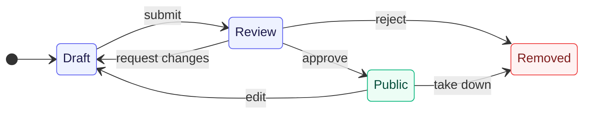

# Authoring flow

> From 'create quiz' to a quiz other people can take.

**Decision:** **⚪ idea**

## Context
Any account opens the [quiz editor](../editor/README.md) and builds a quiz end to end - questions, answers, weights, orientations, result modules. Same editor we use for [official quizzes](../official/README.md), no separate creator tier.

| State | Author | Others |
|---|---|---|
| Draft | takes and edits freely | no access |
| Review | takes it, edits locked | no access |
| Public | takes and shares | full access, listed in [discovery](./discovery.md) |
| Removed | no access | no access |

Review is [moderation](./moderation.md). Every transition out of review carries a written reason.

- **Changes requested** - The quiz goes back to draft; the author fixes it and resubmits when they want to.
- **Rejected for breaking the rules** - The quiz is removed, not returned - see the criteria in [moderation](./moderation.md).
- **New version** - Editing a public quiz opens a new draft, not a review. The author keeps working on it as long as they like and submits it themselves; the approved version keeps serving until the new one is approved.
- **Removal after publishing** - Approval is revocable - a public quiz that turns out to break the rules is removed the same way.

## Opportunity
- Our own output is the ceiling on the catalog. Creators remove it - they bring ideas we would never staff.
- The author never waits on us to iterate, only to reach other people.
- The 2023 editor proved demand with no promotion at all: dozens of community quizzes, including large ones like "+500 questions" and non-political ones like music preferences.
- The creator's alternative is building a platform, a scoring algorithm and reach from zero. We hand over all three - hundreds of thousands of users a year, an editor, and configurable result modules.

## Risk
- The full editor surface is a lot for a first-time creator - [LLM authoring](../editor/llm-authoring.md) exists to soften that.
- Review latency between submit and publish kills the momentum a creator had while building.
- Edit-after-approval is the obvious bypass vector and has to be closed by the state machine, not by trust.
- Most drafts will be abandoned; that is fine, but it shapes what we measure.
