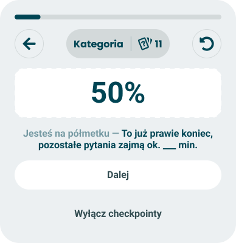

# Halfway through

> The one checkpoint that says nothing about the taker - only how far they have come and how long is left.

**Decision:** **⚪ idea**

## Context
A passive card at the midpoint of the quiz. No axis, no orientation, no finding - a large percentage and one line telling the taker how much time the rest will take. "You are halfway - it is almost the end, the remaining questions will take about __ min."

How it behaves:

- **No chart and no claim** - the only checkpoint carrying nothing political, so there is nothing here the final result can overturn.
- **The number is the visual** - a large percentage stands in for the result module every other card borrows.
- **Time left, not questions left** - "about 6 min" is something a taker can budget against, where "34 questions left" is a reason to quit.
- **The estimate is derived, not authored** - *(todo)* remaining questions multiplied by the average seconds per question; still open whether that average is global, per quiz, or measured on the taker's own pace so far.
- **Fires once** - there is exactly one midpoint, so the card cannot repeat.
- **Passive** - continue, plus the checkpoint opt-out every card carries.

## Opportunity
- **It lands on the drop-off point** - halfway is where the quiz stops feeling short and the finish is still not in sight, which is the moment worth spending a card on.
- **The one card that cannot be wrong** - it makes no claim about the taker, so unlike every other checkpoint it carries no risk of contradicting the result.
- **Time is the honest currency** - it converts remaining effort into a number the taker can decide with, instead of asking them to guess.
- **Free to fire** - no confidence gate, no aggregates, no author configuration, nothing to compute beyond progress.
- **The universal fallback** - when no personal event qualifies at the midpoint, this one always can.

## Risk
- **An honest estimate can be the reason to leave** - "about 12 min" delivered at the halfway point is a fact that argues against finishing.
- **Averages lie for individuals** - a fast reader and a slow deliberator get the same number, and a time promise is the one claim a taker can check immediately.
- **50% is bad news dressed as good** - it says as much is left as is done, and copy calling that "almost the end" strains against the number printed above it.
- **It spends prime real estate on nothing personal** - the midpoint slot is the most valuable one we have, and a percentage is the least interesting thing to put in it.
- **It collides with the halfway split** - [halfway split](../halfway-split.md) fires at the same moment, and two cards back to back at the midpoint is exactly the pacing failure the [event model](./event-model.md) exists to prevent.
- **The percentage has to agree with the progress bar** - a card announcing 50% above a bar that reads differently discredits both - see [progress and pacing](../progress-and-pacing.md).
