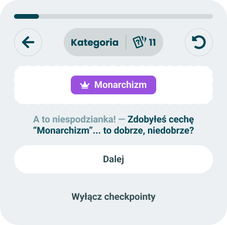

# New trait

> Announces a trait the moment the taker's answers earn it.

**Decision:** **⚪ idea**

## Context
A trait is an orientation that only applies at full agreement - every answer tied to it has to line up, so a taker either has it or does not. That makes unlocking one an event with a clear moment, which is what this checkpoint is built on. See [checkpoints](./README.md) for the card frame and [event model](./event-model.md) for the firing rules.

How it behaves:

- **Shows the badge, not a chart** - the same trait pill the result screen uses, see the [traits module](../../results/modules/traits.md).
- **Copy is surprise plus a question** - "What a surprise - you earned the trait 'Monarchism'... good, bad?" The card names the trait and deliberately refuses to judge it.
- **No confidence gate** - unlike [axis closeness](./axis-closeness.md), there is no threshold to wait for. Full agreement is already the threshold.
- **Once per trait** - and when several unlock at once, the event model picks one.
- **Passive** - continue, or turn checkpoints off.

The open question is **revocation**. A trait held at question 20 can be lost at question 40 by a single disagreeing answer, and we will have announced it already. Two ways out, and they trade against each other:

- **Announce when it is safe** - fire only once every question tied to that trait has been answered, so the trait can no longer be lost. Correct, but pushes most cards to the end of the quiz.
- **Announce as of now** - fire on unlock and let the copy carry the caveat. Livelier, but some takers will see a trait mid-quiz that is missing from their result.

## Opportunity
- **The most collectible moment in the quiz** - a named badge that not everyone gets is exactly the thing people screenshot and compare.
- **Rarity is real** - full agreement is hard, so the card lands as an achievement rather than as another progress update.
- **No configuration** - if a quiz defines traits, the checkpoint works; the author writes nothing.
- **Gives an abandoned quiz something to have been worth** - a taker who quits at least leaves with one concrete thing about themselves.

## Risk
- **Announced then lost** - the revocation problem above is the whole design risk, and either answer costs something.
- **It fires late** - the full-agreement rule means traits usually complete near the end, which is where pacing rules are trying to keep the taker moving to the result.
- **Not every quiz has traits** - unlike axes, traits are optional in a quiz design, so this checkpoint simply cannot appear in some quizzes.
- **A label mid-quiz invites consistency** - being told you are a monarchist at question 11 nudges how you answer question 12, and that is a data problem.
- **Loaded names** - trait names are the sharpest words in a quiz, and handing someone a political label with a wink is easy to read as mockery or as endorsement.
