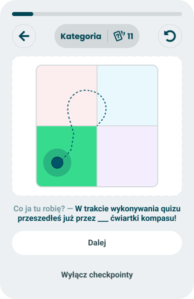
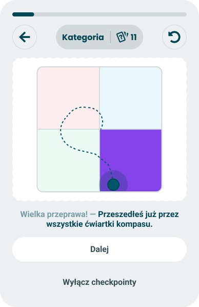

# Nolan chart path

> Draws the route the taker's position has travelled across the compass so far.

**Decision:** **⚪ idea**

Design: Figma - [two or three quadrants](https://www.figma.com/design/DIInW4qrIxsgXmKbSHukNm/mypolitics-app?node-id=5515-67219) | [four quadrants](https://www.figma.com/design/DIInW4qrIxsgXmKbSHukNm/mypolitics-app?node-id=5516-69231) | [four quadrants, second path](https://www.figma.com/design/DIInW4qrIxsgXmKbSHukNm/mypolitics-app?node-id=5581-97574)

## Context
Every other checkpoint reports a position. This one reports the movement between positions: the compass is drawn with a dotted trail from where the taker started to where they are now, and the card counts how many quadrants that trail has crossed - see [checkpoints](./README.md) for the shared card frame and [event model](./event-model.md) for what makes it fire.

Two versions of the same card:

- **Two or three quadrants** - the ordinary case, played for self-deprecation. "What am I doing here? - so far you have wandered through 3 quadrants of the compass!"
- **All four** - the rare one, played as an achievement. "Quite a journey - you have already been through every quadrant of the compass."

| Two or three quadrants | All four |
|---|---|
|  |  |

How it behaves:

- **Fires on movement, not on confidence** - the opposite gate to [axis closeness](./axis-closeness.md). This card is interesting precisely when the reading has not settled.
- **Needs at least two quadrants** - a taker who has never left one quadrant has no path to show and never sees the card.
- **Reuses the compass** - the same [Nolan chart](../../results/modules/nolan-chart.md) as the result screen, with the trail and the current quadrant highlighted on top.
- **Held until the count means something** - fired too early, "you crossed two quadrants" describes three answers rather than a person.
- **The four-quadrant version can still follow** - it is a rarer statement than two or three, so it is allowed to appear later in the same quiz even if the smaller version already did.
- **Passive** - continue, or turn checkpoints off.

## Opportunity
- **It rewards the takers nothing else can reach** - someone whose views are spread across the compass has no clean axis finding to be given, and this turns that into the point rather than the problem.
- **Movement is a story** - a trail is the only visual in the quiz that shows the taker something happening over time instead of a value.
- **It sets up the result** - meeting the compass mid-quiz makes the final position readable, and the trail explains why it landed where it did.
- **No configuration** - any quiz with a compass gets it for free.
- **The trail is worth keeping** - it is a natural thing to replay on the result screen or to share.

## Risk
- **We may be dressing up noise** - early in a quiz the position swings because there is almost no data, not because the taker changed their mind, and calling that a journey is a claim about a person that the numbers do not support.
- **It can undercut the result** - showing how much the position wandered invites the taker to trust the final one less.
- **The quadrant is a partial spoiler** - the card names where they currently sit, which is a piece of the result screen handed over early.
- **Timing conflicts with the count** - the count needs answers behind it, so the card wants to be late, which is where pacing is trying to push the taker towards finishing.
- **Two cards for one idea** - allowing the four-quadrant version after the two-or-three version spends two pacing slots on the same mechanic.
- **Needs a compass** - a quiz without a Nolan chart cannot run it, so the event model needs a fallback.
