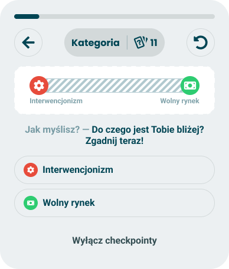
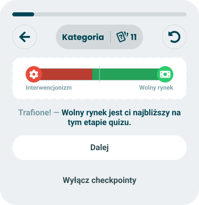
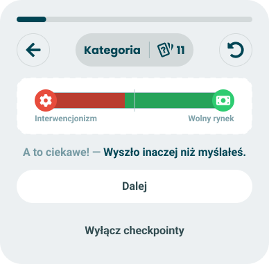

# Single axis puzzle

> Hides one axis, asks the taker to guess which side they came out on, then shows the real reading.

**Decision:** **⚪ idea**

Design: Figma - [ask](https://www.figma.com/design/DIInW4qrIxsgXmKbSHukNm/mypolitics-app?node-id=5515-67799) | [guessed right](https://www.figma.com/design/DIInW4qrIxsgXmKbSHukNm/mypolitics-app?node-id=5516-67925) | [guessed wrong](https://www.figma.com/design/DIInW4qrIxsgXmKbSHukNm/mypolitics-app?node-id=5516-68299)

## Context
The active counterpart to [axis closeness](./axis-closeness.md). Same axis, same chart, but the fill is masked and the taker has to commit to a guess before it is uncovered - see [checkpoints](./README.md) for the shared card frame and [event model](./event-model.md) for what makes it fire.

The card runs in three states:

- **Ask** - the axis chart is drawn with the fill hatched over, both poles still named, and the poles are offered as the answer options. "What do you think - which one are you closer to? Guess now!"
- **Hit** - the mask lifts to the real chart. "Got it - free market is the closest to you at this stage of the quiz."
- **Miss** - the same reveal, framed as a surprise. "Now that's interesting - it came out differently than you thought."

| Ask | Hit | Miss |
|---|---|---|
|  |  |  |

How it behaves:

- **The options are the poles** - a two-pole axis offers two rows, so the guess is a binary and there is nothing to hedge with.
- **The guess is the only way forward** - no continue button until an option is tapped, which is what separates this from a passive card.
- **The reveal is immediate** - the answer replaces the question in place, so the guess and the finding are read together rather than a few questions apart.
- **Hit or miss, never right or wrong** - a miss is *interesting*, not incorrect; the taker's expectation is not the thing being marked.
- **Hedged to the moment** - "at this stage of the quiz" is in the copy, so the reveal is a standing that can still move, not a verdict.
- **Fires on confidence** - the same gate as [axis closeness](./axis-closeness.md); an axis sitting near a tie has no answer worth guessing at.
- **Once per axis** - an axis that got a puzzle does not also get a closeness card, and the [event model](./event-model.md) picks which axis is worth the slot.

Open question: whether the reveal stays on the card or is deferred a few questions, which is how [event model](./event-model.md) describes two-beat events. Immediate keeps the card self-contained; deferred buys a second beat of anticipation at the cost of a guess that can be left unresolved.

## Opportunity
- **A question earns the reveal** - the taker asked for this finding, so it gets read instead of tapped past, which a passive card cannot guarantee.
- **The gap is the product** - the distance between what someone expects of themselves and what their answers say is the most interesting thing the quiz holds, and only a guess exposes it.
- **The failure case is the strong one** - a miss is the memorable outcome, so the mechanic works best exactly when it "fails".
- **No new visuals** - it reuses the axis modules the result screen already ships; the mask is the only addition.
- **Works in any quiz** - every quiz has axes, so it never needs a fallback.

## Risk
- **The most expensive interruption we have** - it demands an answer mid-quiz, so it costs more of the pacing budget than any passive card.
- **It contaminates the answers that follow** - worse than [axis closeness](./axis-closeness.md), because the taker has now committed to a self-image and the remaining questions are a chance to defend it.
- **A miss can be rejected rather than absorbed** - "that is not you", from a quiz that is half finished, is easy to read as the quiz being wrong.
- **A coin flip is right half the time** - two options make a hit cheap, which flattens both outcomes.
- **An overturned reveal contradicts twice** - the taker guessed against a mid-quiz reading; if the final result flips it, we were wrong about them and about their own guess.
- **The poles have to be self-explanatory** - forcing a choice between *interventionism* and *free market* assumes a vocabulary the taker may not have yet, and there is no way to answer "I don't know".
