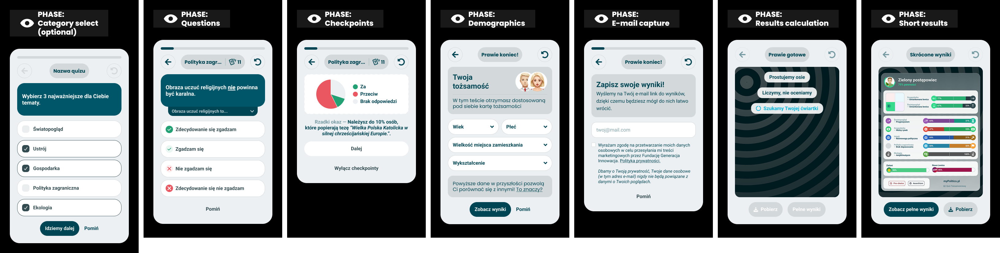

# Phases model

> The seven phases a quiz session runs through, and which of them belong to us.

**Decision:** **⚪ idea**

## Context
A session is not one screen repeated a hundred times. It is a fixed sequence of phases, each with a single job, each able to be skipped, measured and dropped on its own.

| Phase | Job | Can be skipped |
|---|---|---|
| Category select | Pick the topics that matter, so a long quiz can be cut to them | Optional, and only if the quiz defines categories |
| Questions | Collect the answers - see [answer model](./answer-model.md) | No, this is the quiz |
| Checkpoints | Pay the taker back mid-quiz - see [checkpoints](./checkpoints/README.md) | Turned off from any card |
| Demographics | The four fields - see [demographics](../data-harvesting/demographics.md) | Yes |
| E-mail capture | Save the result and ask for consent - see [results saving and marketing](./results-saving-and-marketing.md) | Yes |
| Results calculation | Compute the result while the wait sells the product - see [engaging loader](../results/engaging-loader.md) | No |
| Short results | The first payoff, before the full result - see [short results card](../results/short-results-card.md) | No |

How the sequence behaves:

- **The order is fixed, the membership is not** - category select appears only when a quiz has categories, checkpoints stop appearing once a taker turns them off, and the rest are always present.
- **Checkpoints are the recurring phase** - they interrupt questions repeatedly rather than following them once.
- **Everything asked for comes after the answers** - by the time we ask for demographics or an e-mail, the data we actually need is already collected, so a taker who leaves costs us the extras and not the result.
- **The end announces itself** - the header switches to "almost done" for the closing phases, which is pacing doing its job - see [progress and pacing](./progress-and-pacing.md).
- **The last two phases are the results module's** - calculation and short results are owned there and merely happen while the taker is still inside the questionnaire flow. The phase list is the contract between the two.

## Opportunity
- **One job per phase** - drop-off can be attributed to a specific phase instead of to "the quiz", which is the only way to know what to fix.
- **The data is safe early** - putting every ask after the questions means abandoning at demographics still leaves a complete set of answers.
- **Category select rescues long quizzes** - a taker who would never finish a hundred questions can finish a subset of them.
- **Staged payoff** - a short result before the full one gives the taker something immediately and gives the full screen a reason to be opened.
- **Shared phases, one implementation** - the questionnaire does not rebuild what the results module already owns.

## Risk
- **The closing wall** - demographics, then an e-mail, then a wait, all stacked at the exact moment the taker wants their result.
- **A decision before the quiz starts** - category select sits at the highest drop-off point in the funnel and asks for thought before anything has been earned.
- **Skippable data is missing for a reason** - the people who skip demographics are not a random sample of takers, and the gap is invisible in the dataset.
- **The loader is a deliberate delay** - if the computation is fast, the wait is theatre; if it is slow, the theatre is the only thing keeping people there.
- **A shared contract cuts both ways** - changing the phase list means changing something the results module depends on.
