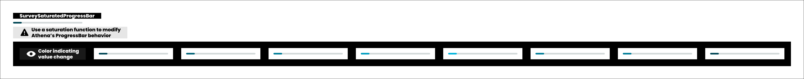

# Progress and pacing

> The bar does not show how far the taker has come - it shows how far it is worth telling them they have come.

**Decision:** **⚪ idea**

## Context
The progress bar is the only thing on screen that answers "how much longer". A truthful one is demoralising: eight questions into eighty it sits at 10%, and four more answers barely move it. The first stretch of a long quiz is where takers leave, and a linear bar is an argument for leaving.

So the displayed value is not the raw one. Below the midpoint the bar is pulled upward along a curve; above it, the bar shows the truth. A quarter of the way through reads as roughly two fifths, the boost is largest around there, and it fades to nothing by the halfway mark, where the two halves meet without a visible jump. Both ends stay exact - an untouched quiz reads empty, a finished one reads full.

The bar also reacts. Every time the value changes the fill flashes a lighter shade and settles back, so a single answer produces something visible even when the width moves by a pixel.

How it behaves:

- **Boosted below the midpoint, honest above it** - the curve touches only the first half, so the closer the taker gets to the finish, the more accurate the promise becomes.
- **The boost peaks early and fades** - it is worth the most about a quarter in and is gone by 50%, which is what keeps the halves continuous.
- **The ends are exact** - the bar never lies about starting or about finishing, only about the middle of the first half.
- **Every answer flashes** - a brief colour change on the fill, so progress is felt as an event and not only measured.
- **One bar for the whole quiz** - checkpoints and demographics do not get their own, so there is a single number to track.

Pacing is the same problem at a different scale. The bar answers how far, the category pill and the question counter answer where, and the interruptions that break the run of questions are budgeted separately by the [event model](./checkpoints/event-model.md) - which is why no card decides for itself whether it may appear.

## Opportunity
- **It buys the length** - the curve spends its help exactly where the quiz is abandoned, which is part of what lets us ask 50 to 100 questions at all.
- **The flash is the cheapest reward we have** - it needs no content, no data and no configuration, and it makes one answer feel like it landed.
- **It is honest where honesty is checkable** - the taker can only verify the estimate near the end, and near the end the bar is true.
- **It costs nothing to run** - a pure function over progress, working identically in every quiz including community ones.

## Risk
- **The second half pays for the first** - the boost is borrowed, not created, so the bar decelerates exactly when the taker is most tired of answering.
- **It has to agree with the numbers we print** - [halfway through](./checkpoints/halfway-through.md) states an explicit percentage, and a card reading 50% above a bar that looks fuller discredits both.
- **Short quizzes distort hardest** - at ten questions, two answers already read as a third of the way done, which is closer to a lie than to encouragement.
- **Long quizzes expose it anyway** - a few percent of felt progress is thin comfort against sixty remaining taps.
- **The flash repeats eighty times** - anything decorative becomes noise at that count, and it needs a reduced-motion path.
- **Being noticed is the failure mode** - a taker who works out that the bar moves faster at the start than at the end has learned that the product handles them, and that is a hard thing to unlearn.
