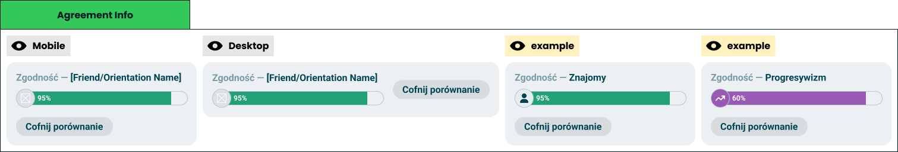

# Agreement info

> One number for the whole comparison, and the way out of it.

**Decision:** **⚪ idea**

Design: [Figma](https://www.figma.com/design/DIInW4qrIxsgXmKbSHukNm/mypolitics-app?node-id=5514-52491)

## Context
While a comparison is running, a bar sits above the result: who is being compared against, how much the two of you agree, and a control to end it.

How it behaves:

- **It names the other side** - a friend or an orientation, with their avatar or icon - see [comparison modes](./comparision-modes.md).
- **One score, drawn as a bar** - the same [universal axis](../modules/universal-axis.md) as everything else, so the headline number is read the same way as the rest of the screen.
- **It stays put** - the comparison is a mode, not a page, and the bar is what makes that state visible while the taker scrolls through [results](./results-comparision.md) or [answers](./answers-comparision.md).
- **Undo is always one tap** - ending the comparison returns the taker to their own result.
- **Two layouts** - stacked on a phone, with the control beside the bar on desktop.

## Opportunity
- **It is the shareable line** - "we agree in 95%" is the sentence that gets screenshotted and sent back.
- **It keeps the mode honest** - a taker always knows whose numbers are overlaid on theirs, and how to get out.
- **It works identically in both modes** - a friend and an orientation produce the same headline, so nothing new has to be learned.
- **It gives the comparison a reason to exist** - one number is what people want first, and the detail underneath is what they explore afterwards.

## Risk
- **A single percentage flattens everything** - two people can agree in 95% and still differ on the only question either of them cares about.
- **It reads as a compatibility score** - a number between two people invites a meaning we never intended.
- **The formula is invisible** - what counts as agreement across weighted, multi-select and skipped answers is a decision nobody sees, and it decides the headline.
- **Persistent chrome costs space** - a fixed bar on a phone is height taken from the result itself.
