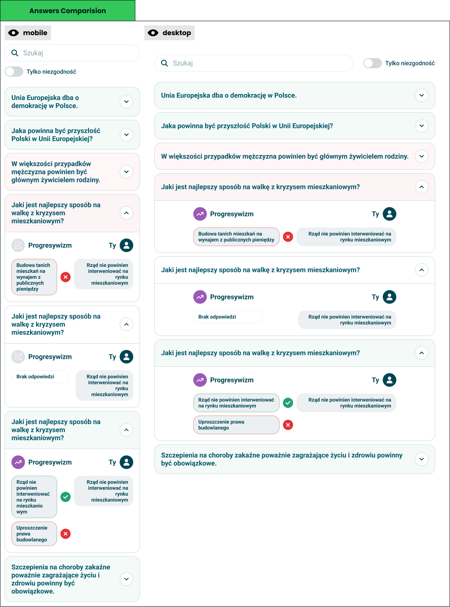

# Answers comparison

> Question by question: what you said, what they said, and where you split.

**Decision:** **⚪ idea**

Design: [Figma](https://www.figma.com/design/DIInW4qrIxsgXmKbSHukNm/mypolitics-app?node-id=5514-53568)

## Context
The other half of comparison mode, and the half that works in both modes - against a friend, and against an orientation. Every question the taker answered becomes a row that opens into the two answers beside each other.

How it behaves:

- **A list of questions, collapsed** - the statement is the row, and expanding it reveals the answers underneath.
- **Two answers, one verdict** - your answer and theirs sit side by side with a mark between them: a tick when they agree, a cross when they do not.
- **The orientation is named** - each expanded row says which orientation the question fed, so a disagreement is legible as a disagreement about something.
- **Rows are tinted by outcome** - agreement and disagreement are visible before anything is opened.
- **Only disagreements** - a toggle drops every row where the two of you matched, which is what most people are actually looking for.
- **Search** - a hundred questions is unbrowsable without it.
- **No answer is a state** - a question one side skipped shows as unanswered rather than as a disagreement.
- **Multi-answer questions show every pick** - each selected answer gets its own mark, so partial agreement stays visible.

Against an orientation the right-hand side is what that orientation implies rather than what a person said, which turns the same view into "where do I actually differ from progressivism".

## Opportunity
- **It is the evidence behind the result** - every number on the result screen ultimately comes from these rows, and this is the only place a taker can audit it.
- **Disagreement is the interesting part** - the filter turns a long list into the three questions worth arguing about.
- **It works without a second person** - orientation mode gives a solo taker the same feature, which is most takers.
- **It teaches what an axis means** - seeing the questions behind progressivism explains the label better than a description could.
- **Cheap to build on what exists** - answers are already stored per question; this is a view over them.

## Risk
- **Answers are more sensitive than results** - a score is an abstraction, an answer is a statement someone made, and this shows it verbatim to another person.
- **It is the sharpest social surface we have** - a filtered list of everything you disagree about is an argument generator, and we built the filter.
- **Long quizzes make long lists** - a hundred rows is a scrolling exercise, even with search.
- **A tick reduces a nuanced answer** - agreeing for opposite reasons still shows as agreement.
- **Comparing to an orientation implies it has a position** - what "progressivism would answer" is our modelling, presented as if it were a participant.
