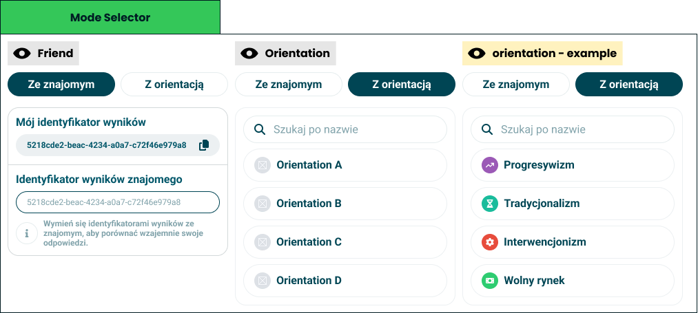

# Comparison modes

> Who you can hold your result up against: a friend, or an orientation.

**Decision:** **⚪ idea**

## Context
Comparison mode is the second tab of the result screen, and it starts with one choice: compare with a friend, or compare with an orientation.

- **With a friend** - each side has a result identifier. You copy yours, they copy theirs, and pasting one in pairs the two results. Nothing is looked up by name, and nobody is searchable.
- **With an orientation** - a searchable list of everything the quiz scores, so the taker can hold their answers against progressivism, the free market, a party or a candidate.

What each mode can show:

- **A friend gives both** - [results comparison](./results-comparision.md) across every module, and [answers comparison](./answers-comparision.md) question by question.
- **An orientation gives answers only** - an orientation has no result of its own to overlay, so only the question-by-question view applies.
- **Either way an agreement score appears** - see [agreement info](./agreement-info.md), which stays on screen for as long as the comparison lasts.

## Opportunity
- **Comparison is the social half of the product** - a result is worth reading once, and worth arguing about repeatedly.
- **Identifiers keep it private** - no friend graph, no accounts to find, no directory of people's politics. The exchange happens in a chat we never see.
- **Orientation mode has no second person** - it works for a taker with nobody to compare against, which is most takers.
- **It reuses every module** - comparison is an overlay on what is already drawn, not a second result screen.
- **It answers the question people actually ask** - "am I more X than you" is the reason results get shared at all.

## Risk
- **An identifier is a bearer token** - whoever holds it can see that result, and people will paste it into public places.
- **Pairing is unequal** - the person who pastes sees the comparison first, and the other may never see it at all.
- **Comparing with an orientation invites a scoreboard reading** - "95% progressive" becomes a label, not a comparison.
- **Two modes on one tab is a decision before a payoff** - the taker has to pick a mode before seeing anything interesting.
- **A friend's result is someone else's sensitive data** - once compared, it has been shown to a second person, and no consent flow made that explicit.
