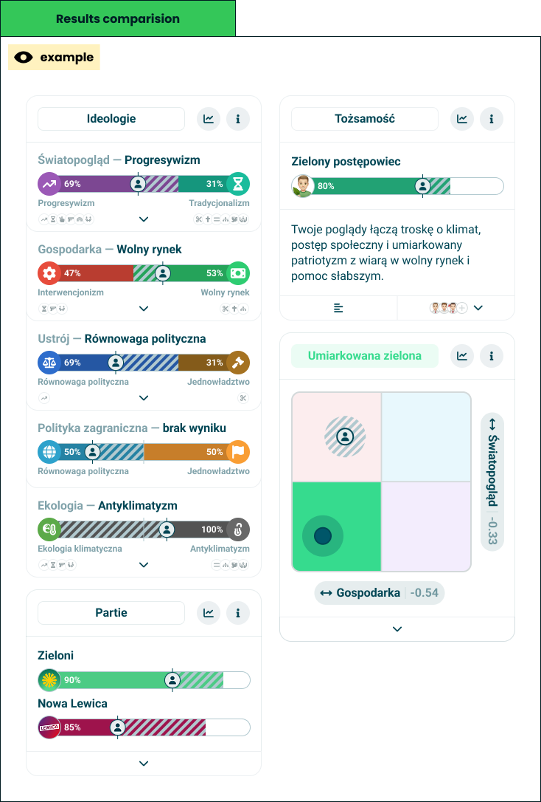

# Results comparison

> The whole result screen, redrawn with a friend's answers laid over yours.

**Decision:** **⚪ idea**

## Context
Available for a friend only - see [comparison modes](./comparision-modes.md). An orientation has no result of its own to lay over anything, so this view is what a paired identifier buys.

How it behaves:

- **Nothing new is drawn** - every module keeps its layout and gains an overlay, because the [universal axis](../modules/universal-axis.md) already knows how to carry a second value.
- **Hatching plus an avatar** - the friend's position is marked on the same track, with the hatching running forward or back depending on whether they are ahead or behind.
- **The map takes two dots** - on the [Nolan chart](../modules/nolan-chart.md) the friend appears as a second, marked position in whichever quadrant they landed in.
- **Badges carry their face** - in [traits](../modules/traits.md) a shared trait shows the friend's avatar, and one only they earned is drawn hatched.
- **The agreement score stays on screen** - see [agreement info](./agreement-info.md), so the headline number is visible however far the taker scrolls.
- **One direction at a time** - the screen belongs to the taker, and the friend is the overlay, not a second column.

## Opportunity
- **This is the argument people came for** - two results side by side is the reason a link gets sent at all.
- **It costs one overlay, not a second screen** - every existing module gains comparison at once.
- **Difference is where the axes finally make sense** - a taker learns what an axis measures by seeing someone else land elsewhere on it.
- **It is repeatable** - the same result can be compared against a different friend the same day, which nothing else on the screen offers.

## Risk
- **We are showing one person another person's politics** - the identifier was pasted willingly, but the overlay is still someone's sensitive data rendered on a stranger's device.
- **A comparison invites a verdict** - two dots on a map imply one of them is better placed, and the product has no way to say that neither is.
- **Overlays crowd small screens** - every bar now carries two values, an avatar and hatching, on a phone.
- **The friend's result ages** - it is a snapshot from whenever they took the quiz, and nothing on screen says how old it is.
- **Difference can end friendships** - the product's most social feature is also its most divisive, and the copy around it cannot pretend otherwise.
