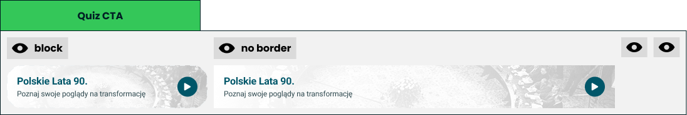

# Follow-up recommendation

> The next quiz to take, offered where the result is finished being read.

**Decision:** **⚪ idea**

Design: [Figma](https://www.figma.com/design/DIInW4qrIxsgXmKbSHukNm/mypolitics-app?node-id=5514-41770)

## Context
A single banner: a title, one line of promise, a themed background image and a play button. It comes in two forms - a bordered block, and a bare band with no frame so it can sit inside other content.

How it behaves:

- **One quiz, not a grid** - the result screen is a result, not a catalogue, and a single choice is a decision rather than a browse.
- **Placed at the end of the reading** - it appears where attention is finishing, not competing with the result at the top.
- **The copy promises something about the taker** - "discover your views on the transformation" sells self-knowledge, not a quiz.
- **The picture does the theming** - it is the only art in the whole flow, and it is what makes the next quiz look like a different experience.
- **Never the quiz just taken** - unfinished and untaken quizzes come first.
- **The choice comes from ranking we already have** - [quality score](../community/quality-score.md) orders the candidates and [discovery](../community/discovery.md) owns where else they surface.

## Opportunity
- **The cheapest loop in the product** - a finished result is the moment of highest trust and highest attention, so a second quiz costs nothing to acquire.
- **It is what makes community quizzes work** - quizzes per session is the number new creators need, and this is where their first users come from.
- **No new ranking** - the score is already computed for the catalogue; this surface just reads it.
- **One component, many places** - the bare variant drops into a results tab, a home page or a feed without a redesign.
- **Themed art travels** - the same banner is what a creator shares outside the platform.

## Risk
- **It can cheapen the result** - an unrelated quiz offered seconds after a political result reads as a content farm rather than a conclusion.
- **Three jobs on one screen** - sharing, saving and this all want the same moment, and the result screen cannot win all three.
- **It lends our credibility** - a community quiz recommended by us on our own result screen inherits an endorsement we did not intend, so labelling has to be unmistakable.
- **Promotion inside the most trusted surface** - an admin boost applied here is advertising in the place where the taker trusts us most.
- **It needs an image** - a quiz without decent art either looks broken in the banner or forces a fallback that looks like nothing.
