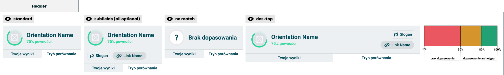

# Header

> The top of the result: one orientation, said plainly.

**Decision:** **⚪ idea**

Design: [Figma](https://www.figma.com/design/DIInW4qrIxsgXmKbSHukNm/mypolitics-app?node-id=5500-3239)

## Context
The header is the answer the taker came for. An avatar in a ring, a name, and how confident we are about it - then the tabs that split the result from [comparison mode](../comparison/comparision-modes.md).

What it shows:

- **Any orientation the author chooses** - the header is pointed at one group and displays whichever orientation leads it. An identity quiz points it at archetypes and shows "Green progressive"; an election quiz points it at candidates and shows a candidate's name and face.
- **Confidence, not a score** - the percentage says how strongly the answers support this result, banded: under 50% is no match, 50 to 80% a partial one, above 80% a real one.
- **No match is a valid answer** - when nothing clears the bar, the header says so, with a question mark where the face would be.
- **Optional extras** - a slogan and a link, both author-written, for a result that has something to say or somewhere to send the taker.
- **One content, two shapes** - the same header stacks on a phone and spreads out on desktop.

## Opportunity
- **It answers the question in one line** - everything below is evidence; this is the verdict, and many takers will read only this.
- **It is the part that gets screenshotted** - a name, a face and a number is the shareable unit, which is why it also anchors the [short results card](../short-results-card.md).
- **Author-pointed, not hard-coded** - the same header serves an ideology quiz, an election quiz and a personality quiz with no special cases.
- **Honest about weak results** - being willing to say no match is what makes the strong results worth trusting.
- **The link earns its place** - an election quiz can send a taker to a programme, which is the most useful thing a result can do.

## Risk
- **A face and a name read as an endorsement** - a candidate's portrait at the top of someone's result is easy to mistake for a recommendation.
- **Confidence is misread as accuracy** - the number describes the answers; takers will read it as how right we are.
- **The bands are a judgement call** - where no match becomes a match decides how often the product refuses to answer, and nothing in the data sets that line.
- **Author copy sits in our most trusted spot** - the slogan and the link are someone else's words in the place that looks most like ours.
- **One orientation flattens a split result** - a taker who genuinely sits between two gets a single name anyway, unless the no-match rule catches it.
