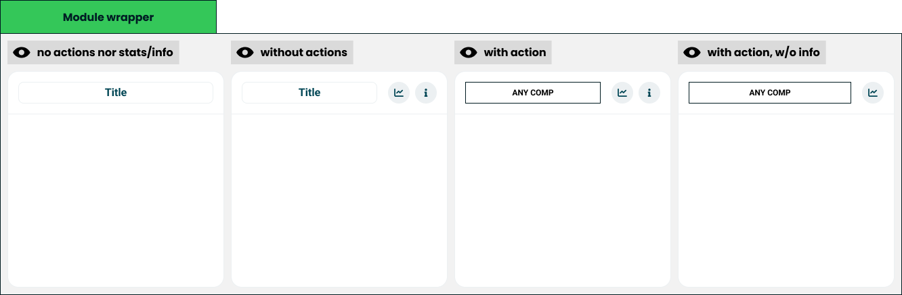

# Module wrapper

> The frame every result module sits in.

**Decision:** **⚪ idea**

## Context
Every module on the result screen is a card with the same frame: a title, up to two actions, and a body the module fills with [bars](./universal-axis.md).

The frame holds:

- **A title slot** - usually the module name given by the quiz author, but it can be any component. The [Nolan chart](./nolan-chart.md) puts its quadrant name there, the [archetype](./archetype.md) puts its result.
- **A stats button** - opens the module's statistics: how everyone else scored on the same thing.
- **An info button** - opens the explanation of what the module measures and how to read it.
- **A body** - whatever the module draws.

Both actions are optional, which gives four configurations: neither, both, an active title with both, and an active title with statistics only. A module with nothing to explain and nothing to compare is simply a titled card.

Those two buttons are the only way out of a module. Everything else on the card is the result itself.

## Opportunity
- **Every module looks like the others** - a screen of unrelated charts reads as one product because the frame never changes.
- **Explanations have a home** - the info button is a fixed place for the caveats that would otherwise clutter the result or be dropped.
- **Depth without noise** - statistics sit one tap away, so the default screen stays a result rather than a dashboard.
- **Authors write titles, not layouts** - a community quiz gets the same frame as ours with nothing configured.
- **A new module inherits the surface** - actions, spacing and behaviour come for free.

## Risk
- **Two small buttons carry a lot** - the parts that make a number honest are the parts easiest to ignore.
- **Optional actions look inconsistent** - a card without an info button beside one that has it reads as an oversight rather than a choice.
- **The title slot can hold anything** - a component in the title is powerful, and is how a card starts looking unlike every other card.
- **The frame sets a floor on space** - on a phone, chrome around every module costs the room the result needs.
