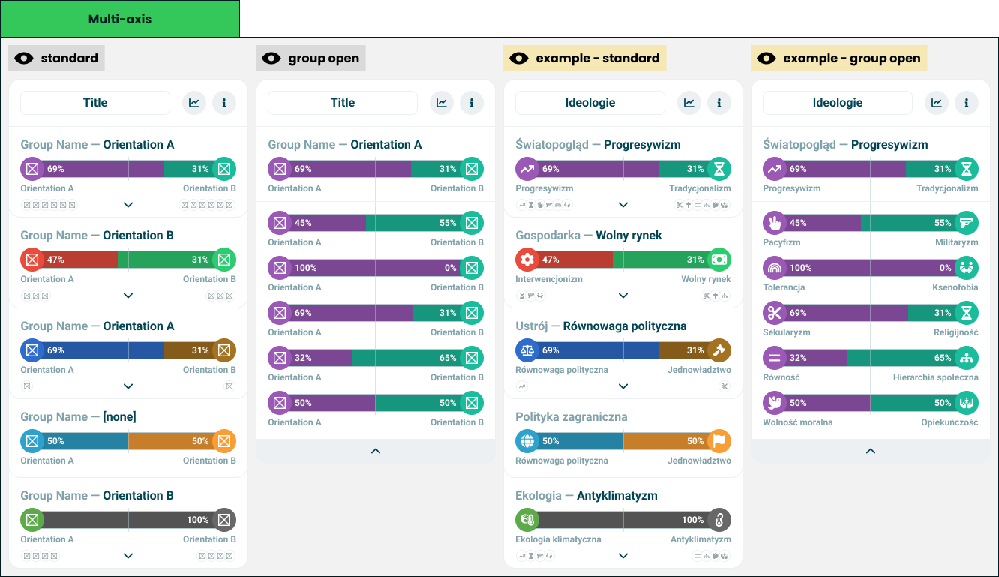

# Multi axis chart

> A group of axes at a time, each collapsed to the side that won it.

**Decision:** **⚪ idea**

## Context
A stack of [double axis charts](./double-axis-chart.md) arranged by group. Each row names a group and the orientation leading it, draws that axis as one bar, and hides the rest of the group behind a chevron.

How it behaves:

- **One row per group** - "worldview - progressivism" is the group and its winner, and the bar underneath is the axis that produced it.
- **Icons preview what is inside** - the small row under each bar shows the orientations the group holds, before anything is expanded.
- **A group opens in place** - expanding replaces the summary with every axis in the group, each its own bar.
- **A tie shows no winner** - a group with nothing ahead names none.
- **It is one card, not many** - a whole ideology model sits inside a single [wrapper](./module-wrapper.md).

It works for any grouping the author defines:

- **Ideologies grouped by theme** - worldview, economy, governance, foreign policy, ecology, as in the asset.
- **Candidates grouped by policy area** - which candidate wins each subject.
- **Any orientation set with structure** - the module only needs groups and pairs; what they mean is the author's business.

## Opportunity
- **A whole model in one card** - dozens of axes stay browsable instead of turning into a wall of charts.
- **Summary first, detail on demand** - the taker reads five lines and decides which one they care about.
- **Structure is the author's** - grouping is configuration, so a quiz with two axes and one with forty both work.
- **The result screen stays short** - collapsing is what makes room for the other modules beside it.

## Risk
- **The group winner hides disagreement** - a group where every axis leans differently still shows one name.
- **Collapsed detail is unread detail** - most takers never open a group, so the nuance we kept is nuance nobody sees.
- **Naming a group is a claim** - what belongs under "worldview" is contested, and the grouping frames the result.
- **Long groups punish the phone** - an opened group of ten axes pushes everything else off the screen.
