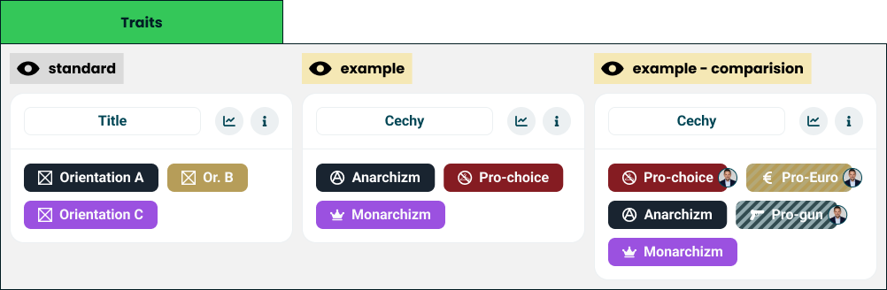

# Traits

> The badges a taker earned, shown as a set.

**Decision:** **⚪ idea**

## Context
A trait is an orientation that only applies at full agreement, so it is not a score to be drawn on a [bar](./universal-axis.md) - it is a thing someone either has or does not. This module shows the ones they have, as coloured pills with an icon and a name.

How it behaves:

- **A set, not a ranking** - the pills have no order that means anything, because every trait is equally earned.
- **Each trait carries its own colour and icon** - the same identity it has everywhere else in the product, including the mid-quiz card that announced it.
- **Comparison marks the pills** - a trait a friend shares carries their avatar, and a trait only they earned is drawn hatched, so agreement and difference are visible at a glance.
- **Empty is possible** - a taker who earned nothing sees no pills, which is a real outcome of a strict rule.

Traits are the sharpest words in a quiz, and they can be anything an author defines:

- **Positions** - "pro-choice", "pro-gun", the asset's examples.
- **Ideological labels** - "anarchism", "monarchism".
- **Non-political tags** - the same module labels a music or personality quiz.

## Opportunity
- **The most collectible part of a result** - a small set of named badges is what people compare, screenshot and argue about.
- **Full agreement makes them mean something** - a trait cannot be half-earned, so it is the one number-free claim on the whole screen.
- **They read instantly** - no axis, no percentage, no explanation needed.
- **Comparison is trivially legible** - shared and unshared badges say more about two people than any chart on the screen.

## Risk
- **A political label attached to a person is the riskiest output we produce** - it is a word about someone, not a position on a scale.
- **Author-defined names are unbounded** - a community quiz can hand out labels that are insulting, partisan or simply wrong.
- **An empty set feels like a failure** - the strictness that makes traits meaningful also makes the module blank for many takers.
- **No score means no nuance** - "pro-gun" earned by a hair looks identical to one earned outright, because the rule allows only one of those.
