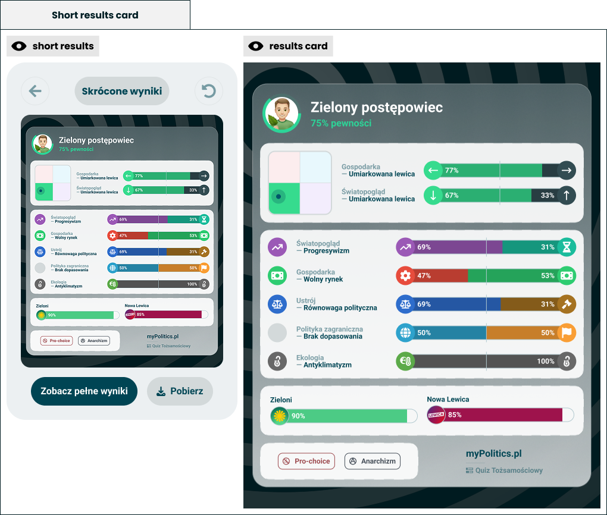

# Short results card

> One generated card that carries the whole result, and can be saved as an image.

**Decision:** **⚪ idea**

Design: [Figma](https://www.figma.com/design/DIInW4qrIxsgXmKbSHukNm/mypolitics-app?node-id=5518-95336)

## Context
The short results phase - see [phases model](../questionnaire/phases-model.md) - shows a single card and two actions: open the full results, or download the card. It is the same object either way. On screen it is the summary; saved, it is a PNG the taker can post anywhere.

The card is a template filled with the quiz's own [result modules](./modules/module-wrapper.md), in a fixed order:

- **Identity** - avatar, archetype name and how confident the result is - see [archetype](./modules/archetype.md).
- **Position** - the compass with the leading axes beside it - see [Nolan chart](./modules/nolan-chart.md) and [double axis chart](./modules/double-axis-chart.md).
- **Axes** - every scored axis as a labelled bar - see [multi axis chart](./modules/multi-axis-chart.md).
- **Matches** - the closest parties or figures.
- **Traits and branding** - the [traits](./modules/traits.md) earned, then myPolitics and the quiz name.

How it behaves:

- **Template, not a layout** - the slot order is fixed for every quiz, so the card is recognisable as ours before anyone reads it.
- **The blocks are the quiz's own modules** - whatever the author configured is what the card renders; nothing here is written twice.
- **A missing module leaves no gap** - a block whose module is not configured is not drawn at all, and the card shrinks to fit what remains.
- **The branding is not a slot** - the footer travels with every shared image, and it is the only part the taker cannot remove.
- **Download is one tap** - offered in the phase where the taker is already looking at the card, not buried in the full results.
- **Short first, full second** - the card summarises; the full result screen is the place to actually read it.

## Opportunity
- **This is the distribution mechanism** - a result worth posting is how the product has always spread, and the card is the thing that gets posted - see [how](../../../concept/how.md).
- **Every quiz gets a designed result for free** - a community quiz with no design work behind it still produces a card that looks like ours.
- **One template covers every quiz shape** - a two-axis quiz and a twelve-axis quiz both resolve into the same card, because the blocks come and go.
- **Staged payoff** - a complete summary immediately, with the full screen still ahead of the taker.
- **Branding travels further than the link** - a screenshot carries the source even when the URL does not.

## Risk
- **A shrinking card can shrink to nothing** - a minimally configured quiz produces a card that looks broken rather than minimal, so the template needs a floor.
- **An image is a public statement** - once saved, our sentence about someone's politics circulates without the explanation that sat next to it.
- **Numbers lose their caveats** - "100%" on an axis reads as certainty about a person when it describes a handful of answers, and the [info modals](./info-modals.md) that explain it do not travel with the PNG.
- **Party matching is the sharpest claim on the card** - it is the block most likely to be screenshotted, argued with, and attributed to us.
- **Confidence is easy to misread** - a percentage next to the archetype looks like a claim about how good the quiz is, not how complete the answers were.
- **The image has to render identically everywhere** - fonts, avatars and emoji that shift between devices turn our one shareable artefact into an inconsistent one.
