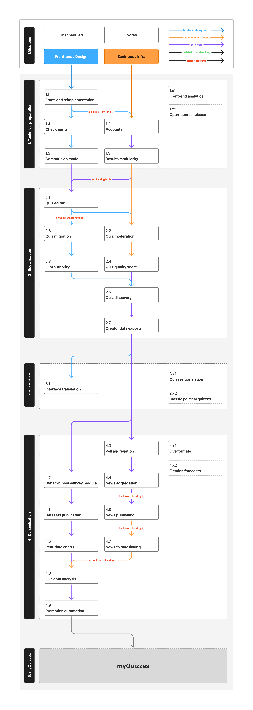

# Roadmap

> The order things happen in. Nothing here is a date.

Milestones run in order, and so do the parts inside them. A part numbered **x1**, **x2** and so on belongs to the milestone but has no place in its order yet.

## Links to docs

| # | Year | Milestone and parts |
|---|---|---|
| **1** | **2026** | **Technical preparation** |
| 1.1 | | Front-end reimplementation |
| 1.2 | | [Accounts](../platform/accounts.md) |
| 1.3 | | [Result modularity](../modules/quiz/results/modules/README.md) |
| 1.4 | | [Checkpoints](../modules/quiz/questionnaire/checkpoints/README.md) |
| 1.5 | | [Comparison mode](../modules/quiz/results/comparison/README.md) |
| 1.x1 | | [Front-end analytics](../platform/analytics.md) |
| 1.x2 | | [Open-source release](../platform/open-source-release.md) |
| **2** | **2026** | **Socialisation** |
| 2.1 | | [Quiz editor](../modules/quiz/community/authoring-flow.md) |
| 2.2 | | [Quiz moderation](../modules/quiz/community/moderation.md) |
| 2.3 | | [LLM authoring](../modules/quiz/editor/llm-authoring.md) |
| 2.4 | | [Quiz quality score](../modules/quiz/community/quality-score.md) |
| 2.5 | | [Quiz discovery](../modules/quiz/community/discovery.md) |
| 2.6 | | [Quiz migration](../platform/quiz-migration.md) |
| 2.7 | | [Creator data exports](../modules/quiz/community/creator-exports.md) |
| **3** | **2026** | **Internationalisation** |
| 3.1 | | [Interface translation](../platform/internationalisation.md) |
| **4** | **2027** | **Dynamisation** |
| 4.1 | | [Datasets publication](../modules/data/datasets/publication.md) |
| 4.2 | | [Dynamic post-survey module](../modules/quiz/data-harvesting/post-survey-module.md) |
| 4.3 | | [Poll aggregation](../modules/polls/aggregation/README.md) |
| 4.4 | | [News aggregation](../modules/media/aggregation/README.md) |
| 4.5 | | [Real-time charts](../modules/data/datasets/realtime-charts.md) |
| 4.6 | | [Live data analysis](../modules/data/analysis/live-analysis.md) |
| 4.7 | | [News to data linking](../modules/media/linking/news-to-data.md) |
| 4.8 | | [News publishing](../modules/media/distribution/social-publishing.md) |
| 4.9 | | [Promotion automation](../modules/media/distribution/promotion-automation.md) |
| 4.x1 | | [Live formats - hot mic, live debate](../modules/media/distribution/live-formats.md) |
| 4.x2 | | [Election forecasts](../modules/polls/predictions/election-forecasts.md) |
| **5** | **2027** | **myQuizzes** |
| 5.1 | | [The non-political spin-off](../modules/quiz/myquizzes/README.md) |

Everything not here is in the [backlog](./backlog.md).
