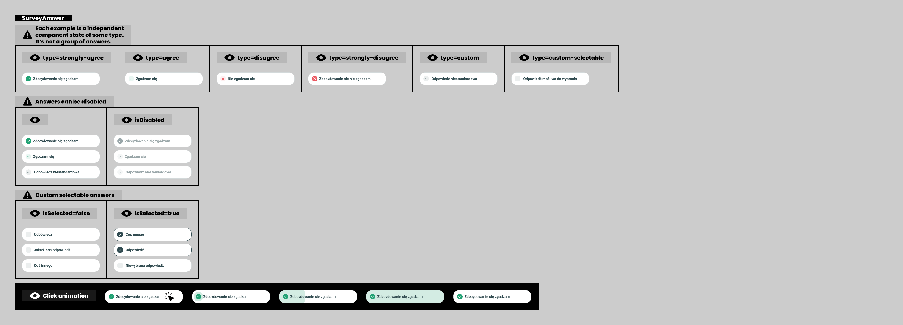

# Answer model

> Technical specification of the six kinds of answer, how the answers of a question become them, and what answering and skipping do.

Docs: [Answer model](../../docs/modules/quiz/questionnaire/answer-model.md). | Design: [Figma](https://www.figma.com/design/DIInW4qrIxsgXmKbSHukNm/mypolitics-app?node-id=4260-1802)

## Kind
Front-end

## Scope
The answers under a question: which of the six kinds each possible answer of the API becomes, the order they are shown in, what one tap does, what "Pomiń" does, and when an answer is disabled or shown as selected. The answer button itself is built; this spec is the rule for what it is handed and what follows a press.

What it does not cover, and where that lives:

- **The question card** - the statement and its explanation. It is built and has no doc.
- **Where the possible answers come from, and what is recorded** - [session and data](./session-and-data.md).
- **What comes after an answer** - the next question, a checkpoint card or the closing cards - [phases model](./phases-model.md).
- **What an answer is worth** - scoring is the back-end's. The estimate behind checkpoints is the [event model](./event-model.md)'s.
- **The rows of category select** - they are drawn with the selectable kind; their rules are in the [phases model](./phases-model.md).
- **Swipe, and keys that answer** - the doc names them as later additions. Nothing here blocks them.
- **A question that takes several answers** - not supported, see "Rules and constraints".
- **How answers pool across quizzes** - the data module.

## Data

### What a question brings
| Input | Data | Meaning | Rules |
|---|---|---|---|
| Answer type | `AGREE_OR_DISAGREE`, `ONE_OF_MANY`, or anything else | Whether the author asked for the agreement scale | From the API, as sent |
| Possible answers | A list, in the API's order | What the taker can pick | At least one - a question with none is never asked |
| Text of a possible answer | Text | Its label, and for a scale question the only thing that says which step it is | Author-supplied. Shown as written |
| Identifier of a possible answer | Text | What is recorded and sent when it is picked | Unique within the question |

A possible answer also carries a weight and the orientations it supports. The answer is the unit that scores: one question can feed several axes because each of its answers names its own orientations. The questionnaire shows none of that and records only the identifier.

### The six kinds
| Kind | Says | Drawn with | Made from a question |
|---|---|---|---|
| Strongly agree | Full agreement | A filled green tick | Yes |
| Agree | Agreement, less of it | A green tick | Yes |
| Disagree | Disagreement | A red cross | Yes |
| Strongly disagree | Full disagreement | A filled red cross | Yes |
| Custom | Whatever the author wrote | A neutral mark | Yes |
| Custom selectable | An author-written option that can be on together with others | A checkbox, empty or ticked | No - only the rows of category select use it |

Green is agreement, red is against, filled is the strong version. A custom answer takes no side and has no colour.

### From text to kind
The API has no field for the step of the scale. In a question of type `AGREE_OR_DISAGREE` the step is read from the text of each possible answer, compared with the space around it removed and without regard to letter case.

| Text | Kind |
|---|---|
| `Zdecydowanie za` | Strongly agree |
| `Częściowo za`, `Za` | Agree |
| `Częściowo przeciw`, `Przeciw` | Disagree |
| `Zdecydowanie przeciw` | Strongly disagree |
| Any other text | Custom |

These are the texts of every scale question in the three public quizzes: one quiz writes `Częściowo za`, the other two write `Za`.

The step of the scale is asked of the back-end as a field of the possible answer. Until it exists the text is what is read, and the table above does not grow with wordings in other languages.

## Interface
| Direction | Name | Shape | Notes |
|---|---|---|---|
| In | Question | Answer type and possible answers | From [session and data](./session-and-data.md) |
| In | Locked | Yes or no | Yes while the screen is moving to another question or phase |
| Out | Answers to draw | A list of label, kind and identifier, in the order to show | One list per question |
| Out | Answered | The identifier of the possible answer | Raised once, after the answer has been acknowledged |
| Out | Skipped | An event with no payload | Raised once, at the press |

## Behaviour

### Kind
| Case | Behaviour |
|---|---|
| A scale question, an answer whose text is in the table | The kind the table gives |
| A scale question, an answer whose text is not in the table | Custom |
| A question of type `ONE_OF_MANY` | Every answer is custom, whatever its text says |
| A question whose type is missing or unknown | Every answer is custom |
| Any question | No answer is custom selectable. No answer is disabled |

### Order
| Case | Behaviour |
|---|---|
| A scale question | Strongly agree, agree, disagree, strongly disagree - whatever order the API sent them in |
| A scale question that also has custom answers | The scale first, in its order, then the custom answers in the API's order |
| A scale question with two answers of the same step | Both are shown as that step, next to each other, in the API's order |
| A scale question that lacks a step | The steps it has, in the scale's order. Nothing stands in for the missing one |
| Any other question | The API's order |

### Label
| Case | Behaviour |
|---|---|
| Any answer | The label is the text the API sent, as written |
| A scale answer | The same. `Zdecydowanie za` is shown as "Zdecydowanie za", not reworded |

The frame draws "Zdecydowanie się zgadzam", "Zgadzam się", "Nie zgadzam się" and "Zdecydowanie się nie zgadzam". Those are sample labels of the component. The questionnaire shows the author's words, so that a question, its answers and the same answers on the result screen read alike.

### Answering
| Case | Behaviour |
|---|---|
| An answer is pressed | It reacts at once: its colour spreads across the button from the icon. This is the acknowledgement, and it is built into the button |
| The acknowledgement has played | The answer is recorded and the questionnaire moves on. There is no confirm step |
| Another answer, "Pomiń" or the back control is pressed while one is being acknowledged | Ignored. The first press stands |
| The same answer is pressed twice quickly | One answer |
| The taker wants another answer | They step back to the question, which removes the answer, and answer again |
| The taker steps back to a question | It is open. No answer is marked as the one picked before |
| A question has one possible answer | It is shown and can be pressed, or skipped |

### Skipping
| Case | Behaviour |
|---|---|
| Any question | "Pomiń" stands under the last answer, drawn as text, not as an answer |
| "Pomiń" is pressed | The question is recorded as skipped and the questionnaire moves on at once. Nothing is acknowledged: no answer was given |
| A skipped question | Counts as done for progress, for the question counter and for position. It has no answer and none is sent for it |
| The taker steps back to a skipped question | The skip is removed and the question is open again |
| The author added a custom answer for "no opinion" | It is an answer like any other. "Pomiń" is still there |
| The taker skips every question | Allowed. See [session and data](./session-and-data.md) for what is handed in |

Skipping is not a seventh kind. The doc's "no neutral point" stands for the scale: there is no middle step, and "Pomiń" does not score as one. It leaves the question out of the result entirely.

### Disabled and selected
| Case | Behaviour |
|---|---|
| An answer of a question | Never disabled: the API has no way to say so |
| A disabled answer, where a screen uses one | Visible and dimmed. It cannot be pressed or focused, and it plays no acknowledgement |
| A screen disables an answer | It also shows why, in words, on the same screen. Category select does: its prompt names the limit that the disabled rows are over |
| An answer of the five kinds a question uses | Never shown as selected. It is pressed, acknowledged, and the question is gone |
| A custom selectable row | Shown as selected while it is on. A press switches it at once, with no acknowledgement and without moving on |

## States and lifecycle
| State | Condition | What is possible in it |
|---|---|---|
| Open | The question has no entry | Press an answer, press "Pomiń", open the explanation |
| Being acknowledged | An answer was pressed and has not been recorded yet | Nothing. It lasts about a third of a second |
| Answered | An entry with an answer | The question is no longer on screen. Stepping back reopens it |
| Skipped | An entry with a skip | The same |

The board draws the six kinds, the disabled state on three of them, the selectable kind off and on, and the acknowledgement in five steps. A question on screen uses the first five kinds in their plain state and the acknowledgement; the phase screen of the [strip](https://www.figma.com/design/DIInW4qrIxsgXmKbSHukNm/mypolitics-app?node-id=5582-97955) draws that, with "Pomiń" under the answers.

## Rules and constraints
- **Kind comes from data.** The questionnaire never decides that a question is an agreement question; the answer type does. It never guesses a step from a text that is not in the table.
- **One answer per question.** A question holds one answer or a skip. The API carries one answer per question, so no question takes several.
- **One tap.** An answer is given by a single press and changed only by stepping back. There is no selected state to review and no button to confirm.
- **The acknowledgement comes first.** Nothing else on the screen changes until the pressed answer has reacted. Over a hundred questions that response is most of what pacing feels like.
- **Skipping is always possible.** "Pomiń" is on every question and is never disabled while the question is open.
- **The author's words are shown.** Labels are never translated, shortened or replaced by the names of the kinds.
- **A disabled answer has a visible reason.** No screen may dim an option without saying why next to it.
- **Not supported: a question with several answers.** It needs three things that do not exist: a way to send more than one answer for a question, a control that confirms the choice, and a rule that keeps such a question from counting more than its neighbours. The selectable kind stays in the component for category select, and the questionnaire never makes one from a question.
- **Not supported: a neutral step.** A taker without an opinion skips, or picks a custom answer if the author wrote one.

Reading the step from Polish text has a cost: a scale question written in another language has every answer shown as custom - no colours, the API's order. It ends when the back-end sends the step as a field.

## Invalid and edge input
| Input | Behaviour |
|---|---|
| A possible answer with no text or no identifier | Never reaches this spec: [session and data](./session-and-data.md) drops it |
| A scale answer written `ZDECYDOWANIE ZA`, or with space around it | Strongly agree. The label is shown trimmed, in the author's letter case |
| A scale answer written in other words - `Raczej za`, `Agree` | Custom |
| A scale question in which no text is recognised | Every answer is custom, in the API's order |
| A question of type `ONE_OF_MANY` whose answers happen to read `Za` and `Przeciw` | Custom. The type decides, not the text |
| Two possible answers with the same text | Both are shown. They are different answers |
| A long label | It wraps and the button grows. It is never cut |
| A label with line breaks | Shown on as many lines as it needs; the breaks themselves are not kept |
| A question with many answers - the presidential quiz has one with fourteen | All are shown, in one list. The page scrolls; "Pomiń" stays under the last one |
| A question with two answers | Two buttons and "Pomiń" |

Nothing here throws. A question whose answers cannot be read as a scale is still a question.

## Non-functional

### Accessibility
- The answers of a question are a group named by its statement, in the order they are drawn.
- Every answer and "Pomiń" is a button with its label as its name. The kind is carried by the icon and the label together, never by colour alone.
- All of it works from the keyboard, in reading order, with a visible focus state. "Pomiń" comes after the last answer.
- A disabled answer is announced as unavailable.
- A custom selectable row announces whether it is on.
- When the question changes, focus moves to the new statement, so a taker using a screen reader hears the question before its answers.

### Motion
The acknowledgement stays inside the button and is short. It plays the same for a taker who asked for reduced motion, as built. The change of question that follows it has its own reduced-motion rule in the [phases model](./phases-model.md).

### Performance
Deciding kind and order is done once per question, when it is shown. A question with dozens of answers must not make a press feel late.

## Dependencies
Relies on:

- [Answer model doc](../../docs/modules/quiz/questionnaire/answer-model.md) - the idea this implements.
- [Session and data](./session-and-data.md) - the possible answers of a question, and the entry an answer or a skip becomes.
- The answer button and the question card, both built - the six kinds, the disabled and selected states and the acknowledgement are the button's.

Relied on by:

- [Phases model](./phases-model.md) - the questions phase draws these answers, and category select draws its rows with the selectable kind.
- [Progress and pacing](./progress-and-pacing.md) - a skipped question counts as done.
- The stats chart checkpoint - its "for", "against" and "no answer" are the scale kinds and the skip.
