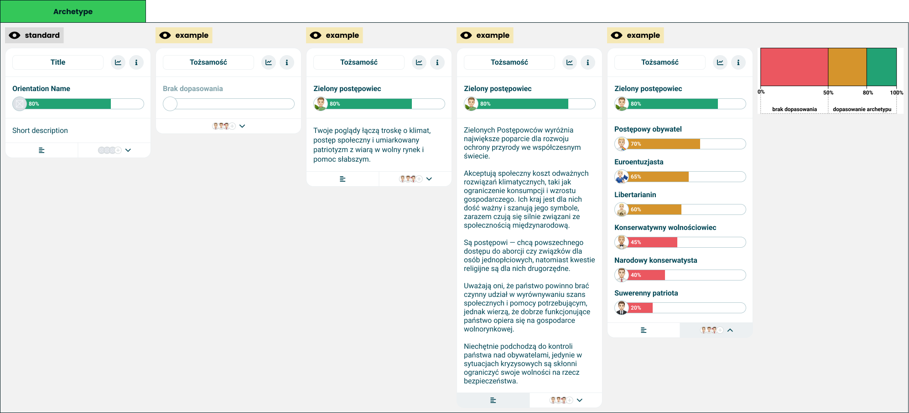

# Archetype

> Technical specification of the module that names the archetype a taker came out closest to.

Docs: [Archetype](../../docs/modules/quiz/results/modules/archetype.md). | Design: [Figma](https://www.figma.com/design/DIInW4qrIxsgXmKbSHukNm/mypolitics-app?node-id=5513-28187)

## Kind
Front-end

## Scope
One result module: a [module wrapper](./module-wrapper.md) around the leading archetype - its name, its match on a one-sided [universal axis](./universal-axis.md), and a description - with two controls that open the full description and the ranking of every other archetype. The module picks the leader from what it is given and remembers what the taker opened; it computes no score.

Not covered here:

- **How a bar draws a value or a comparison** - the [universal axis](./universal-axis.md) spec.
- **The three match bands** - the [header](./header.md) spec.
- **The row a ranking is made of** - the ranked row in the [horizontal bar chart](./horizontal-bar-chart.md) spec.
- **The card frame and its two buttons** - the [module wrapper](./module-wrapper.md) spec.
- **Whether an author's description is acceptable** - moderation.

## Data
| Input | Data | Meaning | Rules |
|---|---|---|---|
| Title | Text | The card's name | Optional, as in the wrapper |
| Archetypes | A list of orientation, match, short description and full description | Every archetype the quiz scores | Descriptions are optional |
| Comparison | The other party, and their match per archetype | A friend's matches on the same bars | Optional |
| Statistics action, info action | Present or absent | The wrapper's two buttons | Optional, independent |

An archetype is an orientation: a name, an image and a colour. A **match** is a number from 0 to 100. Names and both descriptions are author-supplied and untrusted.

The **leader** is the archetype with the highest match. With equal matches, the first in the order given leads.

## Interface
| Direction | Name | Shape | Notes |
|---|---|---|---|
| In | Everything in Data | - | Passed in by the result screen |
| Out | Statistics requested | An event with no payload | Passed through from the wrapper |
| Out | Info requested | An event with no payload | Passed through from the wrapper |

Which view is open is the module's own state.

## Behaviour

### Leader
| Case | Behaviour |
|---|---|
| The leader's match is a match or a partial match | Its name, and a one-sided bar with its image on the cap |
| The leader's match is no match | The "no match" wording, quiet, in place of the name, and an empty track with no cap |
| The bar | No marker and no labels |
| The bar's colour | The colour of the match's band, never the archetype's own colour |

### Views
The body under the leader shows one of three views.

| View | Content |
|---|---|
| Summary | The leader's short description |
| Full description | The leader's full description |
| Ranking | Every other archetype as a ranked row, highest match first, each bar in the colour of its own band |

The ranking is never cut: it shows every archetype it has.

### Controls
Two controls sit at the foot of the card, description first, ranking second.

| Case | Behaviour |
|---|---|
| Description control pressed | Opens the full description. Pressed again, returns to the summary |
| Ranking control pressed | Opens the ranking. Pressed again, returns to the summary |
| One view open and the other control pressed | Switches straight to the other view |
| The open view's control | Marked as active |
| Ranking control, closed | Previews the first few images from the ranking |
| Leader has no full description | No description control |
| No other archetypes | No ranking control |
| Neither control applies | No foot at all |

### No match
| Case | Behaviour |
|---|---|
| Summary | No description. The module does not describe an archetype it declined to name |
| Description control | Not shown |
| Ranking | Shows every archetype, the leader included, since none of them is drawn above it |

### Comparison
| Case | Behaviour |
|---|---|
| Comparison value for an archetype | Passed to that archetype's bar, on the leader and in the ranking |
| No comparison value for an archetype | That bar is drawn without an overlay |
| Comparison present | The leader and the order of the ranking do not change. The card stays the taker's |

## States and lifecycle
| State | Condition | What is possible in it |
|---|---|---|
| Summary - "standard" | Nothing opened | Open the full description, open the ranking |
| Full description | Description control active | Return to the summary, switch to the ranking |
| Ranking | Ranking control active | Return to the summary, switch to the full description |
| No match | The leader is below 50 | Open the ranking |

The module starts in the summary. The state lasts as long as the card is on screen and is not saved anywhere.

## Rules and constraints
- **No match is a result.** The module never names the least bad option.
- **One leader.** Runners-up live in the ranking, however close they are.
- **Descriptions are plain text.** Paragraph breaks are kept; markup, links and anything else in the text are shown as written and never interpreted.
- **A band colours a bar, an orientation does not.** Every bar on this card takes its colour from its match's band, so the ranking reads as strong, loose and none at a glance.
- **The module never hides itself.** With no archetypes it is an empty card under its title.

## Invalid and edge input
| Input | Behaviour |
|---|---|
| No archetypes | An empty card under its title |
| Match absent or not a number | Treated as zero, and listed last |
| Match outside 0-100 | Clamped |
| Short description missing, full description present | The summary has no text; the description control still opens the full one |
| Full description identical to the short one | No description control |
| Description that is only whitespace | Treated as missing |
| Archetype without an image | Its cap is drawn with colour only, and it is left out of the ranking control's preview |
| Archetype name longer than the row | Truncated; complete for assistive technology |
| Comparison value for an archetype not in the list | Ignored |

Nothing here throws.

## Non-functional

### Rendering contexts
The result screen, comparison mode and the generated result image. In the image the caller passes no actions and the module is drawn in the summary, since nothing there can be opened.

### Accessibility
- The leader's name is a heading inside the card.
- Each bar announces its archetype, match and comparison value, as the universal axis specifies.
- A band is never carried by colour alone: every bar has its number, and no match changes the wording.
- The two controls are buttons with text names, since each is drawn as an icon. Each says whether its view is open, and works from the keyboard.
- The ranking is an ordered list.
- When a view opens, focus stays on the control that opened it.

## Dependencies
**Build order: step 2.** Needs the [universal axis](./universal-axis.md) and the [module wrapper](./module-wrapper.md), both built, and from step 1 the [header](./header.md) for the match bands and the [horizontal bar chart](./horizontal-bar-chart.md) for the ranked row.

Relies on:

- [Archetype doc](../../docs/modules/quiz/results/modules/archetype.md) - the idea this implements.
- [Universal axis](./universal-axis.md) and [module wrapper](./module-wrapper.md).
- [Header](./header.md) - the match bands.
- [Horizontal bar chart](./horizontal-bar-chart.md) - the ranked row.

Relied on by nothing in this folder. The [short results card](../../docs/modules/quiz/results/short-results-card.md) reads the same leader and match.
