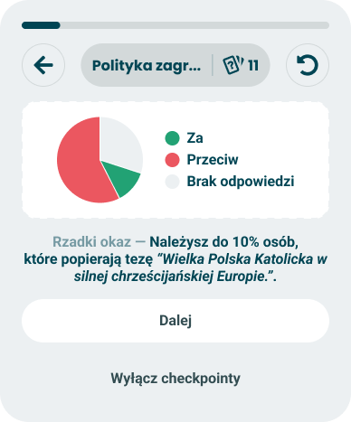

# Checkpoints

> Technical specification of what every checkpoint card shares: the frame, its two buttons, how a card sits in the questionnaire screen, and how turning checkpoints off leaves nothing behind.

Docs: [Checkpoints](../../docs/modules/quiz/questionnaire/checkpoints/README.md). | Design: [Figma](https://www.figma.com/design/DIInW4qrIxsgXmKbSHukNm/mypolitics-app?node-id=5582-98011)

## Kind
Front-end

## Scope
The frame every checkpoint card is drawn in, and the Checkpoints phase of the questionnaire screen. The frame holds a visual, one line of text made of a lead-in and a statement, an optional group of options, and two buttons: "Dalej" and "Wyłącz checkpointy". The phase is what the screen looks like while a card is up: the same progress bar and controls bar as during questions, with the card in place of the question and its answers.

The frame decides nothing about the taker. It draws what it is given and reports which button was pressed.

Not covered here:

- **When a card appears, and which one** - the [event model](./event-model.md). It also owns what turning checkpoints off does to the rest of the session.
- **What the lead-in and the statement say** - [random copy](./checkpoints-random-copy.md).
- **What goes into the visual and the options, and what a guess does** - the card specs: [halfway through](./halfway-through.md), [axis closeness](./axis-closeness.md), [new trait](./new-trait.md), [single axis puzzle](./single-axis-puzzle.md), [Nolan chart path](./nolan-chart-path.md), [double axis puzzle](./double-axis-puzzle.md), [stats chart](./stats-chart.md).
- **The questionnaire screen, its phases and the transition between two questions** - the [phases model](./phases-model.md).
- **The progress bar and the controls bar themselves** - both are built; see [progress and pacing](./progress-and-pacing.md). This spec only says what they show while a card is up.
- **The card frame of the result screen** - the [module wrapper](./module-wrapper.md). A checkpoint borrows a module's visual, never that frame: no title pill, no statistics or info button.

## Data
| Input | Data | Meaning | Rules |
|---|---|---|---|
| Visual | Any content | What the card shows: a chart, a pill, a number | Supplied by the card. Drawn inside the frame's panel |
| Lead-in | Text | The opener that sets the tone | Optional. From the card's pool |
| Statement | Text | The finding, with its values already filled in | Required. May carry author-supplied names and a quoted thesis, so it has no length limit |
| Options | Any content | The rows a puzzle offers | Optional. Supplied by the card |
| Continue available | Yes or no | Whether "Dalej" is offered right now | Yes unless the card says otherwise. A card may change it while it is up |

The opt-out is not an input. It is on every card in every state and a card cannot remove it.

## Interface
| Direction | Name | Shape | Notes |
|---|---|---|---|
| In | Everything in Data | - | From the card the [event model](./event-model.md) returned |
| Out | Continue requested | An event with no payload | "Dalej" was pressed |
| Out | Opt-out requested | An event with no payload | "Wyłącz checkpointy" was pressed |

The questionnaire screen listens to both. On either it closes the card and shows the next question; on the second it also tells the event model that checkpoints are off.

## Behaviour

### The frame
Top to bottom, in this order:

| Part | Behaviour |
|---|---|
| Visual | In a panel with a dashed outline, centred. The panel is as tall as the visual needs |
| Text | One centred paragraph: the lead-in in the quiet colour, a long dash, then the statement in bold. It wraps and is never cut |
| Options | Only when the card supplies them. Between the text and the buttons |
| "Dalej" | The main button. Only when continue is available |
| "Wyłącz checkpointy" | The quiet button under it. Always |

| Case | Behaviour |
|---|---|
| The paragraph does not fit on one line | It wraps as text does. The dash stays at the end of the lead-in and never starts a line |
| No lead-in | The statement alone, with no dash |
| A statement with a long name or a long quoted thesis | It wraps onto as many lines as it needs. The frame grows and the buttons move down with it |
| Continue is not available | "Dalej" is not drawn at all. It is not shown disabled |
| A card changes its visual, text or options while it is up - a puzzle revealing its answer | The frame redraws in place. It is still the same card |
| The frame's width | The width it is given. Its height follows its content |

The two labels are fixed texts of the frame and do not come from a pool. The dash is drawn by the frame and is part of no line.

### The two buttons
| Case | Behaviour |
|---|---|
| "Dalej" pressed | Continue requested, once. The card closes and the next question appears |
| "Wyłącz checkpointy" pressed | Opt-out requested, once. The card closes and the next question appears. No card appears again in this session, or after a reset |
| Either button pressed a second time while the card is closing | Nothing |
| "Wyłącz checkpointy" | Acts on the first press. There is no confirmation and no undo |
| A card that is waiting for a choice | "Wyłącz checkpointy" still works. Together with the card's own options it is the way forward |

### In the questionnaire screen
A card takes the place of the question, its answers and "Pomiń". Everything above it stays.

| Part of the screen | While a card is up |
|---|---|
| Progress bar | Drawn, at the value the questionnaire has after the question just done. It does not move when the card appears or closes |
| Controls bar, pill | What it will show for the question that follows the card - its category and the questions left. It does not change when the card closes |
| Controls bar, back | Disabled. A card is not a place to go back from |
| Controls bar, reset | Enabled. It opens the same confirmation as during questions |
| Question, answers, "Pomiń" | Not drawn |

| Case | Behaviour |
|---|---|
| A card appears | After the answer's own animation, with the transition a change of question uses |
| A card closes | The next question appears with the same transition |
| Reset confirmed while a card is up | The card closes and the session starts over, as from any question. The opt-out, if it was set earlier, stays |
| Reset cancelled | The card is still up, unchanged |
| The taker goes back after a card has closed | The previous question returns and its answer is removed, as always. The card does not come back, then or when that question is answered again |
| The page is reloaded while a card is up | The same card is up again, with the same wording and the same values. A puzzle starts from its first state |
| Two cards | Never. One card at a time, and never one straight after another |

The time a card is on screen is not counted as time spent on any question.

### Turning checkpoints off
| Case | Behaviour |
|---|---|
| Checkpoints are off | The Checkpoints phase does not occur. One question follows another exactly as when no card fires: no gap, no delay, no placeholder, no notice |
| The rest of the screen | Unchanged. The bar, the pill and the buttons behave as they do with checkpoints on |
| The taker wants them back | No control offers it in this session, and a reset keeps them off. A session started any other way - another quiz, or the same quiz after the taker was sent to the results - has checkpoints on |

### Degrade to nothing
The questionnaire must work as if checkpoints did not exist. Every way a card can go wrong ends the same way: no card, next question.

| Case | Behaviour |
|---|---|
| The event model returns nothing | The next question appears |
| A card arrives without a statement | It is not shown. The next question appears |
| A card arrives without a visual | It is not shown. The next question appears |
| Any part of a card fails to draw | The whole card closes and the next question appears. Nothing of the failure is shown |
| A card is up and cannot be continued | Cannot happen: the opt-out is always drawn, and a card that fails closes |

## States and lifecycle
| State | Condition | What is possible in it |
|---|---|---|
| Passive card - every frame except the two below | Continue available, no options | Continue, turn checkpoints off, reset |
| Waiting for a choice - "single-axis puzzle", first frame | Options, continue not available | Choose an option, turn checkpoints off, reset |
| Options with continue - "double-axis puzzle", first frame | Options, continue available | Choose an option, continue, turn checkpoints off, reset |
| Closed | A button was pressed, the card failed, or the session was reset | The questionnaire shows a question |

A card moves between the first three states only when its own spec says so. The frame draws whichever it is told.

## Rules and constraints
- **One finding per card.** One visual, one statement. The frame has no second slot for either.
- **The opt-out is always one press away.** On every card, in every state, at the same place.
- **A card never traps the taker.** There is always a button that leaves it.
- **The frame is the same for every card.** A card fills the visual, the text and the options. It cannot move the buttons, rename them or restyle the frame.
- **Not a dialog.** The card is part of the page. It does not cover the screen, hold the focus inside itself or close on the Escape key.
- **No pressing through.** A press on the visual or the text does nothing. Only the buttons and a card's own options act.
- **No timer.** A card stays until the taker acts. Nothing closes it automatically.
- **Not supported: a third button, a link out of the quiz, or a way to share a card.**

### Calls and their cost
| Call | Instead of | Cost |
|---|---|---|
| Back is disabled while a card is up | Figma, which draws the back button enabled on every card frame | A taker who wants to change the answer just given has to dismiss the card first |
| "Wyłącz checkpointy" acts at once, with no confirmation and no undo | Nothing in the doc or in Figma | A slip of the finger turns checkpoints off for the whole session. The button sits under "Dalej" and is drawn quieter to make that rarer |
| A card that cannot be drawn completely is not drawn at all | Showing what is left of it | A finding is lost because its chart failed. A statement without its chart would be a claim with no evidence |
| The pill shows the question that follows | Nothing in the doc. Figma shows a category and a count without saying whose | When the card stands between two categories, the pill already names the new one |
| A reload brings the same card back | Treating a reload as "Dalej" | The session has to keep which card is up. A puzzle guess made before the reload is forgotten |
| No message confirms that checkpoints were turned off | Nothing in Figma | The taker gets no acknowledgement beyond the cards stopping |

## Invalid and edge input
| Input | Behaviour |
|---|---|
| Lead-in missing, empty or only whitespace | No lead-in and no dash |
| Statement missing, empty or only whitespace | The card is not shown |
| Statement or lead-in with line breaks | Collapsed to one paragraph |
| Text with markup or a link in it | Shown as written, never interpreted. Names and theses are author-supplied |
| Visual wider than the panel | The visual is given the panel's inner width. What does not fit is the card's to solve; the frame never scrolls sideways |
| Options given, but empty | Treated as no options |
| Continue not available and no options | Continue is treated as available, so the card can be left the ordinary way |
| A very narrow screen | The frame keeps its order. Text wraps, buttons stay full width, nothing is cut |

Nothing here throws.

## Privacy and data handling
- **A card shows a partial result on screen.** The frame keeps nothing of it and sends nothing anywhere.
- **The opt-out is one yes-or-no value**, kept with the session in the browser and nowhere else.
- **No analytics event is defined here.** The opt-out rate that [analytics](../../docs/platform/analytics.md) asks for is specified there, not sent from this frame.

## Failure modes
| Failure | Behaviour |
|---|---|
| The visual, the text or the options fail to draw | The card closes, the next question appears, and the card is not tried again |
| The event model fails | No card, as when it returns nothing |
| The session cannot be saved, so the opt-out is not kept | It holds until the page is reloaded. After a reload checkpoints are on again |
| The card cannot be restored after a reload | The next question appears |

## Non-functional

### Rendering contexts
The questionnaire screen only. A checkpoint is never drawn on the result screen or in a generated image.

### Accessibility
- **The card is a labelled region**, named "Checkpoint".
- **Focus moves to the text when a card appears.** The lead-in and the statement are read as one sentence, lead-in first. The text takes focus only this way and is not a stop for the Tab key.
- **It is announced once.** The move of focus is the announcement; the text is not also sent to a live region.
- **Reading and Tab order follow the frame:** visual, text, options, "Dalej", "Wyłącz checkpointy". The controls bar comes before the card, as it does before a question.
- **When a card changes in place**, focus moves to the new text, so a revealed answer is announced like a new card.
- **When a card closes**, focus goes where a change of question puts it.
- **The visual has a text alternative** that says what the chart shows. Each card spec writes it. The statement must make sense without the visual.
- **Both buttons are buttons**, work with Enter and Space, show a visible focus state, and have a pressable area of at least the minimum touch target - the quiet one included.
- **The quiet colour of the lead-in still meets the contrast minimum.** Quiet and bold are style, not meaning: nothing is said by colour alone.
- **Reduced motion.** With the reduced-motion setting on, a card appears and closes without movement.
- **Disabled back is announced as disabled**, not hidden.

### Performance
A card appears no later than the next question would have. Drawing it never delays the answer's own animation.

## Dependencies
Relies on:

- [Checkpoints doc](../../docs/modules/quiz/questionnaire/checkpoints/README.md) and [gamification](../../docs/modules/quiz/questionnaire/gamification.md) - the idea this implements.
- [Event model](./event-model.md) - the card to show, and the opt-out.
- [Random copy](./checkpoints-random-copy.md) - the lead-in and the statement.
- The [phases model](./phases-model.md) - the screen, the transition between questions, back and reset.
- [Session and data](./session-and-data.md) - the session the opt-out is kept with, and what a reload restores.
- [Progress and pacing](./progress-and-pacing.md) - the bar above the card.
- [Universal axis](./universal-axis.md) and the result modules - the visuals cards borrow.

Relied on by every card spec: [halfway through](./halfway-through.md), [axis closeness](./axis-closeness.md), [new trait](./new-trait.md), [single axis puzzle](./single-axis-puzzle.md), [Nolan chart path](./nolan-chart-path.md), [double axis puzzle](./double-axis-puzzle.md), [stats chart](./stats-chart.md).
