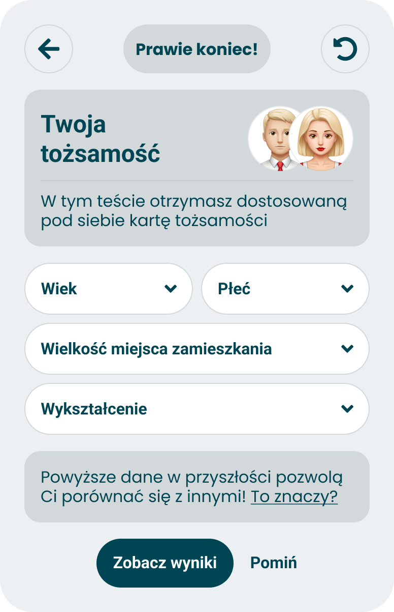

# Demographics

> Technical specification of the four demographic fields of the questionnaire: their option lists, the two buttons under them, and when what was picked is sent.

Docs: [Demographics](../../docs/modules/quiz/data-harvesting/demographics.md). | Design: [Figma](https://www.figma.com/design/DIInW4qrIxsgXmKbSHukNm/mypolitics-app?node-id=5582-98067)

## Kind
Front-end

## Scope
The fourth phase of the questionnaire: a card with a heading, four dropdowns - age, gender, size of the place of residence, education - a line that explains why they are asked with a dialog behind it, and two buttons, "Zobacz wyniki" and "Pomiń". The card and its dialog are built and take their option lists from outside. This spec sets those lists, the rule for the two buttons, and what of the picked values is sent with the result.

The API that stores the result already takes demographics, so nothing is specified for the back-end. Its limits decide three things here, each of which gives up a line of the doc - see "Rules and constraints".

What it does not cover, and where that lives:

- **Where the phase stands, what back and reset do, and the bar and the pill above the card** - [phases model](./phases-model.md).
- **How the values are stored over a refresh, and the request that carries them** - [session and data](./session-and-data.md).
- **Remembering the values for the next quiz** - the doc stores them on the account. Taking a quiz needs no account, see [accounts](../../docs/platform/accounts.md), so they are asked in every session.
- **What may be said with the fields, and how they leave the platform** - the [data module](../../docs/modules/data/README.md) and [exports](../../docs/modules/quiz/data-harvesting/exports.md).
- **The post-survey** - [post-survey module](../../docs/modules/quiz/data-harvesting/post-survey-module.md). The doc places demographics next to it; it is not built, and demographics do not wait for it.
- **Which form of an orientation's name a declared gender picks** - [universal orientation](./universal-orientation.md).
- **Whether the taker is asked for an e-mail afterwards** - [results saving and marketing](./results-saving-and-marketing.md), which reads the declared age from here.

## Data

### The fields
| Field | Name on the card | Width | Sent as |
|---|---|---|---|
| Age | "Wiek" | Half a row | `age`, a number |
| Gender | "Płeć" | Half a row | `gender` |
| Size of the place of residence | "Wielkość miejsca zamieszkania" | A full row | `residenceAreaSize` |
| Education | "Wykształcenie" | A full row | `education` |

The name is the field's placeholder, as built: a field with nothing picked shows its name, and a field with a value shows the value.

### Age
| Option | Sent as |
|---|---|
| "13", "14", and so on to "99", one option per year | That number |

Eighty-seven options, youngest first. There is no "under 18" option: the API accepts an age from 13 to 120 and would refuse the 0 the old product used for it.

### Gender
| Option | Sent as |
|---|---|
| "Kobieta" | `female` |
| "Mężczyzna" | `male` |
| "Inna" | `other` |
| "Wolę nie podawać" | `prefer_not_to_share` |

### Size of the place of residence
| Option | Sent as |
|---|---|
| "Wieś" | `village` |
| "Miasto do 50 tys. mieszkańców" | `city_below_50k` |
| "Miasto od 50 do 200 tys. mieszkańców" | `city_below_200k` |
| "Miasto od 200 do 500 tys. mieszkańców" | `city_below_500k` |
| "Miasto powyżej 500 tys. mieszkańców" | `city_over_500k` |

### Education
The highest level completed.

| Option | Sent as |
|---|---|
| "Podstawowe" | `primary` |
| "Zasadnicze zawodowe" | `basic_vocational` |
| "Średnie" | `secondary` |
| "Wyższe" | `higher` |

The lists belong to the questionnaire and are the same in every quiz. The values on the right are every value the API accepts for the last three fields, and nothing else can be sent.

### Texts on the card
All are built and match the frame.

| Where | Text |
|---|---|
| Heading | "Twoja tożsamość" |
| Under the heading | "W tym teście otrzymasz dostosowaną pod siebie kartę tożsamości" |
| Under the fields | "Powyższe dane w przyszłości pozwolą Ci porównać się z innymi!" followed by the link "To znaczy?" |
| Dialog, title | "Zakres wykorzystania danych" |
| Dialog, body | "Dzięki Twoim odpowiedziom w tej sekcji będziemy mogli przeanalizować Twoje wyniki w przyszłości w celu poprawienia działania quizu, a także przygotowania analiz na data.mypolitics.pl." and, in bold, "Twoje dane pozostaną całkowicie anonimowe." |
| Primary button | "Zobacz wyniki" |
| Second button | "Pomiń" |

## Interface
| Direction | Name | Shape | Notes |
|---|---|---|---|
| In | Picked values | Up to four, from the session | Empty in a new session; kept over a refresh and over going back and forth |
| Out | Value picked | The field and the option | Raised on every pick |
| Out | Given | An event with no payload | "Zobacz wyniki" pressed |
| Out | Skipped | An event with no payload | "Pomiń" pressed |
| Out | Declared age | Under 18, another age, or not declared | Read by the e-mail phase. It is whatever is picked in the age field, whichever button the card was left with |
| Out | Demographics to send | All four values, or nothing | Read by [session and data](./session-and-data.md) when the result is created |

## Behaviour

### Picking
| Case | Behaviour |
|---|---|
| The phase opens in a new session | Four fields, nothing picked, each showing its name |
| A field is opened | Its options are listed in the order of the tables above |
| An option is picked | The field shows it. The other fields are untouched |
| A field with a value is opened again | Another option can be picked. The value can be changed and cannot be emptied |
| The taker wants to take a value back | There is no way to clear one field. "Pomiń" leaves all four out |
| "To znaczy?" is pressed | The dialog opens over the card. Closing it returns to the card with everything as it was |

### The buttons
| Case | Behaviour |
|---|---|
| Fewer than four fields are picked | "Zobacz wyniki" is off. "Pomiń" works |
| All four are picked | "Zobacz wyniki" works. "Pomiń" still works |
| "Zobacz wyniki" | The demographics are given, and the next phase comes |
| "Pomiń", with nothing picked | The demographics are not given, and the next phase comes |
| "Pomiń", with some or all fields picked | The same. Nothing picked is sent, however complete it is. The values stay on the card for as long as the session lasts |
| A button was pressed and the screen is changing | The fields and both buttons take no further press |
| Gender is "Wolę nie podawać" | The field counts as picked. It is the one field with a way to decline inside the list |

"Zobacz wyniki" keeps its label when an e-mail card or the loader still stands between the taker and the result. The frame names it so, and the result is what the press leads to.

### Coming back to the card
| Case | Behaviour |
|---|---|
| Back from the e-mail card | The card shows what was picked. Both buttons work by the rules above, and whichever is pressed now decides again whether the values are given |
| Back from this card to the last question, then forward again | The same values are picked |
| The page is refreshed on this card or on the e-mail card | The values come back with the session |
| The quiz is reset | Nothing is picked |
| Another quiz is started, or the same one after the result | Nothing is picked. The fields are asked again |

### What is sent
| Case | Behaviour |
|---|---|
| The card was last left with "Zobacz wyniki" | All four values travel with the answers, in the same request, as the "sent as" columns say |
| The card was last left with "Pomiń" | No demographics are sent |
| Any age | Sent as the number picked, 13 to 99 |
| The API refuses the request because of the demographics | The hand-in fails as a whole, see [session and data](./session-and-data.md). It is never repeated without the demographics. Every option is a value the API accepts, so this takes a defect or a changed API |
| The result is created | The values are sent once and are not sent anywhere else |

### Age and the e-mail card
| Case | Behaviour |
|---|---|
| An age under 18 is picked - "13" to "17" - and the card is left with either button | The e-mail phase is left out of this session |
| An age of 18 or more is picked | The e-mail phase follows, when sending is set up |
| No age is picked | The same. Nobody is asked their age in order to leave an e-mail |

## States and lifecycle
| State | Condition | What is possible in it |
|---|---|---|
| Empty | Nothing picked | Pick, skip, open the dialog |
| Partial | One to three fields picked | Pick, change, skip, open the dialog |
| Complete | All four picked | Change, give, skip, open the dialog |
| Dialog open | "To znaczy?" was pressed | Read, close |
| Leaving | A button was pressed | Nothing |

The [phase screen](https://www.figma.com/design/DIInW4qrIxsgXmKbSHukNm/mypolitics-app?node-id=5582-98067) draws the empty state with "Zobacz wyniki" as it looks when it works. The off state of that button is not drawn and follows the design system. The [dialog](https://www.figma.com/design/DIInW4qrIxsgXmKbSHukNm/mypolitics-app?node-id=4275-1703) is drawn on the component board.

## Rules and constraints
- **Four fields, fixed lists, no free text.** Nobody can type anything, so nothing identifying can be typed, and answers stay comparable across quizzes and years.
- **All four or none.** The API takes demographics only complete. The doc makes every field skippable on its own; here a taker who would give three fields gives none. It is the cost of the API as it is, and it ends when the back-end takes a partial set.
- **Exact years, not bands.** The doc asks for an age band, not a birth date. The API takes a number, so the list offers every year from 13 to 99. This is finer than the doc promises, and finer data narrows anonymity - the risk the doc itself names. Bands need a field the back-end does not have yet; until then the list is one option per year the API accepts, up to 99.
- **No "under 18" option.** The old product offered "Mniej niż 18" and sent it as 0, which the API refuses: it takes an age from 13 to 120. The list starts at 13 instead, and a taker of 13 to 17 picks their year like everyone else. It costs minors the cover of a single band; an age under 18 still keeps them from the e-mail card.
- **Asked every time.** There is no account to store the values on, so "asked once" is not delivered. They live with the session and end with it.
- **Skipping is free and complete.** "Pomiń" is always on, never dimmed, and nothing picked before it is sent.
- **Giving is a deliberate press.** Picking values sends nothing. Only "Zobacz wyniki" marks them as given.
- **The lists do not change quietly.** Changing an option changes what years of collected data mean. A new option needs a new value in the API first.
- **Not collected: region.** The old product offered a voivodeship as a fifth field, and the API has no field for one. The doc, the frame and the built card have four.
- **Not supported: a different list per quiz.** An author cannot add, remove or reword a field.

The lower end of the age list follows the API as its source reads: `age` is a whole number from 13 to 120. Every option is therefore a value the API accepts, and no hand-in is ever repeated without its demographics to get it stored.

## Invalid and edge input
| Input | Behaviour |
|---|---|
| A stored value that is not in its list - a restored session after a list changed | That field is empty, and the demographics count as not given |
| A stored set marked as given with fewer than four values | Not given |
| A list handed to the card empty | That field cannot be opened, as built. "Zobacz wyniki" can then never work; "Pomiń" does |
| A long option on a narrow phone | The field shows it cut with an ellipsis; the open list shows it in full |
| The age list on a phone | Eighty-seven options in one scrolling list, youngest first |
| A taker younger than 13 | The list has no option for them. "Pomiń" leaves demographics out |
| A taker older than 99 | Picks "99". The list ends there |
| A press on a button twice | One action |

## Privacy and data handling
- **Demographics are views-side data.** They are stored, sent and removed together with the answers, and never with an identity - see [privacy and legal](../../docs/platform/privacy-and-legal.md).
- **They never meet the e-mail.** The request that sends the results link carries no demographic value, and the request that carries demographics carries no address.
- **Age, gender, town size and education next to a political result narrow anonymity.** The dialog promises "Twoje dane pozostaną całkowicie anonimowe". That promise is kept by what is done with the data afterwards, not by this card: exact years make it harder to keep, and the [exports](../../docs/modules/quiz/data-harvesting/exports.md) are where it is kept or broken.
- **Nothing is sent before the hand-in.** Picking a value sends nothing, to the back-end or to analytics. An analytics event may say that the card was given or skipped, never what was picked.
- **Until the hand-in the values sit in the tab.** They are readable on that device like the answers are, and are removed with them.
- **Minors.** A taker of 13 to 17 who gives demographics gives an exact age, like everyone else, and only if they choose to. It travels with the answers and nowhere else, and it keeps the e-mail card away, so no address is ever taken from them.

## Non-functional

### Accessibility
- Each field is named by its field name and announces the picked option.
- The fields, the link and the two buttons are reached by keyboard in reading order: age, gender, residence, education, "To znaczy?", "Zobacz wyniki", "Pomiń".
- "Zobacz wyniki" while off is announced as unavailable, and says why to assistive technology: "Wybierz wszystkie cztery pola albo pomiń". The frame has no visible line for it; a taker who filled three fields sees a dimmed button next to a working "Pomiń".
- The dialog takes focus when it opens, keeps it inside, closes with Escape and with its close button, and returns focus to "To znaczy?".
- Opening the phase puts focus on the heading of the card.

### Rendering contexts
The card takes the width of the frame. Age and gender share a row at every width the questionnaire is drawn at, including the narrowest phones.

## Dependencies
Relies on:

- [Demographics doc](../../docs/modules/quiz/data-harvesting/demographics.md) - the idea this implements.
- [Phases model](./phases-model.md) - the phase, its controls, and what comes after each button.
- [Session and data](./session-and-data.md) - keeping the values, and sending them.
- The [survey API](https://api.mypolitics.pl/api) - the values it accepts. This spec asks it for two things: a partial set of demographics, and an age band in place of a number.
- The built demographics card and its dialog.

Relied on by:

- [Results saving and marketing](./results-saving-and-marketing.md) - the declared age decides whether its phase exists.
- [Universal orientation](./universal-orientation.md) - the declared gender chooses the form of a name where a result is drawn.
- The data module and the exports - the four fields travel with the answers.
