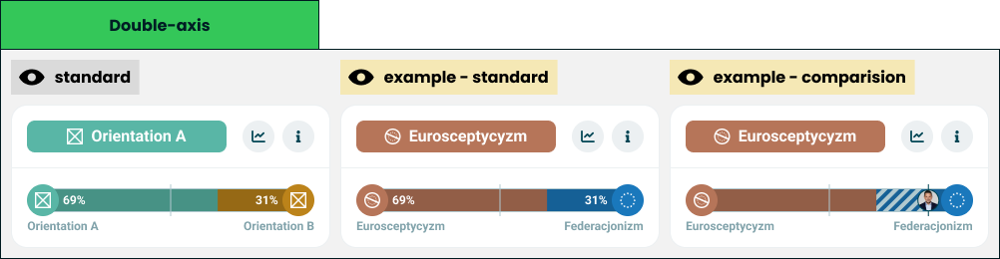

# Double axis chart

> Technical specification of the module that shows two opposing orientations on one bar.

Docs: [Double axis chart](../../docs/modules/quiz/results/modules/double-axis-chart.md). | Design: [Figma](https://www.figma.com/design/DIInW4qrIxsgXmKbSHukNm/mypolitics-app?node-id=5500-2387)

## Kind
Front-end

## Scope
One result module: a [module wrapper](./module-wrapper.md) whose title names the leading side and whose body is a single double-sided [universal axis](./universal-axis.md) with both poles labelled. It holds no state and computes no score.

It also defines the **lead rule** - which side of a pair is the winner, and when there is none. The [multi axis chart](./multi-axis-chart.md) uses the same rule.

Not covered here:

- **How the bar draws two values, a marker or a comparison** - the [universal axis](./universal-axis.md) spec.
- **The card frame and its two buttons** - the [module wrapper](./module-wrapper.md) spec.
- **Which two orientations are paired** - quiz configuration. The pairing is the author's.

## Data
| Input | Data | Meaning | Rules |
|---|---|---|---|
| Start entry | Orientation and value | The pole on the left cap | Required |
| End entry | Orientation and value | The pole on the right cap | Required |
| Marker | Position 0-100, or off | The reference line on the bar | Defaults to 50 |
| Comparison | Orientation and value | The other party on the same bar | Optional |
| Statistics action, info action | Present or absent | The wrapper's two buttons | Optional, independent |

An orientation carries a name, an image and a colour, as in the universal axis.

The two values are drawn as given. The module does not make them add up to a hundred: a pair of 47 and 31 leaves a gap in the middle of the bar.

## Interface
| Direction | Name | Shape | Notes |
|---|---|---|---|
| In | Everything in Data | - | Passed in by the result screen |
| Out | Statistics requested | An event with no payload | Passed through from the wrapper |
| Out | Info requested | An event with no payload | Passed through from the wrapper |

## Behaviour

### Lead
The lead is decided on the values as the taker sees them - rounded to whole numbers - so the title can never contradict the bar.

| Case | Lead |
|---|---|
| One displayed value is higher | That side |
| Both displayed values are equal, including both zero | None. It is a tie |
| One value absent | The side that has a value, if it is above zero |
| Both values absent | None |

### Title
| Case | Behaviour |
|---|---|
| There is a lead | A chip with the leading orientation's icon and name, filled with its colour |
| Tie | A neutral chip naming both poles, start first, with no icon and no colour |
| Tie, title slot narrower than the tie breakpoint | The chip shows the word for a tie instead of the names |
| Tie, title slot at or above the breakpoint, names too long for it | Each name is truncated on its own, so both poles and the separator stay visible |
| Leading orientation without an image | The chip shows the name alone |

The title names the side the taker landed on, not the axis. The chip is never interactive.

A tie title never shows one pole alone. The title slot is a single line, and two names cut to the first one would read as a lead that the bar under it contradicts. Both poles stay named under their caps, so the short form loses nothing.

The tie breakpoint is a **fixed width** of the title slot, tuned once for a typical pair of names. It depends on the width the title is given, not on the viewport, and not on whether a particular pair fits: nothing is measured, so two cards of the same width always show the same form. That is why names too long for a wide slot are shortened one by one rather than switched to the word.

### Bar
| Case | Behaviour |
|---|---|
| Both values present | A double-sided bar, each side filled from its own cap |
| Values that do not reach 100 together | The gap stays in the middle |
| One value absent | That side has no fill and no number; its cap and label still show |
| Both values absent | An empty double-sided track with both caps and labels |
| Comparison present | Passed to the bar unchanged |

Labels are always on: each pole is named under its own cap.

The frame at the top of this page shows its comparison example without numbers. It predates the rule on values next to a comparison in the [universal axis](./universal-axis.md#with-a-comparison) and is to be redrawn.

## Rules and constraints
- The module adds nothing to the bar's own rules. Value placement, hidden small values, the marker and the comparison band behave exactly as the universal axis specifies.
- A narrow lead is still a lead. 51 against 49 names a side; the marker is what shows how narrow it is.
- The module never hides itself.

## Invalid and edge input
| Input | Behaviour |
|---|---|
| Value outside 0-100 | Clamped by the bar. The lead uses the clamped values |
| Values that exceed 100 together | Scaled by the bar. The lead uses the values as given |
| Value not a number | Treated as absent |
| Orientation name missing | Its label row stays reserved and empty. If it leads, the chip shows the image alone |
| Orientation names longer than the room | Each label is truncated by the bar, a title with a lead by the wrapper; both stay complete for assistive technology. On a tie each name is truncated on its own, see Title |
| Orientation without a colour | The neutral fallback, on the chip and on the bar |
| Both poles are the same orientation | Drawn as given. The module does not check the pairing |

Nothing here throws.

## Non-functional

### Rendering contexts
The result screen, comparison mode and the generated result image. In the image the caller passes no actions.

### Accessibility
- The card is named after the leading orientation, or after both poles on a tie, through the accessible name the wrapper takes for a component title.
- The bar announces both orientations, both values and the comparison value, as the universal axis specifies.
- The lead is never carried by colour alone: the title says it in words.

## Dependencies
**Build order: step 1.** Needs the [universal axis](./universal-axis.md) and the [module wrapper](./module-wrapper.md), both built. It can be built alongside the [single axis chart](./single-axis-chart.md), [traits](./traits.md) and the [header](./header.md).

Relies on:

- [Double axis chart doc](../../docs/modules/quiz/results/modules/double-axis-chart.md) - the idea this implements.
- [Universal axis](./universal-axis.md) and [module wrapper](./module-wrapper.md).

Relied on by:

- [Multi axis chart](./multi-axis-chart.md) - uses the lead rule for every group, so this comes first.
- [Nolan chart](./nolan-chart.md) - opens into two double-sided bars.
