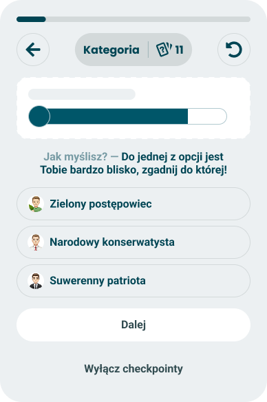
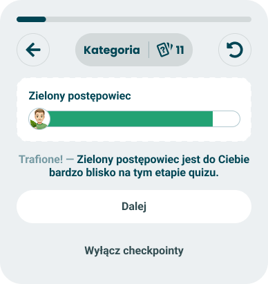
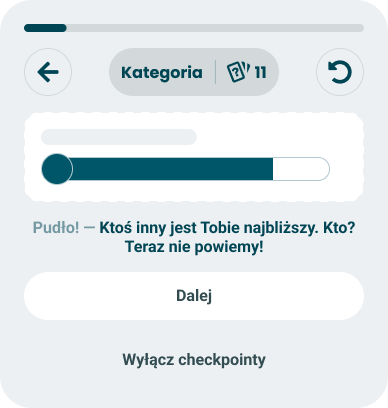

# Double axis puzzle

> Technical specification of the checkpoint card that shows how close the taker is to one archetype without naming it, and asks them to pick it out of three.

Docs: [Double axis puzzle](../../docs/modules/quiz/questionnaire/checkpoints/double-axis-puzzle.md). | Design: Figma - [ask](https://www.figma.com/design/DIInW4qrIxsgXmKbSHukNm/mypolitics-app?node-id=5516-68069) | [hit](https://www.figma.com/design/DIInW4qrIxsgXmKbSHukNm/mypolitics-app?node-id=5516-68119) | [miss](https://www.figma.com/design/DIInW4qrIxsgXmKbSHukNm/mypolitics-app?node-id=5516-68344)

| Ask | Hit | Miss |
|---|---|---|
|  |  |  |

## Kind
Front-end

## Scope
One checkpoint card with three states: what it puts into the shared card frame in each (a closeness bar with its name masked or uncovered in the visual slot, a lead-in and a statement, three option rows while it asks), how the three options are chosen and ordered, when the card asks to be shown, what a tap does, and what happens in a quiz that cannot run it. The card holds one piece of state of its own - whether the taker has guessed, and whether the guess was the closest archetype.

The name is the doc's. The card is about archetypes - named positions, each built from many axes - and not about one axis with two poles.

Not covered here:

- **The card frame, the progress bar and the controls above it, the buttons "Dalej" and "Wyłącz checkpointy", and what each does** - the [checkpoints](./checkpoints.md) spec.
- **Which card wins a slot, the pacing numbers, the opt-out, the seeded draw, and the running state this card reads** - the [event model](./event-model.md) spec. This spec states the card's own trigger and gate, and what its draw must guarantee.
- **The pools of alternative lines and how one is drawn** - the [checkpoint random copy](./checkpoints-random-copy.md) spec.
- **How a bar draws a fill and a cap** - the [universal axis](./universal-axis.md) spec. **The row of a name over a bar** - the ranked row in the [horizontal bar chart](./horizontal-bar-chart.md) spec. **The three match bands** - the [header](./header.md) spec.
- **The archetype's description and the ranking of the others** - the result's [archetype](./archetype.md) module. The card shows neither.
- **Keeping the guess** - the doc wants it kept; the result the API takes has no field for it, so nothing stores it.
- **A reveal a few questions later** - not built. A hit is revealed on the card and a miss is never revealed.

## Data
| Input | Data | Meaning | Rules |
|---|---|---|---|
| Archetypes | A list of orientation and closeness, in the quiz's order | Every archetype the quiz scores | From the quiz and the running state, read once when the card fires |
| Questions done, questions in the quiz | Counts | Progress | From the running state. Done is answered plus skipped |
| Session seed | The seed of the session | What makes the draw repeatable | The session's own, see [session and data](./session-and-data.md). The card reaches it only through the event model's seeded draw |
| Lines | A lead-in and a statement for each of ask, hit and miss | The wording | From three copy pools, one per state |

An **archetype** is an orientation used as a named position, as the [universal orientation](./universal-orientation.md) spec puts it. The survey API has no mark for it and no module configuration, so the card takes the quiz's orientations of type identity. When a quiz can say which orientations its archetype module points at, that list is used and the type is not checked.

An **eligible archetype** is one that is not hidden and has a name.

**Closeness** is the archetype's value in the running state, 0-100: how far the answers so far support it. It is the mid-quiz counterpart of the match the result shows.

The **leader** is the eligible archetype with the highest closeness and the **runner-up** the next one. With equal closeness, the one that comes first in the quiz is ahead - the same tie rule as the result's [archetype](./archetype.md) module. Ranking uses the exact values.

The name and the image of an archetype may come in a masculine and a feminine form. The taker's gender is not asked before the end of the quiz, so the card shows the form the universal orientation spec gives a taker who was not asked yet: the masculine one.

## Interface
| Direction | Name | Shape | Notes |
|---|---|---|---|
| In | Running state | Closeness of every archetype, questions done | Read at each question boundary |
| In | Seeded draw | A repeatable pick and a repeatable order, keyed to this card | From the event model. See Options |
| In | Shown before | Whether this card was already shown in this session | Kept by the event model with the session |
| In | Lines | A lead-in and a statement for the state being shown | Drawn by the copy pool. The hit pool has a slot for the leader's name |
| Out | Candidate | "Double axis puzzle is due", with the leader, its closeness and the three options in order | Offered to the event model at a question boundary |
| Out | Card content | The visual, the lead-in, the statement and the option rows | Handed to the card frame when the event model picks this card |

The guess never leaves the card. Continuing and turning checkpoints off belong to the frame.

## Behaviour

### When it may fire
| Property | Value |
|---|---|
| Trigger | The leader is clearly ahead of the runner-up |
| Gate | Half the questions or more are done; the leader's closeness is 5 points or more above the runner-up's; the leader's closeness is 50 or more; the quiz has three or more eligible archetypes |
| Class | Personal |
| How often | Once per run of the quiz, whatever the taker does on it |

| Case | Behaviour |
|---|---|
| Every part of the gate holds at a question boundary | The card is offered |
| Fewer than half the questions are done | Not offered, however wide the separation |
| The separation is under 5 points | Not offered. The answer the guess is marked against would be arbitrary |
| The leader's closeness is under 50 | Not offered. The result's archetype module names nobody under 50, and the card does not name the least bad option either |
| The card was offered and the event model dropped it | It is offered again at a later boundary for as long as the gate holds |
| The card was shown - guessed, continued without a guess, or closed by the opt-out | Never offered again in this run |
| The taker goes back and removes answers after the card was shown | The card stays used |
| The quiz is reset | A new run: the card can be shown once again |
| Checkpoints were turned off earlier | Never shown |
| The quiz has no archetypes, or fewer than three eligible ones | The card never fires. Nothing replaces it and the taker sees no gap |

The pacing numbers that decide whether an offered card is shown are the event model's and are not repeated here.

### Options
Three option rows: the leader and two distractors.

| Case | Behaviour |
|---|---|
| The correct option | The leader |
| Where distractors come from | The four eligible archetypes ranked right behind the leader. With fewer than five eligible archetypes, all the others |
| How the two are picked | Drawn from those with the seeded draw |
| Order of the three rows | Shuffled with the seeded draw. The leader has no fixed place |
| A row | The archetype's image, then its name |
| Two archetypes with the same name | The later one in the ranking is left out before the draw. Two rows never read the same |

The distractors are the taker's own near misses: close enough to be plausible, and at least the gate's 5 points behind the leader.

What the seeded draw guarantees:

| Case | Behaviour |
|---|---|
| The same session seed and the same answers in the same order | The same two distractors, in the same order |
| The card is shown again after a page refresh | The same three rows in the same order |
| Another card drew a line or anything else before this one | No effect. The card's draw is keyed to this card and does not shift with the number of earlier draws |
| A different session | The draw may differ |

### Ask
| Case | Behaviour |
|---|---|
| Visual | A blank placeholder where the name will be, and under it a one-sided bar filled to the leader's closeness |
| The bar's colour | Neutral. Not the leader's colour and not the colour of its match band |
| The bar's cap | The neutral colour alone. The leader's image is not drawn |
| Number, marker | Not drawn |
| Text | The ask line |
| Options | The three option rows, under the text |
| "Dalej" | Offered. It continues to the next question without a guess; nothing is revealed and the card counts as shown |
| "Wyłącz checkpointy" | Offered, as on every card |

This follows the ask frame of this card, which has "Dalej". The [single axis puzzle](./single-axis-puzzle.md) asks without it.

### Guess
| Case | Behaviour |
|---|---|
| The taker taps the leader's row | The card moves to hit |
| The taker taps either other row | The card moves to miss |
| A second tap while the card is changing | Ignored. The first tap is the guess |
| After the guess | The option rows are gone and the guess cannot be changed |

Hit or miss is decided against the ranking read when the card fired.

### Hit
| Case | Behaviour |
|---|---|
| Visual | The placeholder is replaced by the leader's name, and the bar gets the leader's image on its cap - the ranked row the result's archetype module draws |
| The bar's colour | The colour of the band its closeness falls into: match from 80, partial match from 50. Never the archetype's own colour |
| The bar's length | Unchanged. It was true while it was masked |
| Number, marker | Not drawn |
| Text | The hit line, naming the leader |
| "Dalej", "Wyłącz checkpointy" | Offered |
| The taker prefers reduced motion | The name and the image replace the mask at once, with no transition |

### Miss
| Case | Behaviour |
|---|---|
| Visual | Unchanged from ask: the placeholder, the neutral bar, the cap without an image |
| Text | The miss line. It does not name the leader |
| The leader | Not named, not pictured and not described anywhere on the card, for any way of reading it |
| The row the taker tapped | Not marked and not repeated |
| "Dalej", "Wyłącz checkpointy" | Offered |

A miss withholds the answer on purpose: the closest archetype is the headline of the result screen.

### Text
| State | Slot | Figma text, exactly | What varies |
|---|---|---|---|
| Ask | Lead-in | "Jak myślisz?" | The line, drawn from the ask pool |
| Ask | Statement | "Do jednej z opcji jest Tobie bardzo blisko, zgadnij do której!" | The line, drawn from the ask pool |
| Ask | Option rows | "Zielony postępowiec", "Narodowy konserwatysta", "Suwerenny patriota" | The names of the three options |
| Hit | Name over the bar | "Zielony postępowiec" | The leader's name |
| Hit | Lead-in | "Trafione!" | The line, drawn from the hit pool |
| Hit | Statement | "Zielony postępowiec jest do Ciebie bardzo blisko na tym etapie quizu." | The line, drawn from the hit pool. "Zielony postępowiec" is the slot for the leader's name |
| Miss | Lead-in | "Pudło!" | The line, drawn from the miss pool |
| Miss | Statement | "Ktoś inny jest Tobie najbliższy. Kto? Teraz nie powiemy!" | The line, drawn from the miss pool. No slot |
| Every state | Buttons | "Dalej", "Wyłącz checkpointy" | Nothing. They belong to the frame |

The lead-in is drawn muted and the statement strong, as on every card. The frame draws the dash between them.

None of the three Figma lines uses a verb form that depends on the taker's gender, so each can open its pool as written. Every other line of the pools, held in the [checkpoint random copy](./checkpoints-random-copy.md) spec, has to keep that property, keep the archetype's name in the nominative, and keep the hedge of the hit frame - "na tym etapie quizu" or words to the same effect.

## States and lifecycle
| State | Condition | What is possible in it |
|---|---|---|
| Ask | The card was just shown | Tap one of the three options, continue without a guess, or turn checkpoints off |
| Hit | The taker tapped the leader | Continue, or turn checkpoints off |
| Miss | The taker tapped another option | Continue, or turn checkpoints off |

The card starts in ask and moves at most once. The state lasts as long as the card is on screen. If the questionnaire shows the same card again after a page refresh, it starts in ask again with the same leader, the same bar and the same three rows, and the earlier guess is gone.

## Rules and constraints
- **A miss reveals nothing.** Not the name, not the image, not the band colour, not a description for assistive technology.
- **The bar is true in every state.** Its length is the leader's closeness from the moment the card appears; only the name, the image and the colour are held back.
- **No match is never guessed at.** Under 50 the card does not exist.
- **The reading is the one of the moment the card fired.** Nothing on the card updates while it is open.
- **Three options, always.** The card has no form with two or with four.
- **Hit or miss, never right or wrong.** No state uses the words or the colours of an error or a success beyond the band colour of the uncovered bar.
- **Nothing here is configurable.** No author setting turns the card on or off, picks its options or changes its wording.

### Calls
| Call | Cost |
|---|---|
| The ask state offers "Dalej", as its frame draws it. The doc does not say whether the guess can be passed over | The most demanding card can be tapped past without reading, and it is spent all the same |
| The card needs a closeness of 50 or more, on top of the separation and the midpoint | A taker with no clear archetype never sees it, and the card fires less often |
| The card says "bardzo blisko" for any closeness from 50 up | For a partial match the wording promises more than the bar shows |
| Distractors come from the four archetypes ranked right behind the leader | In a quiz whose archetypes are near-copies of each other the three rows are hard to tell apart; in one with few archetypes the draw has no choice |
| The three rows are shuffled with the seed | The order is not the ranking, so the card cannot be read for who is second |
| The bar carries no number, as in all three frames | "Bardzo blisko" has no figure behind it until the result |
| Archetypes are the orientations of type identity | A quiz that uses another type for its archetypes cannot run the card until the API can say which orientations the archetype module points at |
| The masculine form of a name is shown mid-quiz | A taker who later declares female meets the same archetype under another name on the result |
| The guess is not kept anywhere. The doc calls it worth keeping | The self-perception comparison is lost until the result can carry it |
| A hit names the leader with half the quiz still to go, as the doc accepts | The headline of the result is spent early, and may differ from the final one |

## Invalid and edge input
| Input | Behaviour |
|---|---|
| The quiz has no orientation of type identity | No archetypes. The card never fires |
| An archetype that is hidden | Not eligible. It is neither ranked nor offered |
| An archetype without a name | Not eligible. A row without a name cannot be guessed |
| An archetype no question of the quiz feeds | Not eligible, as the event model says. It is neither ranked nor offered |
| An archetype without a closeness yet, or with one that is not a number | Ranked as zero, and last |
| A closeness outside 0-100 | Clamped before ranking |
| Every archetype at the same closeness | No separation. The card does not fire |
| An archetype without an image | Its row shows a neutral placeholder in the image's place; on a hit its cap is drawn with the colour of its match band alone, as the universal axis draws any entry without an image |
| Fewer than two distractors left after same-name rows are removed | The card does not fire |
| A name longer than its option row, or than the room over the bar | It wraps onto further lines. It is never cut |
| A pool line without the name slot | Shown as written |
| A line longer than the card | It wraps onto further lines |

Nothing here throws, and a card that cannot be built is skipped without the taker seeing anything.

## Privacy and data handling
- **The guess is a statement about the taker's political self-image.** It lives in the card for as long as the card is on screen. It is not kept with the session, not sent with the result and not sent to analytics.
- **The three rows and a hit name political identities on screen.** They are computed on the device from the answers and are never sent.
- **The seed decides the rows and nothing else here.** It is the session's own identifier and is not derived from anything about the taker.

## Failure modes
| Failure | Behaviour |
|---|---|
| An archetype's image does not load | The neutral placeholder, on the row and on the cap. The card stays usable |

## Non-functional

### Rendering contexts
The questionnaire only, inside the card frame, at every width the questionnaire supports. The card is not part of the result screen or of the generated result image.

### Accessibility
- The three options are buttons, grouped and named by the statement. Each is named by its archetype; the image adds nothing to the name.
- Keyboard: the options are reached in their order, then "Dalej", then "Wyłącz checkpointy", and each is activated with Enter or Space. Each shows a visible focus state. No other key is bound.
- The pressable area of an option is at least the minimum touch target.
- The masked bar is announced as a single image whose description says a hidden archetype is close to the taker. It carries no name and no number, in ask and in miss.
- The placeholder for the name is decoration and is not announced.
- On a hit the name over the bar is text, and the bar's description names the archetype without a number.
- When the card moves to hit or miss, focus moves to the new text, as the frame does for every card that changes in place, so the new lead-in and statement are announced without the taker having to look for them. "Dalej" is the next stop. Focus is never left on an option that is gone.
- Hit and miss differ by their words, never by colour alone.

## Dependencies
Needs the [checkpoints](./checkpoints.md) frame, the [event model](./event-model.md) with the running state it defines (closeness of every archetype, questions done), its seeded draw and its record of cards shown, and three pools in [checkpoint random copy](./checkpoints-random-copy.md). It is built after the [single axis puzzle](./single-axis-puzzle.md), which brings the option row and reuses the bar without numbers that [axis closeness](./axis-closeness.md) adds to the universal axis.

What the card needs and the app or the survey data cannot give today:

| Need | Today |
|---|---|
| A bar without a number, to the eye and in its description | The universal axis always draws a value that fits and always announces it |
| A bar description that says "hidden" and names nobody | The universal axis writes its own description from the orientation's name and value |
| A cap without an image, in the neutral colour of the frame | Already possible: the universal axis draws a colour-only cap for an orientation without an image, in the colour it is given |
| The uncovered row - a name over a one-sided bar in the band's colour | Exists as the ranked row and the match bands of the result modules. Only the number has to go |
| A placeholder in the name's place | Does not exist. It is a blank shape of the name's height |
| An option row with an orientation's image and name | Does not exist. It comes with the single axis puzzle |
| Which orientations are archetypes | The survey API sends no mark and no module configuration. The type identity stands in |
| Closeness per archetype during the quiz | Nothing computes scores on the device yet. It comes with the running state |
| A field for the guess | The result the API takes has none |

Relies on:

- [Double axis puzzle doc](../../docs/modules/quiz/questionnaire/checkpoints/double-axis-puzzle.md) - the idea this implements.
- [Universal orientation](./universal-orientation.md) - what an archetype is, its two forms and the hidden mark.
- [Archetype](./archetype.md) - the leader, the tie rule and the bar coloured by its band.
- [Header](./header.md) - the match bands. [Horizontal bar chart](./horizontal-bar-chart.md) - the ranked row. [Universal axis](./universal-axis.md) - the bar.
- [Single axis puzzle](./single-axis-puzzle.md) - the option row, the bar without numbers, and the wording of a guess.

Relied on by nothing. It is the last of the two puzzles to be built.
