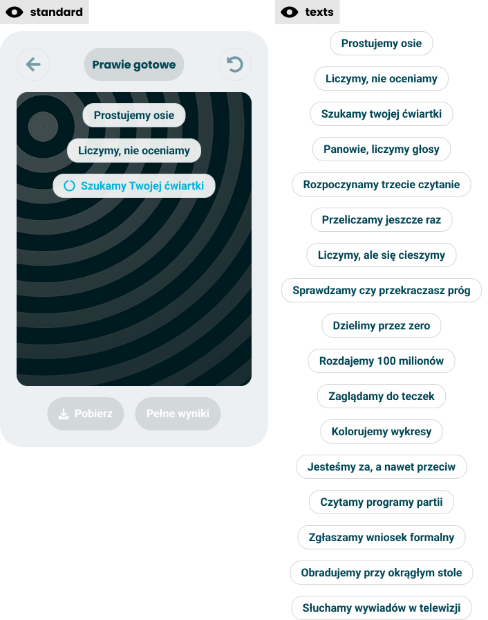

# Engaging loader

> Technical specification of the results calculation phase - the card that narrates the wait while the answers are submitted, the result link is requested and the result is calculated.

Docs: [Engaging loader](../../docs/modules/quiz/results/engaging-loader.md). | Design: [Figma](https://www.figma.com/design/DIInW4qrIxsgXmKbSHukNm/mypolitics-app?node-id=5518-84111)

## Kind
Front-end

## Scope
The results calculation phase of the questionnaire, from the moment the taker leaves the last closing card to the moment they leave for their result. It covers the card - a dark field of rings, a stack of short lines that arrive one at a time, and the two result actions drawn disabled - the pool the lines come from and how they are drawn, how long the card stays, and the three steps behind it, always in this order: the answers are submitted, the result link is requested if the taker gave an address, and the calculated result is waited for. It also covers what a failure of each step looks like, and where the taker is sent when it is over.

What it does not cover, and where that lives:

- **What is submitted** - which answers, topics and demographics go into the result. [Session and data](./session-and-data.md) builds the submission; this spec only sends it and reacts to the answer.
- **How a result is calculated** - the survey API.
- **The place of this phase in the sequence, and the controls bar** - the [phases model](./phases-model.md).
- **The short results card** - the phase the [doc](../../docs/modules/quiz/results/short-results-card.md) puts after this one. It is not built yet, so this phase ends by leaving for the results destination.
- **The results screen** - the results module. Until this app has one, the destination is the production results page.
- **What "Pobierz" and "Pełne wyniki" do** - the short results card. Here they are drawn and never work.
- **The e-mail card, the link request and the endpoint that answers it** - [results saving and marketing](./results-saving-and-marketing.md). That spec owns the contract; this one says when the request is made and what the taker sees when it fails.
- **Checkpoint copy** - [random copy](./checkpoints-random-copy.md). The loader uses the same kind of draw, with a pool of its own.

## Data
| Input | Data | Meaning | Rules |
|---|---|---|---|
| Session identifier | Identifier (UUID v4) | Names the result, seeds the draw, and is the last part of the results address | Required. Created with the session |
| Submission | The body of the result, ready to send | What the survey API stores and calculates from | Built by the session. Not read or changed here |
| Address and consent | An e-mail address and whether the consent box was ticked | What the link request is made with | Optional. Present only when the taker gave an address on the e-mail card. Held in the tab's memory, never stored |
| Pool | 17 lines of text | What the card can say | Fixed, shipped with the app, the same in every quiz |
| Results destination | A web address ending in the session identifier | Where the taker goes when the result exists | One constant: `https://mypolitics.pl/results/{session identifier}` |

### Texts
Polish source strings. The first three are drawn in the frames; the last six are not and are set here.

| Element | Text | Source |
|---|---|---|
| Pill in the controls | "Prawie gotowe" | Frame |
| First result action, with a download icon | "Pobierz" | Frame |
| Second result action | "Pełne wyniki" | Frame |
| Announcement for assistive technology | "Liczymy Twoje wyniki" | Set here |
| Message, the answers could not be saved | "Nie udało się zapisać Twoich odpowiedzi. Sprawdź połączenie i spróbuj ponownie." | Set here |
| Message, the result is not ready in time | "Liczenie wyników trwa dłużej niż zwykle. Twoje odpowiedzi są zapisane. Spróbuj ponownie za chwilę." | Set here |
| Retry button | "Spróbuj ponownie" | Set here |
| Notice, the link could not be sent | "Nie udało się wysłać linku na Twój e-mail. Twoje wyniki są gotowe. Zapisz adres strony z wynikami, żeby móc do nich wrócić." | Set here |
| Button under the notice | "Zobacz wyniki" | Set here |

### The pool
The whole pool, in the order of the Figma frame ["texts"](https://www.figma.com/design/DIInW4qrIxsgXmKbSHukNm/mypolitics-app?node-id=5518-95758).

| # | Line |
|---|---|
| 1 | "Prostujemy osie" |
| 2 | "Liczymy, nie oceniamy" |
| 3 | "Szukamy Twojej ćwiartki" |
| 4 | "Panowie, liczymy głosy" |
| 5 | "Rozpoczynamy trzecie czytanie" |
| 6 | "Przeliczamy jeszcze raz" |
| 7 | "Liczymy, ale się cieszymy" |
| 8 | "Sprawdzamy czy przekraczasz próg" |
| 9 | "Dzielimy przez zero" |
| 10 | "Rozdajemy 100 milionów" |
| 11 | "Zaglądamy do teczek" |
| 12 | "Kolorujemy wykresy" |
| 13 | "Jesteśmy za, a nawet przeciw" |
| 14 | "Czytamy programy partii" |
| 15 | "Zgłaszamy wniosek formalny" |
| 16 | "Obradujemy przy okrągłym stole" |
| 17 | "Słuchamy wywiadów w telewizji" |

Two lines differ from what is typed in the frames. Line 1 ends with a space in every frame, which is dropped. Line 3 is "Szukamy twojej ćwiartki" in the pool frame and "Szukamy Twojej ćwiartki" on both screens; the capital wins, as everywhere else the app addresses the taker.

Words with a meaning of their own:

- A **line** is one entry of the pool, drawn on the card as a pill.
- The **order** is the pool shuffled for one session. It is the same every time it is worked out for the same session identifier.
- A **run** is one pass of the card, from the first line to leaving, to the notice or to a failure. A session has one run, plus one for every retry and every refresh.
- The **current line** is the newest line of a run, drawn in the accent colour with a spinner. Every earlier line is **finished**: plain, no spinner, still on the card.

## Interface
| Direction | Name | Shape | Notes |
|---|---|---|---|
| In | Session identifier | UUID v4 | From the session |
| In | Submission | The body of the result | From the session |
| In | Address and consent | Text and yes or no, or nothing | From the e-mail card, in memory |
| Out | Create result | The submission, sent once per attempt | To the survey API: `POST /v1/result` |
| In | Answer to create | Stored, already stored, refused, or no answer | See "Submission" |
| Out | Send link | Address, consent, session identifier, language | To the link endpoint, at most once per session. The request and its answers are in [results saving and marketing](./results-saving-and-marketing.md) |
| In | Answer to send link | Accepted, or anything else | See "Requesting the link" |
| Out | Read result | The session identifier | To the survey API: `GET /v1/result/{id}` |
| In | Answer to read | A result whose `results` is empty or filled | Filled means calculated |
| Out | Leave | The results destination | Opened in the same tab. The stored session is cleared at this moment and not before |

## Behaviour

### Entering the phase
| Case | Behaviour |
|---|---|
| The taker arrives from the last closing card | A run starts: the first line appears and the submission is sent, both at once |
| The page is refreshed during the phase | The session restores into this phase and a run starts again from its first line. The submission is sent again; the API answers that the result already exists, which counts as stored, and the run carries on |
| The page is refreshed and the taker had given an address | The address was in memory only and is gone. If the link was not requested before the refresh, it is not requested at all, and the card says nothing about it - it cannot know an address was ever given |

### The three steps
| Step | Starts when | Ends when |
|---|---|---|
| 1. Submission | The run starts | The API says the result is stored, or already exists |
| 2. Link request | Step 1 ended, the taker gave an address, and no link was requested yet in this session | The endpoint answers, or 10 seconds pass |
| 3. Waiting for the result | Step 1 ended | A read shows the result calculated |

Steps 2 and 3 run side by side. A run is **ready to leave** when the result is calculated, the link request - if one was made - has ended, and five lines have had their time.

### Drawing the lines
| Case | Behaviour |
|---|---|
| A session reaches the phase | The pool is shuffled into the order, seeded by the session identifier |
| A run starts | It takes lines from the start of the order |
| A line is taken | It is not taken again in that run |
| The same session runs again - after a refresh or a retry | The same order, from its first line. The taker sees the same lines again |
| Two sessions | Different orders, except by chance |
| The app runs in English | The same pool through the English catalogue, each line translated for its plain meaning. The jokes do not survive; an English pool of its own is content work for [internationalisation](../../docs/platform/internationalisation.md) |

### The sequence
| Case | Behaviour |
|---|---|
| A run starts | The first line appears as the current line |
| A line has been current for 1.2 seconds | It becomes finished and the next line of the order appears under it as the current one |
| Five lines have had their time and the run is ready to leave | The run ends and the taker leaves, or sees the notice if the link could not be sent |
| Five lines have had their time and the run is not ready to leave | Lines keep arriving at the same pace |
| The eighth line appears | It is the last. It stays current, spinner turning, until the run is ready to leave or the wait runs out |
| The result is calculated before the fifth line has had its time | Nothing changes on the card. The run still shows five lines |
| A line is longer than the field is wide | It wraps inside its pill. It is never cut |

Five lines at 1.2 seconds make the shortest stay 6 seconds, whatever the arithmetic takes. That is the doc's "its length is a decision", and it costs a taker whose result is ready in one second the other five. Eight lines are what the field holds; after 9.6 seconds the card stops adding lines and simply waits.

### The field and the actions
| Case | Behaviour |
|---|---|
| The field | The ring artwork of the Figma frame ["background"](https://www.figma.com/design/DIInW4qrIxsgXmKbSHukNm/mypolitics-app?node-id=5584-98431), with the lines stacked from the top and centred |
| Motion of the field | The rings drift outwards from their centre, slowly and without end, travelling the distance between two rings in about 3 seconds |
| A line arrives | It fades in |
| The taker asked their system for reduced motion | The rings stand still, lines appear without a fade, and the spinner is drawn without turning. Lines still arrive one at a time, at the same pace |
| "Pobierz" and "Pełne wyniki" | Drawn disabled for the whole phase, in the frame's order. They show where this ends |
| A disabled action is pressed | Nothing happens |
| The run ends well | The taker leaves at once. The actions never become active in this phase |

### Controls while the card is on screen
| Case | Behaviour |
|---|---|
| Progress bar | Not drawn, as in the frame |
| Pill | "Prawie gotowe" |
| Back | Drawn disabled, in every state of the card |
| Reset | Drawn disabled while a run is under way and on the notice. Enabled in the two failed states, so a taker whose submission is refused for good can start over |

### Submission
| Case | Behaviour |
|---|---|
| The API answers that the result is stored | Step 1 has ended. Reading starts, and the link is requested if there is an address |
| The API answers that a result with this identifier already exists | The same as stored. An earlier attempt got through: its answer was lost, or the page was refreshed |
| No answer within 10 seconds, or the connection fails | The submission is sent once more by itself. If that fails too, the run ends in the failure "the answers could not be saved" |
| The API refuses the submission, or answers with a server error | The run ends in the same failure, with no second try by itself |
| The run is still showing lines while the submission is on its way | The lines keep their pace. They do not wait for the API |

Because "already exists" counts as stored, sending the same submission twice is always safe, and every retry and every refresh can start from the submission.

### Requesting the link
| Case | Behaviour |
|---|---|
| The taker gave no address, or the e-mail phase was left out | No request. Step 2 does not exist for this session |
| The result is stored and the taker gave an address | One request is made, with the address, the consent, the session identifier and the app's language |
| The submission failed | No request. A link is never asked for while no result exists |
| The endpoint accepts | The address and the tick are dropped. Nothing is shown: the card never says a link was sent, the message in the mailbox does |
| The endpoint answers anything else, the connection fails, or 10 seconds pass with no answer | The link counts as not sent. The address and the tick are dropped, and the request is not repeated |
| The link was not sent and the run becomes ready to leave | The notice replaces leaving, see "The notice" |
| The link was not sent and the run ends in a failure | The failure is shown first. The notice comes when a later run is ready to leave |
| A run is retried after the link request has ended | No second request. One session asks for one link at most |
| The run is still showing lines while the request is on its way | The lines keep their pace. A slow endpoint can hold the run for up to 10 seconds past the result, and no longer |

The request is made once and never by itself again, because a repeat after a lost answer would mail the link twice.

### The notice
| Case | Behaviour |
|---|---|
| The run is ready to leave and the link was not sent | The lines are removed, the rings stand still, and the field shows the notice with "Zobacz wyniki" under it. The pill, the disabled controls and the disabled actions stay |
| "Zobacz wyniki" pressed | The taker leaves for the results destination |
| The taker does nothing | The notice stays. It does not time out and does not leave by itself, so it cannot be missed |
| The page is refreshed while the notice shows | A run starts again and ends by leaving. The notice is not shown twice; it was already read |
| The link was sent, or no address was given | No notice. The taker leaves straight away |

The notice says three things and nothing else: the link was not sent, the result is ready, and the address of the results page is now the only way back. It gives no reason, because the app cannot tell a refused address from a broken mail service honestly, and it offers no second try, because the result is what the taker came for. It is the one place the app speaks about the link after the e-mail card, and it speaks once.

### Waiting for the result
| Case | Behaviour |
|---|---|
| The result is stored | The result is read at once, and then once every second |
| A read shows `results` empty | The result is not calculated yet. Keep reading |
| A read shows `results` filled | The result is calculated. Reading stops |
| A read fails or says the result does not exist | Counted as not calculated yet. Keep reading |
| 30 seconds have passed since the result was stored and it is still not calculated | The run ends in the failure "the result is not ready in time" |

### Failure and retry
| Case | Behaviour |
|---|---|
| A run ends in a failure | The lines are removed, the rings stand still, and the field shows the message for that failure with "Spróbuj ponownie" under it. The pill, the disabled back control and the disabled actions stay; reset becomes available |
| "Spróbuj ponownie" pressed | A new run starts: the message goes, the first line of the order appears, and the submission is sent again |
| A run that follows a failure | Owes no minimum stay. It ends as soon as the result is calculated and the link request, if one is made, has ended |
| The retry fails too | The same failure state again. There is no limit on retries |
| Reset is pressed on a failure, and confirmed | The session is cleared and a new one starts in the first phase, as the [phases model](./phases-model.md) says. An address and a tick still held in memory are dropped |
| The taker reloads the page on a failure | The session restores into this phase and a run starts again |

On a failure the card stops being funny: no line of the pool is on screen next to an error.

### Leaving
| Case | Behaviour |
|---|---|
| The run ends well and no notice is due | The stored session is cleared and the results destination opens in the same tab, as an ordinary navigation |
| "Zobacz wyniki" pressed on the notice | The same |
| The taker comes back with the browser's back button | The session was cleared on leaving, so the questionnaire opens at its first phase with a new session. The finished loader is never shown again, even when the browser restores the page from memory |
| The short results card is built | It replaces leaving: the run ends by resolving into that card, and the two actions become its actions. Nothing else in this spec changes |

## States and lifecycle
| State | Condition | What is possible in it |
|---|---|---|
| Running - Figma ["standard"](https://www.figma.com/design/DIInW4qrIxsgXmKbSHukNm/mypolitics-app?node-id=5518-95712) | A run is showing lines, fewer than eight | Watch |
| Holding | The eighth line is current and the result is not calculated | Watch |
| Failed, answers not saved | The submission failed | Retry, reset |
| Failed, result not ready | 30 seconds passed after the result was stored | Retry, reset |
| Link not sent | The run is ready to leave and the link request did not end in "accepted" | Read the notice, "Zobacz wyniki" |
| Left | The run was ready to leave, and any notice was read | Nothing. The taker is on the results page |

Only the first state is drawn, on the board and as the screen of the [phase strip](https://www.figma.com/design/DIInW4qrIxsgXmKbSHukNm/mypolitics-app?node-id=5583-98319): two finished lines and a third one current. Holding looks the same with eight lines. The two failed states and the notice have no frame: they reuse the card and the field, with the message and its one button where the lines were.

## Rules and constraints
- **The sequence sets the length, not the arithmetic.** The shortest stay is five lines; a fast result does not shorten it.
- **Nothing is held back from the API.** The submission goes out when the phase starts, not when the lines end.
- **One result per session.** The submission is sent when this phase starts and at no other moment; repeats of it are harmless. A taker who leaves before this phase leaves no result.
- **The link follows the result.** It is requested only after the result is stored, at most once per session, and never for a result that does not exist.
- **The link never holds the result back.** Whatever the link endpoint answers, the taker reaches the results destination. The most a failed request costs is one notice and one press.
- **Said once, plainly.** A link that was not sent is reported on this card, in one sentence, before leaving. The card never claims that a link was sent.
- **The session outlives the phase.** It is cleared on leaving, so a refresh at any moment of the phase comes back to it.
- **Deterministic.** The same session identifier gives the same order of lines.
- **No line twice in a run.** Eight lines at most are shown, and the pool has seventeen.
- **The subject is the process, never the taker's views.** A line added to the pool jokes about counting, parliament or procedure. It names no living politician and no party, and it is never chosen by what the taker answered.
- **The pool is content.** Adding, removing or rewording a line is a change of strings and nothing else.
- **One pool for every quiz.** A line about quadrants is shown in a quiz without a compass too.
- **No way back.** Back does not work here, and reset does not work while a run is under way, so the result submitted is the one the taker answered for. Reset works only once a run has failed.
- **No animation library.** The motion is plain CSS, and all of it has a still version.
- **Not supported: a progress percentage.** The card never shows how far the calculation is; the stack of lines is the progress.
- **Not supported: skipping the wait.**

## Invalid and edge input
| Input | Behaviour |
|---|---|
| A line of the pool that is empty or only space | Left out of the order |
| A pool with fewer lines than a run needs | The run shows what there is, and the last line stays current. The minimum stay is counted as if there were five |
| An empty pool | No lines are shown. The stay is still 6 seconds and everything else works |
| `results` arrives as text holding JSON | Read as JSON. Text that holds "null" is empty |
| `results` is filled with an empty list of orientations | Calculated. What an empty result looks like is the results page's matter |
| The answer to create has an identifier other than the session's | Treated as stored. The session identifier is the one read and the one in the destination |
| A session with no answers at all | Submitted as it is. The API accepts a result with any number of answers |
| The session identifier is not a UUID v4 | The API refuses the submission, and the run ends in the failure "the answers could not be saved" |
| The taker is offline when the phase starts | Both attempts fail, then the failure state. Retry works once they are back online |
| The tab is in the background | Lines and reads may slow down with the browser's timers. The run ends when both conditions hold, whenever that is |
| The taker presses "Spróbuj ponownie" twice quickly | One run |
| The taker presses "Zobacz wyniki" twice quickly | One navigation |
| An address reaches the phase although no link endpoint is configured | No request and no notice. Without an endpoint there is nothing to promise |
| An address that the link endpoint refuses as invalid | The link counts as not sent, like any other answer that is not "accepted" |

## Privacy and data handling
- **The submission carries special-category data.** Answers to political questions, and demographics when they were given, go to the survey API and nowhere else. They are not sent to analytics, to error reporting, or written to a log in the browser.
- **The result identifier is a bearer key.** Whoever has the results address can open the result. It appears in the address bar after leaving and in the e-mailed link, and is not sent to any third party from this phase.
- **The address passes through once.** It arrives from the [e-mail card](./results-saving-and-marketing.md) in memory, goes into one request to the link endpoint, and is dropped as soon as that request ends, whatever the answer. It is never written to storage, the address bar, analytics or error reporting, and never sent to the survey API.
- **The address and the answers travel apart.** The submission goes to the survey API without the address; the link request goes to the link endpoint without any answer. The session identifier is the only thing both carry.
- **The stored session is cleared on leaving.** Until then the answers and the demographics stay in the tab's storage, so that a refresh loses nothing.

## Failure modes
| Failure | Behaviour |
|---|---|
| The survey API is down | Two attempts, then "the answers could not be saved" with retry. The answers stay in the session |
| The API stored the result and the answer was lost | The second attempt is answered "already exists", which counts as stored |
| The API refuses the submission as malformed | The failure state. Retry will be refused again; the taker can reset and start the quiz over. The cause is a defect in the app or a changed API, not something a taker can fix |
| The calculation is slow or its queue is stuck | "The result is not ready in time" after 30 seconds. Retry waits another 30 |
| The calculation never finishes | Retry keeps failing. The result is stored, so the e-mailed link, if it was sent, will work once it is calculated |
| The link endpoint is down, slow, or refuses the request | The link counts as not sent. The run goes on, and the taker reads the notice before leaving |
| The link endpoint accepted and its answer was lost | The notice says the link was not sent although a message may arrive. The opposite mistake - silence about a link that never comes - is the worse one |
| The page is refreshed after an address was given and before the link was requested | No link and no notice. The taker reaches the result and is not told; nothing remembers that an address was given |
| The results destination is down | The taker lands on an error page of another site. Nothing here can tell |
| The taker closes the tab during the run, after the result was stored | The result exists. Without the e-mailed link they cannot reach it |
| The taker closes the tab during the run, before the result was stored | No result |

## Non-functional

### Rendering contexts and accessibility
- The card takes the width it is given and is checked at the narrowest phone widths: the longest line, "Sprawdzamy czy przekraczasz próg", wraps inside its pill and the two actions stay side by side or wrap as a pair, with no sideways scroll.
- Entering the phase is announced once, with "Liczymy Twoje wyniki". The lines are not announced one by one - eight jokes read aloud in ten seconds would talk over each other.
- A failure is announced as soon as it shows, and focus moves to "Spróbuj ponownie". The notice is announced the same way, and focus moves to "Zobacz wyniki".
- The two actions, back, and reset while it is off, are real buttons in a disabled state, so assistive technology reads them as unavailable and the keyboard skips them.
- Nothing on the card flashes, and every moving part stands still under reduced motion.

### Performance
- The first line is on screen as soon as the phase is, before any answer from the API.
- One read per second, for 30 seconds at most per run. One link request per session, given 10 seconds.
- The motion of the field is cheap enough to run on a low-end phone without delaying the lines; if it cannot be, it stands still.

## Dependencies
Build order: after the questionnaire screen, its session and the survey API layer.

Relies on:

- [Engaging loader doc](../../docs/modules/quiz/results/engaging-loader.md) - the idea this implements.
- [Phases model](./phases-model.md) - the sequence this phase closes, and the controls bar.
- [Session and data](./session-and-data.md) - the session identifier, the submission, restoring into this phase after a refresh, and clearing the session on leaving.
- [Results saving and marketing](./results-saving-and-marketing.md) - the address and the consent this phase sends, and the contract of the endpoint it sends them to.
- The [survey API](https://api.mypolitics.pl/api) - creating a result and reading it. It answers "already exists" for a repeated identifier and sends `results` empty until the calculation is done; both were checked against its own tests.
- The production results page - the destination, until this app has a results screen.

Relied on by:

- The [short results card](../../docs/modules/quiz/results/short-results-card.md) - the phase that will follow. Its frame draws the two actions as "Zobacz pełne wyniki" and "Pobierz", in the other order and with another label than here, although the doc wants nothing to move when the card resolves. That spec settles which one changes.
