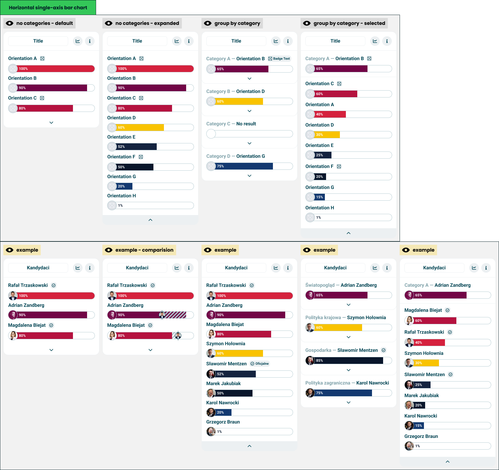

# Horizontal bar chart

> Technical specification of the module that ranks orientations, best match first.

Docs: [Horizontal bar chart](../../docs/modules/quiz/results/modules/horizontal-bar-chart.md). | Design: [Figma](https://www.figma.com/design/DIInW4qrIxsgXmKbSHukNm/mypolitics-app?node-id=5500-1414)

## Kind
Front-end

## Scope
One result module: a [module wrapper](./module-wrapper.md) around a ranked list of one-sided [universal axis](./universal-axis.md) bars, one per orientation. The list is either flat and cut short, or grouped by category. The module sorts what it is given and remembers what the taker opened; it computes no score.

It also defines the **ranked row** - a name, an optional badge and a bar. The [archetype](./archetype.md) ranking is a list of the same rows.

Not covered here:

- **How a bar draws a value or a comparison** - the [universal axis](./universal-axis.md) spec.
- **The card frame and its two buttons** - the [module wrapper](./module-wrapper.md) spec.
- **Who gets a badge and what it says** - quiz configuration. The module draws the badge it is given.

## Data
| Input | Data | Meaning | Rules |
|---|---|---|---|
| Title | Text | The card's name | Optional, as in the wrapper |
| Entries | A list of orientation, value and optional badge | What is ranked | Used when there are no categories |
| Categories | A list of a name and its entries | The same, broken by category | Optional. When present, the list is grouped |
| Visible rows | A whole number | How many rows a flat list shows before the fold | Defaults to 3. The author chooses where the fold is |
| Comparison | The other party, and their value per orientation | A friend's scores on the same rows | Optional |
| Statistics action, info action | Present or absent | The wrapper's two buttons | Optional, independent |

A **badge** qualifies one row. It is an icon alone, or an icon with a short text, as in a verified mark or an "official" label. A row has at most one.

## Interface
| Direction | Name | Shape | Notes |
|---|---|---|---|
| In | Everything in Data | - | Passed in by the result screen |
| Out | Statistics requested | An event with no payload | Passed through from the wrapper |
| Out | Info requested | An event with no payload | Passed through from the wrapper |

What is open is the module's own state. Nothing outside is told about it.

## Behaviour

### Ranked row
| Case | Behaviour |
|---|---|
| A row | The orientation's name, then its badge if it has one, and under them a one-sided bar with the orientation's image on the cap |
| The bar | No marker and no labels. The name above already identifies it |
| Value absent | An empty track with no cap, as the universal axis draws "no orientation" |
| Comparison value for this orientation | Passed to the bar, which draws the band and the other party's image |
| No comparison value for this orientation | The row is drawn without an overlay |
| A row or a badge pressed | Nothing happens |

### Order
| Case | Behaviour |
|---|---|
| Entries | Sorted by value, highest first |
| Equal values | Keep the order they were given in |
| Entries without a value | Last, in the order they were given |
| Comparison present | The order does not change. The list stays the taker's |

### Flat list
| Case | Behaviour |
|---|---|
| More entries than visible rows | The top rows are shown, with a control under them that opens the rest |
| Opened | Every row is shown, and the control at the foot of the card closes the list again |
| As many entries as visible rows, or fewer | Every row is shown and there is no control |

### Grouped list
| Case | Behaviour |
|---|---|
| A category | A heading with the category's name and its leading orientation, the leader's badge, the leader's bar, and a control that opens the category |
| The leader | The first row of the category's own ranking |
| Category where no entry has a value above zero | The heading says there is no result, the bar is an empty track, and the control still opens the category |
| The list of categories | Shown in the order given, never sorted and never cut |
| A category opened | The card shows that category alone: its heading and leader, then the rest of its ranking in full, and a control at the foot that returns to the list of categories |

One category is open at a time, and the fold does not apply inside one: an opened category shows every row it has.

## States and lifecycle
| State | Condition | What is possible in it |
|---|---|---|
| Flat, folded - "no categories - default" | No categories, more entries than visible rows, not opened | Open the rest |
| Flat, open - "no categories - expanded" | The same, opened | Close it |
| Flat, complete | No categories, nothing behind the fold | Read |
| Grouped - "group by category" | Categories present, none opened | Open one |
| Category open - "group by category - selected" | One category opened | Return to the list |

The module starts folded, or grouped with nothing open. The state lasts as long as the card is on screen and is not saved anywhere.

## Rules and constraints
- **Rank is by the taker's value only.** Nothing else moves a row - not a badge, not the comparison, not the category.
- **A badge is not a result.** It never changes a row's position, colour or bar.
- **The fold hides rows, it does not remove them.** Rows behind it are still in the ranking and still reachable in one press.
- **The module never hides itself.** With no entries it is an empty card under its title.

## Invalid and edge input
| Input | Behaviour |
|---|---|
| Visible rows below 1, or not a whole number | The default of 3 |
| Both entries and categories passed | The categories win |
| Category with no entries | Drawn as a category with no result, and with no control to open it |
| Category without a name | The heading shows the leader alone |
| Entry without an orientation name | The bar is drawn under an empty name |
| Name and badge longer than the row | The name is truncated first and stays complete for assistive technology; the badge keeps its text |
| Badge with a text but no icon, or an icon but no text | Drawn with what it has |
| Value outside 0-100, or not a number | Clamped, or treated as absent, as the universal axis specifies |
| The same orientation twice in one list | Drawn twice. The module does not deduplicate |
| Comparison value for an orientation not in the list | Ignored |

Nothing here throws.

## Non-functional

### Rendering contexts
The result screen, comparison mode and the generated result image. In the image the caller passes no actions and the module is drawn in its starting state, since nothing there can be opened.

### Accessibility
- The rows are an ordered list, so the rank is announced and not only seen.
- Each bar announces its orientation, value and comparison value, as the universal axis specifies.
- A badge is announced with its row. An icon-only badge has a text name.
- The open and close controls are buttons that say what they do and whether the list is open, and work from the keyboard.
- When a category opens or closes, focus stays on the control that was pressed or moves to the one that replaces it. It is never lost.

### Performance
An opened list can hold dozens of bars. The module does no measuring; opening and closing only changes which rows are drawn.

## Dependencies
**Build order: step 1.** Needs the [universal axis](./universal-axis.md) and the [module wrapper](./module-wrapper.md), both built. It can be built alongside the other step 1 modules, and the [archetype](./archetype.md) waits on it.

Relies on:

- [Horizontal bar chart doc](../../docs/modules/quiz/results/modules/horizontal-bar-chart.md) - the idea this implements.
- [Universal axis](./universal-axis.md) and [module wrapper](./module-wrapper.md).

Relied on by:

- [Archetype](./archetype.md) - its ranking is a list of ranked rows, so this comes first.
