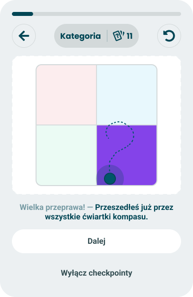

# Nolan chart path

> Technical specification of the checkpoint card that draws the route the taker's position has travelled across the compass, and counts the quadrants it passed through.

Docs: [Nolan chart path](../../docs/modules/quiz/questionnaire/checkpoints/nolan-chart-path.md). | Design: Figma - [two or three quadrants](https://www.figma.com/design/DIInW4qrIxsgXmKbSHukNm/mypolitics-app?node-id=5515-67219) | [four quadrants](https://www.figma.com/design/DIInW4qrIxsgXmKbSHukNm/mypolitics-app?node-id=5516-69231) | [four quadrants, second path](https://www.figma.com/design/DIInW4qrIxsgXmKbSHukNm/mypolitics-app?node-id=5581-97574)

| Two or three quadrants | Four quadrants | Four quadrants, second path |
|---|---|---|
|  |  |  |

## Kind
Front-end

## Scope
One passive checkpoint card in two versions: what it puts into the shared card frame (the compass map with a dotted trail and the taker's dot in the visual slot, a lead-in and a statement), how the trail is built from the positions the taker has held, how quadrants are counted, when each version asks to be shown, and what happens in a quiz that has no compass. The card takes no input and holds no state.

Not covered here:

- **The card frame, the progress bar and the controls above it, the buttons "Dalej" and "Wyłącz checkpointy", and what each does** - the [checkpoints](./checkpoints.md) spec.
- **Which card wins a slot, the pacing numbers, the opt-out, and the running state this card reads** - the [event model](./event-model.md) spec. This spec states the card's own trigger and gate, and what the history of positions has to hold.
- **The pools of alternative lines and how one is drawn** - the [checkpoint random copy](./checkpoints-random-copy.md) spec.
- **The map, the dot, the position and the levels** - the result's [Nolan chart](./nolan-chart.md) spec. This spec says what the card leaves out of that module and the one thing it adds.
- **Replaying or sharing the trail after the quiz** - the doc names it as an opportunity. Nothing keeps the trail past the session, so it is not built.

## Data
| Input | Data | Meaning | Rules |
|---|---|---|---|
| Compass | A horizontal axis and a vertical axis, each with a start side and an end side | The two axes the map is built from | From the quiz. Absent in a quiz without a compass |
| Position history | A list of positions, in the order they were reached | Where the taker stood after each answered question | From the running state |
| Quadrants visited | A count, 0-4 | How many quadrants the history has been in | From the running state, counted as below |
| Questions done | Count | Questions answered plus questions skipped | From the running state |
| Quadrant colours | Four colours, one per corner | What each quadrant is drawn in | From the quiz when it supplies them; otherwise the default set |
| Earlier path card | The position the taker held when it was shown | Where the second path begins | From the event model's record of cards shown. Absent before the first path card |
| Lines | A lead-in and a statement for each version | The wording | From two copy pools, one per version |

A quiz **has a compass** when its axes include one marked as the compass's horizontal axis and one marked as its vertical axis - `compass_x_axis` and `compass_y_axis` in the survey API - and each of the two has at least one orientation of the quiz on its negative side and at least one on its positive side. The orientation type "compass" plays no part in this.

The **start side** of a compass axis is its negative side and the **end side** its positive side. The horizontal axis runs from start on the left to end on the right, the vertical axis from start at the bottom to end at the top, as in the [Nolan chart](./nolan-chart.md). Each side has one value from 0 to 100 in the running state, however many orientations it holds.

A **position** is the pair of coordinates the Nolan chart spec defines: for each axis, the end value minus the start value, over 100. A position exists once both sides of both axes have a value. Before that the taker has no position, which is not the same as standing in the centre.

The **position history** holds one position for every answered question from the first one that has a position. A skipped question adds nothing. It is worked out again from the answers in their order, so taking an answer back removes its position, and a page refresh loses nothing.

A quadrant is **visited** when at least one position of the history lies in it at the moderate or the extreme level - the two levels at which the Nolan chart names a quadrant. A position at the centre level is on the trail and visits nothing. The **count** is the number of visited quadrants.

The **default set** of quadrant colours is the one of the Figma frames, by corner: red at the top left, blue at the top right, green at the bottom left, purple at the bottom right.

## Interface
| Direction | Name | Shape | Notes |
|---|---|---|---|
| In | Running state | The position history, the count, questions done | Read at each question boundary |
| In | Quiz | Whether it has a compass, and its quadrant colours | Read once, with the quiz |
| In | Cards shown | Which version of this card was shown in this session, and the position held at that moment | Kept by the event model with the session |
| In | Line | A lead-in and a statement. The two-or-three pool has a slot for the count | Drawn by the copy pool for the version being shown |
| Out | Candidate | "Nolan chart path is due", with the version | Offered to the event model at a question boundary |
| Out | Card content | The map with its trail, the lead-in and the statement | Handed to the card frame when the event model picks this card |

The card raises no event of its own. Continuing and turning checkpoints off belong to the frame.

## Behaviour

### When it may fire
| Property | Value |
|---|---|
| Trigger | The count is 2 or more |
| Gate | No confidence gate - the card fires on movement. 10 questions or more are done, and the quiz has a compass |
| Class | Personal |
| How often | Each version once per run of the quiz, so two cards at most. The two-or-three version is never shown after the four-quadrant one |

| Case | Behaviour |
|---|---|
| The count is 2 or 3, 10 questions are done, no path card was shown yet | The two-or-three version is offered |
| The count is 4, 10 questions are done, the four-quadrant version was not shown yet | The four-quadrant version is offered, whether or not the two-or-three version was shown before |
| The count reaches 4 before any path card was shown | The four-quadrant version is offered. The two-or-three version is never shown in this run |
| The two-or-three version was shown with a count of 2, and the count becomes 3 | Nothing. That version was used |
| The four-quadrant version is offered after the two-or-three version was shown | The event model ranks it as a type not seen yet - the one exception to "a type already seen loses". It is still the same type for the rule against two cards of one type in a row, so another card has to come between the two |
| No other card comes between the two versions | The four-quadrant version is never shown |
| The card was offered and the event model dropped it | It is offered again at a later boundary for as long as its condition holds |
| The count changes between the offer and the showing | The version and the number are those of the moment the card is shown |
| Fewer than 10 questions are done | Not offered, whatever the count |
| The taker never leaves one quadrant, or stays at the centre level | The count stays under 2. The card never fires |
| The taker takes answers back after a version was shown | The history and the count shrink with the answers. A version already shown is not shown again |
| The quiz is reset | A new run: the history is empty and each version can be shown once again |
| Checkpoints were turned off earlier | Never shown |
| The quiz has no compass | The card never fires. Nothing replaces it and the taker sees no gap |

The pacing numbers that decide whether an offered card is shown are the event model's and are not repeated here.

### Map
The map is the one the result's [Nolan chart](./nolan-chart.md) draws, taken out of its module.

| Case | Behaviour |
|---|---|
| Always | A square of four quadrants, each in a pale tint of its colour |
| The current position is moderate or extreme | Its quadrant is filled with its colour at full strength - the highlighted quadrant |
| The current position is at the centre level | No quadrant is filled |
| The taker | A dot with a halo at the current position, drawn above the trail |
| Dot at an edge or a corner | Its centre is placed exactly; whatever falls outside the map is cut off |
| The trail | Drawn above the quadrants and below the dot - see Trail |

What the card leaves out of the module:

| Left out | Why |
|---|---|
| The module wrapper, with its statistics and info buttons | The card sits in the checkpoint frame |
| The title naming the quadrant and its level | The card counts quadrants and names none. Naming the current one would hand over a piece of the result |
| The axis names and coordinates beside the map | Not in the frames. The card is about the route, not the reading |
| The control that opens the two axes, and the rows behind it | The card has nothing to open |
| The other side of a comparison | There is nobody to compare with mid-quiz |

### Trail
| Case | Behaviour |
|---|---|
| The first path card of a run, either version | The trail runs from the first position of the history to the current one - frames "two or three quadrants" and "four quadrants" |
| The second path card of a run - the four-quadrant version after the two-or-three version | The trail runs from the position held when the earlier card was shown to the current one. The part already shown is not drawn again - frame "four quadrants, second path" |
| Shape | One continuous dotted line through the positions in the order they were reached, smoothed into curves. It passes through every position |
| Neighbouring positions that are the same to two decimals | One point. An answer that did not move the taker adds nothing to the line |
| The trail leaves a quadrant and comes back | Drawn as travelled. The count has the quadrant once |
| The trail crosses itself | Drawn as travelled |
| A position at an edge or a corner | The line runs to it; whatever falls outside the map is cut off |
| Colour | One colour along its whole length, the dot's. It does not take the colours of the quadrants it crosses |
| Motion | None. The trail is drawn complete when the card appears |
| The second path, when the earlier position is not known or is no longer in the history | The whole trail, as on a first path card |

On a first path card every counted quadrant has a piece of the trail in it. On the second path card it need not: the line shows what happened since the last card, the statement counts the whole run.

### Text
| Version | Slot | Figma text, exactly | What varies |
|---|---|---|---|
| Two or three | Lead-in | "Co ja tu robię?" | The line, drawn from the two-or-three pool |
| Two or three | Statement | "W trakcie wykonywania quizu przeszedłeś już przez ___ ćwiartki kompasu!" | The line, drawn from the two-or-three pool. "___" is the slot for the count |
| Four, both frames | Lead-in | "Wielka przeprawa!" | The line, drawn from the four-quadrant pool |
| Four, both frames | Statement | "Przeszedłeś już przez wszystkie ćwiartki kompasu." | The line, drawn from the four-quadrant pool. No slot |
| Both | Buttons | "Dalej", "Wyłącz checkpointy" | Nothing. They belong to the frame |

The lead-in is drawn muted and the statement strong, as on every card. The frame draws the dash between them.

| Case | Behaviour |
|---|---|
| The count slot | The count as a numeral, 2 or 3. It is never 1 and never 4 in this version |
| The second path card | The same four-quadrant pool as a first four-quadrant card. A line already used in the session is not drawn again |

Both Figma statements use a gendered verb form - "przeszedłeś", "Przeszedłeś". The taker's gender is not known during the questions, so neither can go into a pool as written, and the [checkpoint random copy](./checkpoints-random-copy.md) spec holds the neutral lines that replace them. A line of the two-or-three pool also has to read correctly with both numerals.

## States and lifecycle
The card has no state of its own. Which of its three looks is drawn is decided when it is shown.

| State | Condition | What is possible in it |
|---|---|---|
| Two or three quadrants | The count is 2 or 3 | Continue, or turn checkpoints off - both in the frame |
| Four quadrants | The count is 4, and no path card was shown before | The same |
| Four quadrants, second path | The count is 4, and the two-or-three version was shown before | The same |

## Rules and constraints
- **The card counts quadrants and names none.** No text, title or description on it says which quadrant the taker is in.
- **No position is not the centre.** The trail starts at the first position the taker actually held, not at the middle of the map.
- **The centre visits nothing.** A taker circling the middle of the map has not been through four quadrants.
- **The thresholds are the Nolan chart's.** Position, level and quadrant are computed exactly as on the result, so the dot on the card and the dot on the result follow one rule.
- **The map is always square**, whatever the card's width.
- **The card never updates while it is open.** The trail and the count are those of the moment it was shown.
- **Not interactive.** Nothing on the map can be pressed, hovered or focused.
- **Nothing here is configurable.** No author setting turns the card on or off or changes its wording.

### Calls
| Call | Cost |
|---|---|
| The third frame, "four quadrants, second path", is the four-quadrant version shown after the two-or-three version, with the trail starting where the earlier card left off. The doc links the frame and does not describe it; its trail stays inside one corner of the map under the same four-quadrant line | The second card never shows the whole route, and the event model has to remember the position of the first one |
| A quadrant is visited only at the moderate or the extreme level | A taker who hovers near the centre never sees the card; the running state has to count quadrants this way and not by sign alone |
| The trail starts at the first position held. The frames draw it from the middle of the map | The first stretch can begin far out, where one or two answers put the taker |
| The count includes the swings of the first answers; only the 10-question floor holds the card back | Early in a quiz the trail is drawn by lack of data as much as by the taker, and the card still calls it a journey |
| The highlighted quadrant follows the Nolan chart: none at the centre level. The doc says the current quadrant is highlighted | A card shown while the taker stands near the centre has a trail and no filled quadrant |
| No axis names and no coordinates on the card, as in the frames | The taker cannot tell which direction is which until the result |
| Quadrant colours fall back to the default set of the frames, because the survey API sends none | Every quiz's compass looks the same mid-quiz, and the result has to use the same four colours to look like one product |
| The trail is drawn whole and is not animated | Late in a long quiz the line is dense, and the card has no movement of its own |
| The four-quadrant version still needs another card between it and the two-or-three version | In a quiz where nothing else fires, the rarer statement is never made |
| The trail is not kept after the session | It cannot be replayed on the result screen or shared |

## Invalid and edge input
| Input | Behaviour |
|---|---|
| Only one of the two compass axes is present | No compass. The card never fires |
| Two axes marked as the same compass axis | The first in the quiz's order is used |
| A compass axis with a side that names no orientation of the quiz | No compass |
| A side's value outside 0-100 | Clamped before the coordinate is computed |
| A side's value absent or not a number, for one answer | No position for that answer. The history continues with the next one that has a position |
| A history with a single distinct position | The count is under 2. The card does not fire |
| A count above 4 or below 0 | Read as 4 or as 0 |
| A quadrant colour missing or not a colour, in a quiz that supplies colours | The neutral fallback for that quadrant, tint and fill, as in the Nolan chart |
| A highlighted quadrant in a colour close to the trail's | The trail and the dot keep a light edge, so both stay visible on any fill |
| A pool line without the count slot | Shown as written |
| A line longer than the card | It wraps onto further lines |
| A history of several hundred positions | Drawn whole. Nothing is cut or sampled beyond the two-decimal rule |

Nothing here throws, and a card that cannot be built is skipped without the taker seeing anything.

## Privacy and data handling
- **The history is a record of the taker's political position over time.** It is computed on the device from the answers, lives with the session and is never sent - not with the result and not to analytics.
- **The card shows where the taker stands now.** It is drawn on their own screen only and is not part of any image the product generates.

## Non-functional

### Rendering contexts
The questionnaire only, inside the card frame, at every width the questionnaire supports. The card is not part of the result screen or of the generated result image.

### Accessibility
- The map is announced as a single image. Its description says how many of the four quadrants the route has passed through, and whether the taker now stands in the highlighted quadrant or near the centre. It names no quadrant, as the card names none.
- The trail is a dotted line and the taker a dot with a halo; neither is told from the map by colour alone.
- The map exposes no focusable element. Focus, the announcement when the card appears and the two buttons are the frame's.
- The count is read as a number inside the statement, not as a blank.
- Nothing on the card moves, so a preference for reduced motion changes nothing here.

### Performance
The history has at most one position per question. A trail of a few hundred points is drawn once, when the card appears, and must not delay the card.

## Dependencies
Needs the [checkpoints](./checkpoints.md) frame, the [event model](./event-model.md) with the running state it defines (a position per answered question, the count of quadrants visited, questions done) and its record of cards shown, and two pools in [checkpoint random copy](./checkpoints-random-copy.md). It can be built alongside the other cards.

What the card needs and the app or the survey data cannot give today:

| Need | Today |
|---|---|
| The map by itself - quadrants, highlighted quadrant, dot | The map exists only inside the result's Nolan chart, together with its title, its axis names and its open control. It has to become usable without them |
| A trail on the map | Nothing draws a line on the map |
| A position after every answer, and the quadrants visited | Nothing computes scores on the device yet. Both come with the running state |
| The position held when the earlier path card was shown | Nothing records which cards were shown. It comes with the event model |
| Which axes form the compass | Present: the survey API marks them by axis type, and the identity quiz has both |
| Quadrant colours, and quadrant names for the result | The survey API sends neither. The card uses the default set and needs no names |

Relies on:

- [Nolan chart path doc](../../docs/modules/quiz/questionnaire/checkpoints/nolan-chart-path.md) - the idea this implements.
- [Nolan chart](./nolan-chart.md) - the map, the position, the levels and the quadrant rule.
- [Universal orientation](./universal-orientation.md) - how an axis finds its orientations.

Relied on by nothing.
