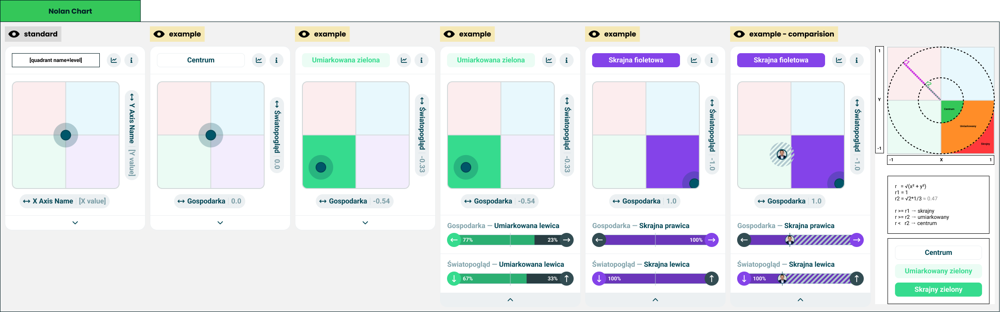

# Nolan chart

> Technical specification of the module that crosses two axes into a map and places the taker on it.

Docs: [Nolan chart](../../docs/modules/quiz/results/modules/nolan-chart.md). | Design: [Figma](https://www.figma.com/design/DIInW4qrIxsgXmKbSHukNm/mypolitics-app?node-id=5508-25681)

## Kind
Front-end

## Scope
One result module: a [module wrapper](./module-wrapper.md) around a square map of four quadrants with a dot where the taker's two scores put them. The title names the quadrant and how far out the taker is, and the card opens to show the two axes the position was built from. The module turns two pairs of values into a position and a level, and remembers whether it is open; it computes no score.

Not covered here:

- **How a bar draws two values, a marker or a comparison** - the [universal axis](./universal-axis.md) spec.
- **The heading-and-bar row the card opens into** - the axis row in the [multi axis chart](./multi-axis-chart.md) spec.
- **The card frame and its two buttons** - the [module wrapper](./module-wrapper.md) spec.
- **Which two axes are crossed, and what the quadrants are called** - quiz configuration.

## Data
| Input | Data | Meaning | Rules |
|---|---|---|---|
| Horizontal axis | A name, a start entry and an end entry | The axis drawn left to right | Required |
| Vertical axis | A name, a start entry and an end entry | The axis drawn bottom to top | Required |
| Quadrants | Four, each with a colour, a moderate name and an extreme name | What each corner of the map is called | Author-supplied |
| Centre name | Text | What the middle of the map is called | Author-supplied |
| Pole names | For each of the four poles, a moderate name and an extreme name | What a lean along one axis is called | Author-supplied |
| Comparison | The other party, and their two pairs of values | A friend's position on the same map | Optional |
| Statistics action, info action | Present or absent | The wrapper's two buttons | Optional, independent |

An entry is an orientation and a value from 0 to 100, as in the universal axis.

Every name is a complete phrase written by the author - "moderate green", "extreme green" - and the module never builds one out of a level and a noun. In Polish and many other languages the two halves have to agree, and a composed name would be wrong half the time.

### Position
Each axis becomes one coordinate between -1 and 1:

> coordinate = (end value - start value) / 100

The start pole is at -1 and the end pole at 1. The horizontal axis runs left to right, the vertical axis bottom to top. Coordinates are computed from the exact values and shown rounded to two decimals.

### Level
The distance from the centre decides the level of the whole position:

> r = √(x² + y²)

| Level | Condition |
|---|---|
| Centre | r below √2 / 3, about 0.47 |
| Moderate | r from √2 / 3, below 1 |
| Extreme | r of 1 and above |

Along a single axis the same idea uses the coordinate alone:

| Level | Condition |
|---|---|
| Centre | Coordinate nearer to zero than 1/3 |
| Moderate | From 1/3, short of 1 |
| Extreme | Exactly at the pole, 1 or -1 |

The quadrant is given by the signs of the two coordinates. A coordinate of exactly zero counts toward the end pole.

## Interface
| Direction | Name | Shape | Notes |
|---|---|---|---|
| In | Everything in Data | - | Passed in by the result screen |
| Out | Statistics requested | An event with no payload | Passed through from the wrapper |
| Out | Info requested | An event with no payload | Passed through from the wrapper |

Whether the card is open is the module's own state.

## Behaviour

### Title
The title is placed in the wrapper's title slot as a component title.

| Case | Behaviour |
|---|---|
| Centre | The centre name, in the plain title style, with no colour |
| Moderate | The quadrant's moderate name, as coloured text on a pale tint of the quadrant's colour |
| Extreme | The quadrant's extreme name, on the quadrant's colour at full strength |
| No position | The "no result" wording, in the plain title style |

### Map
| Case | Behaviour |
|---|---|
| Always | A square of four quadrants, each in a pale tint of its colour |
| Moderate or extreme | The taker's quadrant is filled with its colour at full strength |
| Centre | No quadrant is filled |
| The taker | A dot with a halo at the position |
| Dot at an edge or a corner | Its centre is placed exactly and the dot is drawn in full, over the edge of the map. The halo and the fills stay inside the map |
| No position | No dot and no filled quadrant |

Each axis is named beside the map with its coordinate: the horizontal axis under the map, the vertical axis along its side.

### Opened
| Case | Behaviour |
|---|---|
| Closed | A control at the foot of the card opens it |
| Opened | Two axis rows appear under the map, horizontal axis first, and the control at the foot closes the card |
| A row's heading | The axis's name, then the pole name for the taker's level along that axis |
| A row's heading at the centre level | The axis's name alone |
| A row's bar | Double-sided, with the marker and no labels. The caps carry the poles' icons |
| A row's colours | The side the taker leans to takes the quadrant's colour; the other side is neutral |

### Comparison
| Case | Behaviour |
|---|---|
| Comparison present | The other party's image is drawn at their position, on a hatched disc |
| Their quadrant | Never filled. The filled quadrant is always the taker's |
| Their position at an edge or a corner | Moved inward so the image stays fully on the map |
| Both at the same position | The other party's image is drawn on top; the taker's halo stays visible around it |
| The other party has no position | No second marker |
| Opened | Both rows carry the comparison band, as the universal axis draws it |

## States and lifecycle
| State | Condition | What is possible in it |
|---|---|---|
| Closed - "standard" | Not opened | Open the card |
| Open | Opened | Read the two axes, close the card |

The module starts closed. The state lasts as long as the card is on screen and is not saved anywhere.

## Rules and constraints
- **No position is not the centre.** A taker the quiz could not place gets no dot and the "no result" wording. The centre is reserved for a taker who was placed there.
- **The thresholds are constants.** They are the same for every quiz and are not configuration; the info button can state them in one sentence.
- **The map is always square**, whatever the card's width.
- **Two dots at most.** Group comparison is not a case this module handles.
- **Names come from the author, colours come from the quadrant.** The module never takes the title's colour from an orientation.

## Invalid and edge input
| Input | Behaviour |
|---|---|
| An axis with either value absent or not a number | No position |
| Value outside 0-100 | Clamped before the coordinate is computed |
| A pair that does not add up to 100 | The coordinate is still the difference over 100 |
| Quadrant name missing for the taker's level | The quadrant's other name, and failing that the centre name |
| Centre name missing | The title is empty and the wrapper draws its header without one |
| Pole name missing | The row's heading shows the axis's name alone |
| Quadrant without a colour | The neutral fallback: tint, fill and title |
| Axis name longer than the room | Truncated; complete for assistive technology |
| Title longer than the title slot | Truncated by the wrapper; complete for assistive technology |
| Other party without an image | A neutral placeholder on the hatched disc |

Nothing here throws.

## Non-functional

### Rendering contexts
The result screen, comparison mode and the generated result image. In the image the caller passes no actions and the module is drawn closed.

### Accessibility
- The map is announced as a single image. Its description carries the quadrant name and level, both axis names with their coordinates, and the other party's quadrant when there is a comparison.
- The level is never carried by colour alone: the title says it in words.
- The other party is marked by a hatched disc and their image, not by colour.
- The open and close control is a button that says what it does and whether the card is open, and works from the keyboard.
- The card is named after its title, through the accessible name the wrapper takes for a component title.

## Dependencies
**Build order: step 3.** Needs the [universal axis](./universal-axis.md) and the [module wrapper](./module-wrapper.md), both built, and the [multi axis chart](./multi-axis-chart.md) from step 2 for the axis row.

Relies on:

- [Nolan chart doc](../../docs/modules/quiz/results/modules/nolan-chart.md) - the idea this implements.
- [Universal axis](./universal-axis.md) and [module wrapper](./module-wrapper.md).
- [Multi axis chart](./multi-axis-chart.md) - the axis row.
- [Double axis chart](./double-axis-chart.md) - the double-sided bar it opens into.

Relied on by nothing in this folder.
