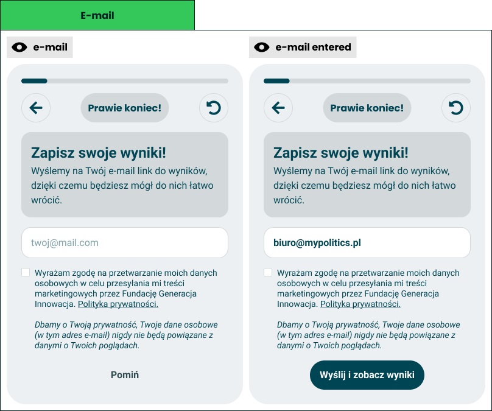

# Results saving and marketing

> Technical specification of the e-mail capture phase - the card that offers the result link by e-mail and an optional marketing consent - and of the send-and-forget endpoint behind it.

Docs: [Results saving and marketing](../../docs/modules/quiz/questionnaire/results-saving-and-marketing.md). | Design: [Figma](https://www.figma.com/design/DIInW4qrIxsgXmKbSHukNm/mypolitics-app?node-id=5516-70263)

## Kind
Mixed

## Scope
Two halves, specified together because the promise printed on the card is only true if the back-end keeps it.

- **Front-end** - the e-mail capture phase of the questionnaire: one card with a heading, an e-mail field, an unticked consent checkbox, the privacy promise and one button that is "Pomiń" until the address is valid and "Wyślij i zobacz wyniki" after. The card only collects: it hands the address and the consent to results calculation and makes no request itself.
- **Back-end** - one endpoint that sends one message with the result link and forgets the address, and one marketing list that holds addresses and nothing from the quiz. No such back-end exists today, so this half is the contract for whoever builds it. Until an endpoint is configured the phase is switched off and the questionnaire runs without it.

The request to the endpoint is made in the next phase, once the result has been stored, so a link is never mailed for a result that does not exist. The request and its answers are specified here; when it is made and what the taker sees if it fails are in the [engaging loader](./engaging-loader.md).

What it does not cover, and where that lives:

- **The order of phases, and what back and reset do in general** - the [phases model](./phases-model.md). This spec only says what the two controls do while this card is on screen.
- **What a session keeps over a refresh, and that nothing is shared across devices** - [session and data](./session-and-data.md).
- **The value the progress bar shows** - [progress and pacing](./progress-and-pacing.md).
- **Submitting the answers, making the link request and telling the taker when it fails** - the [engaging loader](./engaging-loader.md), the phase that follows this one.
- **The page the link opens** - the results module. Today it is the production results page, see the results destination in the [engaging loader](./engaging-loader.md).
- **Marketing campaigns** - what is sent to the list, how often and with which tool. This spec fixes only what the list holds and how an address gets on and off it.
- **The privacy policy itself** - a public document. The card links to it.
- **Accounts** - [accounts](../../docs/platform/accounts.md). Nothing here needs one or creates one.
- **A back-end task** - the repo has no task convention for back-end work. The contract below is the hand-off.

## Data

### What the card holds
| Input | Data | Meaning | Rules |
|---|---|---|---|
| Address | Text typed by the taker | Where the link is sent | Optional. Kept in the tab's memory only, see "Privacy and data handling" |
| Consent | Ticked or not | Agreement to marketing content from the foundation | Unticked when the card opens. Never ticked by the app |
| Declared age | The age chosen in demographics, if any | Whether the card may be shown at all | Only whether it is under 18 matters, see "Whether the phase is part of the session" |
| Endpoint address | Configuration (`VITE_RESULTS_EMAIL_URL`) | Where the request goes | Absent today. Decides whether the phase exists |

A **valid address** has exactly one `@`, at least one character before it, a domain after it that contains a dot with at least one character on each side of every dot, no whitespace anywhere, and at most 254 characters. Space around the typed text is removed before the check and before sending. This is a filter against obvious slips, not a proof: the back-end is the final judge.

### Texts
Polish source strings. The first eight are drawn in the frames; the last two are not and are set here.

| Element | Text | Source |
|---|---|---|
| Pill in the controls | "Prawie koniec!" | Frame |
| Heading | "Zapisz swoje wyniki!" | Frame |
| Body | "Wyślemy na Twój e-mail link do wyników, dzięki czemu łatwo do nich wrócisz." | Frame text reworded, see below |
| Field placeholder | "twoj@mail.com" | Frame |
| Consent | "Wyrażam zgodę na przetwarzanie moich danych osobowych w celu przesyłania mi treści marketingowych przez Fundację Generacja Innowacja. Polityka prywatności." | Frame. "Polityka prywatności." is a link |
| Promise | "Dbamy o Twoją prywatność, Twoje dane osobowe (w tym adres e-mail) nigdy nie będą powiązane z danymi o Twoich poglądach." | Frame |
| Button, no valid address | "Pomiń" | Frame |
| Button, valid address | "Wyślij i zobacz wyniki" | Frame |
| Name of the field for assistive technology | "Adres e-mail" | Set here |
| Hint under the field | "Wpisz pełny adres e-mail, na przykład twoj@mail.com." | Set here |

The frame's body reads "Wyślemy na Twój e-mail link do wyników, dzięki czemu będziesz mógł do nich łatwo wrócić." The verb form "będziesz mógł" addresses a man. The source string says the same without a gendered form, by the rule the checkpoint cards follow.

### The request
At most one request per session. Results calculation makes it right after the survey API has stored the result, and only when the taker gave an address on the card. It fills in the result identifier and the language; the card supplies the address and the consent.

| Field | Data | Meaning | Rules |
|---|---|---|---|
| `email` | Text | The address | Required. Trimmed |
| `resultId` | Identifier (UUID v4) | The result the link opens | Required |
| `marketingConsent` | Yes or no | Whether the box was ticked | Required |
| `consentWording` | Short identifier | Which consent text the taker saw | Sent only with consent. Changes whenever the consent text on the card changes |
| `language` | `pl` or `en` | The language of the message | Required |

It is a `POST` with a JSON body to the configured address. The address of the endpoint carries nothing personal: no query string and no identifier in the path, so that a log of addresses anywhere on the way holds neither the e-mail nor the result.

The endpoint gives one of four answers, each with an empty body or a fixed one: accepted (`202`), invalid (`400`), too many requests (`429`) and unavailable (`503`). The app treats anything else as unavailable.

The request carries no quiz, no answers, no demographics, no session data beyond the identifier, and no text for the message. The back-end builds the link from the identifier and its own configured results address, so a caller can never make it send a link of their choosing.

### What the back-end keeps
| Entity | Data | Kept | Rules |
|---|---|---|---|
| The address, without consent | - | Nowhere | Used for one message and dropped when the request ends |
| The address together with the result identifier | - | Nowhere, ever | Not in a table, a queue, a cache, a log, a trace, a metric label or a backup |
| The result identifier | - | Nowhere | Used to build the link and dropped |
| Marketing list entry, with consent | Address, consent date, consent wording, language | Until the address is removed | The date is a calendar day with no time of day. Nothing else is stored |
| Request counter for rate limiting | Network address of the caller and a count | For the length of the limit window | Held apart from the request body. Never written next to an e-mail |

A **marketing list entry** deliberately has no time of day, no network address, no browser details, no quiz and no result identifier. A result records when it was created, so a consent stamped to the second could be matched to the result submitted seconds later; a day cannot.

### The message
| Part | Content |
|---|---|
| Sender | The foundation's own domain, authenticated so that mailbox providers accept it (SPF, DKIM, DMARC) |
| Subject | "Twoje wyniki w myPolitics" |
| Body | "Oto link do Twoich wyników:" and the link, then "Zachowaj tę wiadomość. Nie przechowujemy Twojego adresu razem z wynikami, więc nie możemy wysłać linku ponownie." |
| Added with consent | "Twój adres trafił na listę, na którą Fundacja Generacja Innowacja wysyła informacje o nowych quizach. Możesz się z niej wypisać w każdej chwili:" and an unsubscribe link |
| Never in it | The result, any answer, the name of the quiz, an open-tracking image, a rewritten or tracked link |

The English message says the same. A request with a language the back-end does not know gets the Polish one.

## Interface
| Direction | Name | Shape | Notes |
|---|---|---|---|
| In | Declared age | "Under 18", another age, or not declared | From demographics |
| In | Endpoint address | A web address, or nothing | From configuration, read once when the app starts |
| In | Privacy policy address | A link | The app's privacy page |
| Out | Whether the phase is part of this session | Yes or no | Asked by the questionnaire before entering the phase |
| Out | Phase finished | An event: skipped, or an address given - then with the address and whether the box was ticked | Raised once. The questionnaire moves to results calculation |
| Out | Send link | The request above | Made by results calculation, not by the card. Listed here because the contract is |
| In | Answer of the endpoint | Accepted, invalid, too many requests or unavailable | Received by results calculation. See "The endpoint" |

The address and the consent leave the card once, in memory, for results calculation to put into the request. They are handed to nothing else and written nowhere.

## Behaviour

### Whether the phase is part of the session
| Case | Behaviour |
|---|---|
| No endpoint address is configured | The phase does not exist. Demographics lead straight to results calculation, and nothing on screen hints that a card is missing |
| An endpoint address is configured | The phase is shown after demographics, whether demographics were filled in or skipped |
| The taker declared an age under 18 | The phase is left out for this session, as if it were switched off |
| The taker skipped demographics without picking an age | The phase is shown. Nobody is asked their age in order to leave an e-mail |
| The taker types an address, goes back, and declares an age under 18 | The phase is left out when they come forward again. What was typed and ticked is dropped and no link is requested |
| The configuration changes while a session is open | Nothing changes for that session. The address is read when the app starts |

The foundation does not process personal data of people under 16. The line is drawn at 18 all the same: every age under 18 picked from the demographics list is treated as too young. It costs sixteen- and seventeen-year-olds the saved link.

### The button
| Case | Behaviour |
|---|---|
| The field is empty | "Pomiń", drawn as a text button |
| The field holds text that is not a valid address | "Pomiń" |
| The field holds a valid address | "Wyślij i zobacz wyniki", drawn as the filled button. "Pomiń" is not drawn |
| The address stops being valid while typing | The button turns back into "Pomiń" at once |
| The consent box is ticked or unticked | The button does not change. Consent never enables, disables or renames it |
| "Pomiń" pressed | The phase finishes as skipped. Whatever is in the field or the box is dropped, and no link is requested later |
| "Wyślij i zobacz wyniki" pressed | The phase finishes with the address and the consent handed over. The card makes no request and does not wait for one |
| Either button pressed twice quickly | The phase finishes once |
| The taker wants to skip with a valid address in the field | They clear the field, and "Pomiń" returns |

There is one button in every state, so a taker is never asked to choose between two ways forward. The card makes no request, so it cannot fail and never holds anyone back.

The card never says that a link was sent. Its label promises a send and the results, and the send follows seconds later, once the result exists. If it fails, the taker is told once, on the loader, before they leave for the result.

### The field
| Case | Behaviour |
|---|---|
| The card opens | The field is empty and shows the placeholder. It is not focused by the app, so a phone keyboard does not cover the promise and the button |
| The taker types or pastes | The button follows the validity of the text after every change |
| The browser fills the field in | The same as typing |
| The field loses focus holding text that is not a valid address | The hint appears under the field |
| The taker presses Enter with a valid address | The same as pressing "Wyślij i zobacz wyniki" |
| The taker presses Enter with text that is not a valid address | Nothing is handed over and nothing is skipped. The hint appears |
| The taker presses Enter in an empty field | Nothing happens |
| The text becomes valid or the field is emptied | The hint disappears |

A typed address is drawn in bold, as the frame shows, so a slip is easier to see before moving on.

### Consent and the promise
| Case | Behaviour |
|---|---|
| The card opens | The box is unticked |
| The box or its text is pressed | The box toggles |
| "Polityka prywatności." is pressed | The privacy policy opens in a new tab. The box does not toggle and the card keeps what was typed |
| The address is given with the box ticked | The request will say so, and the back-end adds the address to the marketing list |
| The address is given with the box unticked | The link is requested all the same. The address is used once and kept nowhere |
| The box is ticked and the taker skips | Nothing is requested and no consent is recorded. Consent without an address is nothing |
| The promise is pressed | Nothing happens. The promise is not part of the checkbox |

The promise is drawn under the consent, where the frame has it, and belongs to the whole card: it is read out as the description of the e-mail field, not as part of the consent.

### Controls while the card is on screen
| Case | Behaviour |
|---|---|
| Progress bar | Drawn, as in the frame. All questions are behind the taker, so it reads full; the short fill in the frame is a placeholder |
| Pill | "Prawie koniec!" |
| Back | Returns to demographics. What was typed and ticked here is still there when the taker comes forward again |
| Reset, confirmed | Clears the session, the field and the box, and returns to the first phase |

### The endpoint
| Case | Behaviour |
|---|---|
| A well-formed request, the message handed to the mail provider | Answers "accepted" with an empty body. The address is dropped |
| The same, with consent | The address is put on the marketing list first, then the message is handed over, then "accepted" |
| The address is malformed, or its domain cannot receive mail | Refuses the request as invalid. Nothing is sent or stored |
| The result identifier is not a UUID v4, or a required field is missing | Refuses the request as invalid |
| Whether the result exists | Not checked. The endpoint has no access to the results; the app makes the request only after the result was stored |
| More than 10 requests from one network address within an hour | Answers "too many requests". Nothing is sent or stored |
| The mail provider refuses or cannot be reached | Answers "unavailable". Nothing is stored; an address put on the list by this request is taken off again |
| The marketing list cannot be written, with consent | Answers "unavailable". No message is sent |
| The same request arrives twice | Two messages. The back-end keeps nothing it could recognise a repeat by |
| Any answer | Never repeats the address or the identifier back, and never says whether the address is already on the list |

"Accepted" means the provider took the message, not that it reached a mailbox.

### The marketing list
| Case | Behaviour |
|---|---|
| A consenting address that is not on the list | Added, with the day, the consent wording and the language |
| A consenting address that is already on the list | Kept once. The entry keeps its first date and takes the newer wording and language |
| An address on the list sends again without consent | The entry is untouched. Leaving the box empty is not a withdrawal |
| The unsubscribe link is followed | The entry is deleted. Ticking the box in a later quiz adds the address again |
| The owner asks for erasure | The entry is deleted. There is nothing else to delete |
| A marketing message bounces for good, or is reported as spam | The entry is deleted |
| The message with the result link bounces | Nobody is told. The taker has left and no record ties the address to a result |
| Two spellings of one address that differ only in letter case | One entry. Addresses are stored in lower case |

## States and lifecycle

### The card
| State | Condition | What is possible in it |
|---|---|---|
| Empty - Figma ["e-mail"](https://www.figma.com/design/DIInW4qrIxsgXmKbSHukNm/mypolitics-app?node-id=5516-70395) | Nothing in the field | Type, tick, "Pomiń", back, reset |
| Not valid yet | Text in the field that is not a valid address | The same. The hint shows once the field loses focus |
| Address entered - Figma ["e-mail entered"](https://www.figma.com/design/DIInW4qrIxsgXmKbSHukNm/mypolitics-app?node-id=5518-95254) | A valid address in the field | Edit, tick, "Wyślij i zobacz wyniki", back, reset |
| Left out | No endpoint address, or an age under 18 declared | The card is never drawn |

The first and third states are drawn in Figma, and the first is also the screen of the [phase strip](https://www.figma.com/design/DIInW4qrIxsgXmKbSHukNm/mypolitics-app?node-id=5582-98197). "Not valid yet" is not drawn: it is the same card with the typed text and, once the field loses focus, the hint under it. The card has no waiting state and no failed state, because it makes no request.

### A marketing list entry
| State | Condition | What moves it |
|---|---|---|
| Absent | The address was never sent with consent, or was removed | A request with consent that the mail provider accepts |
| Subscribed | Address, day, wording and language are stored | Unsubscribe, an erasure request, a permanent bounce or a spam report - each deletes it |

There is no "pending" state and no second message asking to confirm. The address is on the list as soon as the link is sent, and the same message says so and carries the way off.

## Permissions
| Role | Can | Cannot |
|---|---|---|
| Anyone, without an account | Ask for one link message per request, to any address, for any result identifier, within the rate limit | Choose the text or the target of the link, learn whether an address is on the list, read anything back |
| The owner of an address | Leave the list through the unsubscribe link, ask for erasure | Find a result by the address - there is no record to find |
| Foundation staff who send marketing | Read and export the list: address, day, wording, language | See which quiz, result or answers an address came with. That link does not exist |
| Support | Explain that a lost link cannot be recovered | Look a result up by an e-mail, or resend a link |
| The endpoint | Reach the mail provider and the marketing list | Reach the store of results. It needs nothing from it and is not given access to it |

A request over the limit, or refused as invalid, gets its answer and leaves no trace of its content.

## Rules and constraints
- **Send and forget.** The address and the result identifier meet once, inside one request, and are never written down together.
- **Consent is not a gate.** The link is sent with the box ticked or unticked, and skipping is always possible.
- **Never pretend.** With no endpoint there is no card, not a card that does nothing. Nothing in the app says a link was sent, and a link that could not be sent is said so, once, before the taker leaves.
- **The card collects, results calculation sends.** No request leaves the card. The link is requested only after the result is stored, so a mailed link always points at a result that exists.
- **The link never holds the result back.** Whatever the endpoint answers, the taker reaches their result.
- **Switched off by configuration.** One setting turns the phase on. No code change is needed when the endpoint exists.
- **Encrypted or not at all.** An endpoint address that is not `https` is treated as not configured.
- **A link, never the result.** The message holds a web address and no political content, so neither the mailbox nor the mail provider holds a profile.
- **The caller cannot shape the message.** Its text is fixed per language and the link is built by the back-end.
- **The hand-over to the mail provider happens inside the request.** No queue of ours holds an address waiting to be sent.
- **All or nothing.** A request either sends the message and, with consent, stores the entry, or does neither.
- **One address per request.** Lists of addresses are not supported.
- **Not supported: resending.** The link is requested once. After that nobody can send it again - not the taker, not support.
- **Not supported: confirming the address before the list.** One message, one step. It costs us the certainty that the person who ticked the box owns the address; the unsubscribe link in that same message is the remedy.

## Invalid and edge input
| Input | Behaviour |
|---|---|
| Only whitespace in the field | An empty field |
| Space before or after the address | Removed before checking and sending |
| A space inside the text, as in a pasted "Jan Kowalski <jan@poczta.pl>" | Not a valid address. "Pomiń", and the hint |
| Two addresses, or two `@` | Not a valid address |
| No dot in the domain, or a dot at its start or end | Not a valid address |
| More than 254 characters | Not a valid address |
| Capital letters | Valid. Sent as typed; the list stores lower case |
| Letters outside ASCII | Valid on the card if the shape fits. The back-end decides |
| A well-formed address with a typo in the domain | Requested. The link goes to a stranger or nowhere, and nothing can call it back. The bold address in the field is the only guard |
| An address that belongs to someone else | Requested. With consent it lands on the list; the message tells the owner and carries the way off |
| An endpoint address that is empty, not a web address, or not `https` | The phase is switched off |
| An endpoint that is configured and does not answer | The card works and the taker moves on. The request fails in results calculation, and the taker is told there |
| An answer of the endpoint that is not one of the four | Unavailable |
| An unknown consent wording in a request | Stored as sent. The wording is evidence of what the taker saw, not a value to validate |
| A request without consent that carries a consent wording | The wording is ignored |
| The page is refreshed on this card | The card opens empty and unticked. The address was never stored |
| The page is refreshed in results calculation, before the link was requested | The address is gone with the page, so no link is requested. The loader cannot know one was asked for and says nothing; the result is reached all the same |

## Privacy and data handling
Political views are special-category data, and an e-mail address is the most direct identity this product ever touches. The rule from [privacy and legal](../../docs/platform/privacy-and-legal.md) is that the two never meet in anything that lasts.

In the browser:

- **The address and the tick live in the tab's memory only.** They are not written to the session that survives a refresh, to any other storage, to a cookie or to the address bar.
- **They are dropped as soon as they are used**: when the endpoint has answered, whatever the answer, and also on skip, on reset, on a refresh and when the tab closes.
- **They cross one boundary**: from the card to results calculation, in memory, to be put into the one request.
- **No analytics event carries the address**, any part of it, its domain, its length or a value derived from it. Events may say that the card was shown or skipped, that a link was requested, accepted or failed, and whether consent was given.
- **Error reporting and session recording never capture the field** or the body of the request.

In the back-end:

| Place | Rule |
|---|---|
| Access logs, at every hop we run | No line is written for this endpoint |
| Application logs | Nothing from the request body. Counts of accepted, refused, limited and failed requests are allowed, with no label taken from a request |
| Error traces | Reported with the body, headers and local values removed. An error text from the mail provider that names the recipient is not passed on |
| Analytics | No event is sent from this endpoint |
| Queues, caches, temporary files | None hold the address or the identifier |
| Backups | Cover the marketing list and nothing else, because nothing else exists |
| The mail provider | Open and click tracking are off for this message, the message content is not retained after delivery, and processing stays inside the European Economic Area |
| The marketing list | Address, day, wording and language. It is never joined to results, answers, demographics, analytics or a network address |

What remains after a request: a result under a random address, which exists with or without this card, and, if the box was ticked, one line on the marketing list. The message in the taker's own mailbox is the only place the address and the link sit together, and it is theirs.

## Failure modes
| Failure | Behaviour |
|---|---|
| The endpoint cannot be reached, or does not answer in time | The result is not held back. The taker is told on the loader that the link could not be sent, then goes to their result |
| The request reached the endpoint and the answer was lost | The taker is told the link could not be sent although a message may arrive. It is the smaller of the two possible errors |
| The endpoint is down for a long time | Every taker who gives an address is told the link could not be sent. Removing the setting switches the phase off until the endpoint is back |
| The mail provider accepts and the mailbox rejects or files it as spam | Invisible to us and to the app. The taker has no link unless they kept the results page open |
| The answers cannot be stored in results calculation | No link is requested. A link is never mailed for a result that does not exist |
| The result is stored and its calculation is slow | The message may arrive before the result is calculated. The link opens the results page, which waits for it |
| The marketing list is unavailable | Requests with consent fail and the taker is told the link could not be sent; requests without consent work |
| A rate limit hits takers who share a network address | They are told the link could not be sent and reach their result |
| The endpoint is used to flood one mailbox | Limited per network address only. No limit per recipient exists, because it would mean remembering recipients |

## Non-functional

### Rendering contexts and accessibility
- The card takes the width it is given and is checked at the narrowest phone widths: the consent and the promise wrap, and nothing scrolls sideways.
- The field has a name for assistive technology, is announced as an e-mail field, and lets the browser offer the taker's saved address.
- The checkbox is a real checkbox whose label is the consent text. The link inside it is reachable on its own from the keyboard.
- The hint is announced when it appears.
- The change of the button from "Pomiń" to "Wyślij i zobacz wyniki" is a change of its name, so assistive technology reads the new one.
- Focus order follows reading order: back, reset, field, checkbox, privacy link, button.

### Limits
- The endpoint answers within 5 seconds in the usual case. The app gives up after 10.
- 10 requests per hour from one network address.
- Retention of the address without consent: none.

## Dependencies
Build order: the card needs the questionnaire screen and its session first; the endpoint needs nothing from the app and can be built at any time. The phase stays switched off until both exist.

Relies on:

- [Results saving and marketing doc](../../docs/modules/quiz/questionnaire/results-saving-and-marketing.md) - the idea this implements.
- [Phases model](./phases-model.md) - the place of this phase in the sequence, and the controls bar it sits under.
- [Session and data](./session-and-data.md) - what a refresh restores, and that the address and the tick are not part of it.
- [Demographics](./demographics.md) - the declared age.
- [Privacy and legal](../../docs/platform/privacy-and-legal.md) - the separation this spec holds, and the age below which no personal data is processed.
- A mail provider and a store for the marketing list - neither is chosen here.

Relied on by:

- [Engaging loader](./engaging-loader.md) - the phase that follows. It stores the result, makes the link request with what this card collected, and tells the taker when the request fails.
- [Accounts](../../docs/platform/accounts.md) - which counts on a saved result arriving by e-mail.
