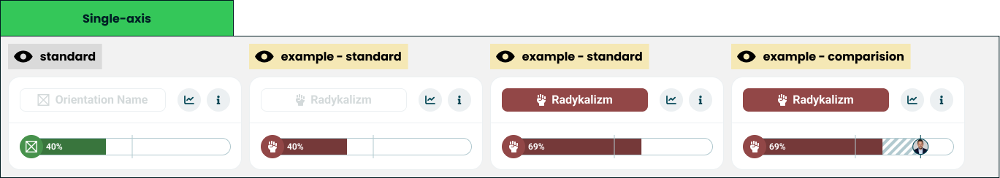

# Single axis chart

> Technical specification of the module that shows one orientation as one bar.

Docs: [Single axis chart](../../docs/modules/quiz/results/modules/single-axis-chart.md). | Design: [Figma](https://www.figma.com/design/DIInW4qrIxsgXmKbSHukNm/mypolitics-app?node-id=5508-22154)

## Kind
Front-end

## Scope
One result module: a [module wrapper](./module-wrapper.md) whose title is the orientation and whose body is a single one-sided [universal axis](./universal-axis.md). It holds no state and computes no score.

Not covered here:

- **How the bar draws a value, a marker or a comparison** - the [universal axis](./universal-axis.md) spec.
- **The card frame and its two buttons** - the [module wrapper](./module-wrapper.md) spec.
- **Which orientation the module points at** - quiz configuration.

## Data
| Input | Data | Meaning | Rules |
|---|---|---|---|
| Orientation | Name, image, colour | What the card is about | Required. Image and colour are optional |
| Value | Number, 0-100 | The orientation's score | Optional. Absent means the quiz has no answers behind this orientation |
| Marker | Position 0-100, or off | The reference line on the bar | Defaults to 50 |
| Comparison | Orientation and value | The other party on the same bar | Optional |
| Statistics action, info action | Present or absent | The wrapper's two buttons | Optional, independent |

The scale is absolute: the value is drawn as given, never relative to another module on the screen.

## Interface
| Direction | Name | Shape | Notes |
|---|---|---|---|
| In | Everything in Data | - | Passed in by the result screen |
| Out | Statistics requested | An event with no payload | Passed through from the wrapper |
| Out | Info requested | An event with no payload | Passed through from the wrapper |

## Behaviour

### Title
The title is a chip holding the orientation's icon and name, placed in the wrapper's title slot as a component title.

| Case | Behaviour |
|---|---|
| Value at or above the marker position | Emphasised: the chip is filled with the orientation's colour |
| Value below the marker position | Quiet: the chip is outlined and its content muted |
| Marker switched off | The emphasis line stays at 50 |
| Value absent | Quiet |
| Orientation without an image | The chip shows the name alone |

The chip is never interactive.

### Bar
| Case | Behaviour |
|---|---|
| Value present | A one-sided bar filled from the start cap, the orientation's image on the cap |
| Value is zero | The cap and an unfilled track, with no number |
| Value absent | An empty track with no cap, as the universal axis draws "no orientation" |
| Comparison present | Passed to the bar unchanged; the bar draws the band and the other party's image |

Labels under the bar are off: the title already names the orientation.

## Rules and constraints
- The module adds nothing to the bar's own rules. Value placement, rounding, the marker and the comparison band behave exactly as the universal axis specifies.
- An empty track is a state, not an error. The card is still drawn for an orientation with no value.
- The module never hides itself. Leaving it out is the result screen's decision.

## Invalid and edge input
| Input | Behaviour |
|---|---|
| Value outside 0-100 | Clamped by the bar. The title's emphasis uses the clamped value |
| Value not a number | Treated as absent |
| Orientation name missing or empty | The chip shows the image alone. With neither, the wrapper gets no title |
| Orientation name longer than the title slot | Truncated by the wrapper, complete for assistive technology |
| Orientation without a colour | The neutral fallback, on the chip and on the bar |
| Marker outside 0-100 | Clamped; the emphasis line moves with it |

Nothing here throws.

## Non-functional

### Rendering contexts
The result screen, comparison mode and the generated result image. In the image the caller passes no actions.

### Accessibility
- The card is named after the orientation, through the accessible name the wrapper takes for a component title.
- The bar announces the orientation, its value and the comparison value, as the universal axis specifies.
- Emphasis is never the only signal: the number on the bar says the same thing.

## Dependencies
**Build order: step 1.** Needs the [universal axis](./universal-axis.md) and the [module wrapper](./module-wrapper.md), both built. Nothing else in this folder has to exist first, and it can be built alongside the [double axis chart](./double-axis-chart.md), [traits](./traits.md) and the [header](./header.md).

Relies on:

- [Single axis chart doc](../../docs/modules/quiz/results/modules/single-axis-chart.md) - the idea this implements.
- [Universal axis](./universal-axis.md) and [module wrapper](./module-wrapper.md).

Relied on by nothing in this folder. The [horizontal bar chart](./horizontal-bar-chart.md) and the [archetype](./archetype.md) use the same one-sided bar, but compose the universal axis directly.
