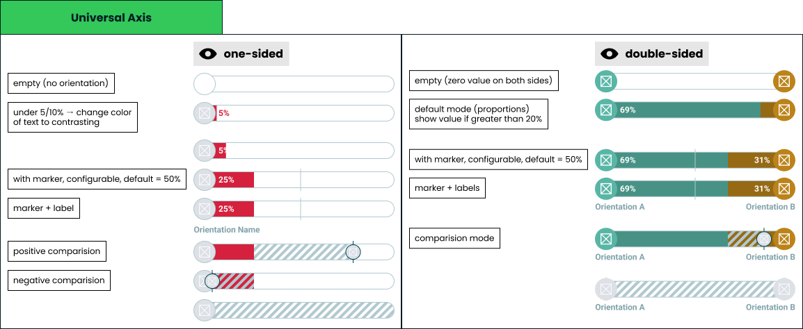

# Universal axis

> Technical specification of the bar every result module is built from.

Docs: [Universal axis](../../docs/modules/quiz/results/modules/universal-axis.md) | Design: [Figma](https://www.figma.com/design/DIInW4qrIxsgXmKbSHukNm/mypolitics-app?node-id=5514-39733&t=hEbhkMevUiNatOvQ-4)

## Scope
One presentational component. It renders a value on a track and nothing else - no scoring, no data access, no interaction, no state. Every module that shows a score composes it: single axis, double axis, multi axis, horizontal bar, Nolan chart, archetype, the checkpoint cards, and the generated result image.

## Inputs
| Input | Data | Meaning | Rules |
|---|---|---|---|
| Start entry | Orientation and value | The orientation anchored to the left cap | Optional |
| End entry | Orientation and value | The orientation anchored to the right cap | Optional; its presence is what makes the bar double-sided |
| Comparison | Orientation and value | The other party on the same track | Optional; exactly one, never a list |
| Marker | Number, 0-100 | Position of the reference line | Defaults to 50, can be disabled |
| Labels | Boolean | Whether orientation names show under the caps | Off by default |

An **orientation** carries an identifier, a display name, an image and a colour. Anything with points is one - an ideology, a party, a candidate, an archetype, a trait, and a friend in comparison mode. A friend is passed as an orientation like any other, their avatar being the image, so the component never distinguishes a person from an ideology.

Colour and image come from quiz configuration or from a user profile, so both are untrusted data rather than design tokens.

A **value** is a share of the track from 0 to 100. The component never normalises: whatever proportion the caller passes is what gets drawn.

## Modes
| Mode | Condition |
|---|---|
| Empty | Neither entry present |
| One-sided | One entry present, anchored to its own cap |
| Double-sided | Both entries present |

Each entry is anchored to the cap that belongs to it, so an end entry alone renders as a one-sided bar filling from the right.

The mode follows which entries are passed, not which have values. An entry without a value means the orientation is known and its score is not: it keeps its cap, so a double-sided bar with one unknown side stays double-sided. It draws like a value of zero and is announced as missing.

## Fill geometry
- Each fill starts at its own cap and extends by its value as a share of the track width.
- Any remainder stays unfilled. On a double-sided bar with values that do not reach 100 between them, the gap sits in the middle.
- A cap is rendered only for an entry that is present.
- Fills never overlap the opposite cap.

## Value label cases
| Case | Rendering |
|---|---|
| One-sided, value at or above the fit threshold | Value inside the fill |
| One-sided, value below the fit threshold | Value immediately after the fill, in the orientation colour against the track |
| One-sided, value is zero | No value shown |
| Double-sided, side at or above its fit threshold | Value inside that side's fill |
| Double-sided, side below its fit threshold | No value for that side; the other side still shows its own |
| Entry absent | No value shown |

The fit thresholds are **fixed percentages**, one per mode, not measured from the rendered text. Measuring would make the same bar render differently depending on which font loaded, the locale's digits and the environment doing the drawing, and this bar has to look identical in the app, on a checkpoint card and inside the generated image. Fixed numbers also cost nothing on a screen holding dozens of bars. The trade is that each threshold is tuned once for the widest realistic label rather than being exactly right for every one.

Values are displayed rounded. Layout always uses the exact value, so rounding never moves a fill.

### With a comparison
A comparison does not remove the numbers. A side keeps its value wherever the band and the other party's image leave it uncovered.

| Case | Rendering |
|---|---|
| The other party's position is clear of the side's number | The value is shown by the rules above |
| The other party's position is within the clearance of the cap the number sits at | No value for that side; the other side of a double-sided bar still shows its own |
| Value that would be written after the fill | No value shown |

The clearance is a **fixed percentage**, one per mode, a little above the fit threshold so that it also leaves room for the other party's image. It is tuned once and never measured, for the same reasons as the thresholds. A number is never drawn under hatching or under the image; a hidden value is still carried by the description for assistive technology.

The numbers stay because modules that colour a bar by something other than the orientation - a match band, for one - rely on the number to say what the colour says.

## Marker cases
| Case | Rendering |
|---|---|
| Default | Line at the midpoint |
| Configured | Line at the given position |
| Disabled | Not drawn |
| At 0 or 100 | Drawn at the edge, fully inside the track |

The marker sits above the fills and below the comparison layer, and is drawn whether or not any entry is present.

## Comparison cases
Comparison carries exactly one other party. Group comparison is not a case this component handles - a screen comparing several people composes several bars.

Hatching exists only for comparison. Without a comparison the bar has no hatched area at all, and with one the hatched band is exactly the span between the two values - the difference is the thing being drawn.

| Case | Rendering |
|---|---|
| Other is ahead | Hatched band from the taker's value to theirs, continuing past the fill |
| Other is behind | Hatched band from their value to the taker's, drawn over the fill |
| Values are equal | No band; the image alone marks the shared position |
| Taker has no entry, or an entry without a value | The whole track is hatched and only the other party's image is positioned |
| Other is at 0 or 100 | The image is clamped so it stays fully inside the track |
| Double-sided bar | The band is measured against the start entry on the same shared track |

One hatching pattern serves both directions. Direction is conveyed by where the band sits, never by colour, because both cases must be recognisable wherever the bar is drawn. A wider band means a bigger disagreement, which is what makes a screen of bars scannable for where two people actually differ.

Draw order is fills, then marker, then band, then the other party's image, which is always topmost. Which values stay visible next to the band is set in [value label cases](#with-a-comparison).

## Label cases
- A label sits under the cap of the entry it names, on one line, truncated when it does not fit.
- The full name remains available to assistive technology even when the visible text is truncated.
- When labels are enabled their row is reserved whether or not a name is present, so enabling them never shifts a neighbouring bar.

## Invalid and edge input
| Input | Behaviour |
|---|---|
| Value below 0 or above 100 | Clamped into range |
| Values that together exceed the track | Both fills scaled proportionally so they meet without overlapping |
| Value missing or not a number | The entry stays present: its cap and label are drawn, with no fill and no number |
| Orientation without an image | Cap renders with colour only |
| Orientation without a colour | Falls back to a neutral colour |
| Orientation name longer than the track | Truncated visually, preserved for assistive technology |

Nothing here throws. Quiz configuration is author-supplied and can be wrong; a broken bar must degrade rather than take a result screen down.

## Rendering contexts
The same component renders in the app, on checkpoint cards mid-quiz, and inside the generated result image, at one size in all of them. There is no compact variant: the bar fills the width it is given and everything on it - caps, type, marker, hatching - keeps its proportions. That is also what makes identical output across the three contexts achievable, and it rules out anything depending on hover, viewport, animation state, measured text or fonts that are not embedded.

## Accessibility
- The bar is not interactive and exposes no focusable elements.
- It is announced as a single image whose description carries the orientation names, their values, and the comparison value when present.
- Colour is never the only carrier of meaning: values are written, comparison uses a pattern, and the marker is a shape.
- Value text must meet contrast against the fill it sits on, which is why a small value moves out of the fill rather than shrinking - the type size is the same everywhere.

## Performance
A single screen can hold dozens of instances, and an opened multi axis group can add dozens more at once. The component does no measurement work per instance beyond layout, and the entry animation runs on first paint only, disabled under a reduced-motion preference.
